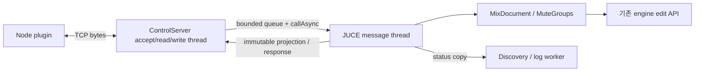

# LiveMix Stream Deck 연동 설계

작성: 2026-09-08, Astra. 공동 설계·구현 검증: Claude(maintainer). 제품 결정·실사용 검증: 곰튀김 / gom. 상태: **Claude 검토용 설계안**. 이번 작업은 이 문서만 작성하며 구현·설치·배포는 하지 않는다.

## 결정 요약

1. LiveMix ↔ plugin은 **127.0.0.1 TCP + NDJSON v1**, 기본 포트 49721 충돌 시 자동 포트, 사용자별 discovery 파일로 연결한다.
2. 외부 제어는 **기본 OFF**. 한 번 켜면 자동 연결하며, 로컬 토큰을 자동 전달하므로 포트·암호 입력은 없다.
3. 모든 조회·명령 적용은 JUCE 메시지 스레드에서 수행하고 기존 `MixDocument` / `MuteGroups` 편집 경로를 사용한다.
4. 전체 snapshot + 최대 10 Hz 상태 delta, 명령 ack/error, 세션 세대·revision으로 동기화한다. 미터는 v1에서 제외한다.
5. 마이크·FX는 Uuid 우선, 세션을 바꿀 때 유일한 동일 이름만 fallback한다. 없거나 중복이면 조작하지 않는다.
6. 6종 조작 action + 선택적 상태 key를 제공한다. 다이얼은 1% 단위, 짧게 누르면 프리/포스트, 기본 reset은 없다.
7. TypeScript, `@elgato/streamdeck` 2.x, Node.js 24, Stream Deck 7.1+, Windows 전용으로 만든다.
8. UUID는 `com.gomtwigim.livemix`로 제안하며 공개 전 확정한다. ko/en UI, 영어 Marketplace 제출물, 직접 설치 파일을 준비한다.
9. C++ 실제 document 테스트 → fake host/서버 → 실제 LiveMix 통합 → 고객 Mobile 검증을 거친다. 다이얼 실물 검증은 별도 필요하다.
10. LiveMix 0.6.0을 먼저 배포하고 plugin 1.0.0을 연결한다. 다섯 구현 Round마다 Claude가 결과와 증거를 검증한다.

## 1. 전송 방식과 연결 발견

### 1.1 현재 제품을 기준으로 한 범위

읽은 기준 소스는 `livemix/src/MixDocument.h/.cpp`, `MixModel.h`, `MuteGroups.h/.cpp`, `GlobalHotkeys.h/.cpp`, `LiveMixSettings.h/.cpp`, `Main.cpp`, `MixEngine.h`, `ui/MainComponent.h/.cpp`, `ui/SettingsDialog.h/.cpp`다. `README.md`, 루트·tests의 `CMakeLists.txt`, `tests/TestMain.cpp`, `tests/MuteGroupsTests.cpp`, `tests/MixDocumentTests.cpp`, `installer/LiveMix.iss`, `site/`, 기존 제품 설계 및 `scratch_sd/FEATURE_INVENTORY.md`도 대조했다. 추가 확인한 색상 기준은 `ui/LiveMixPalette.h`와 `ui/Widgets.h`다.

현재 LiveMix 버전은 **0.5.3**, 세션 파일 버전은 **2**다. 프로토콜 버전과 독립적으로 유지한다. 초기 제품 설계의 자동 저장·설정 목록보다 현재 코드가 우선한다. 원격 조작 때문에 주기적 세션 저장이나 새 오디오 기능을 추가하지 않는다.

| 제품 의미 | 현재 UI·코드 기준 | 연동에서 지킬 의미 |
|---|---|---|
| 마이크 ON/OFF | LM-026, `MixChannel::on` | 원래 스위치 상태다. 뮤트그룹이나 ASIO 상태와 동일하지 않다. |
| 전체 마이크 | LM-250/251의 실제 트레이 명칭은 `마이크 전부 ON` / `마이크 전부 OFF` | action 이름은 요청한 `전체 마이크`, 명시적 ON/OFF 선택 문구는 기존 트레이와 맞춘다. |
| 마이크·FX 뮤트그룹 | LM-046/078은 소속 표시, LM-109/111은 핫키, LM-252/253은 트레이 토글 | 현재는 핫키뿐 아니라 트레이로도 조작 가능하다. 그룹의 현재 뮤트와 소속 편집은 구별한다. |
| 플러그인 그룹 | LM-033~035, LM-166~175 | 독립된 1~5개의 OFF 스위치다. 하나를 선택하면 다른 그룹이 꺼지는 preset 선택기가 아니다. |
| 보내는 양, 프리/포스트 | LM-036~041 | 0~100%의 선형 전송량. 프리는 **체인 전**, 포스트는 **체인 후**다. 마이크 OFF이면 둘 다 새 입력 전송이 끊긴다. |
| 돌아오는 양 | LM-070~072, `MixFx::returnAmount` | snapshot에 표시하지만 v1 명령으로 편집하지 않는다. |
| 오디오 상태 | LM-010/019, `MixEngine::isDeviceRunning()` | 연결됐더라도 `오디오 멈춤`일 수 있다. 제어 연결을 소리가 나온다는 보증으로 표시하지 않는다. |

Stream Deck Mobile은 휴대폰에서 LiveMix에 직접 접속하지 않는다. **휴대폰 ↔ PC의 Stream Deck App ↔ PC의 Node plugin ↔ LiveMix** 순서다. Mobile의 같은 네트워크 조건과 PC App 필요성은 Elgato가 명시한다. 따라서 LiveMix 포트를 LAN에 열 필요가 없다. [Mobile 설치 안내](https://help.elgato.com/hc/en-us/articles/16786832942221-Elgato-Stream-Deck-Mobile-2-0-Getting-Started)

### 1.2 대안 비교와 권고

| 기준 | loopback TCP + discovery | Windows named pipe | LiveMix 안의 WebSocket 서버 |
|---|---|---|---|
| JUCE 구현 | `StreamingSocket::createListener(port, "127.0.0.1")`, accept, byte stream 사용 | `NamedPipe`로 1개 연결은 간단. 다중 instance accept·ACL·종료 취소를 별도로 관리 | HTTP upgrade, masking, frame 분할, ping/close와 서버 라이브러리·배포 의존성까지 필요 |
| Node 구현 | 내장 `node:net` | 내장 `node:net`의 Windows IPC 지원. native npm addon 불필요 | WebSocket client는 편리하지만 C++ 서버 쪽 비용이 큼 |
| 포트·이름 충돌 | 기본 포트 실패 시 OS 할당 포트와 discovery로 자동 복구 | TCP 포트 충돌 없음. pipe 이름·다른 사용자·다중 instance 충돌은 처리해야 함 | TCP와 같은 포트 문제 |
| 여러 도구 | 연결별 독립 송신 큐. 같은 PC의 Companion·진단 도구와 공용 | Windows에서는 가능. pipe 인스턴스를 계속 보충하는 서버 필요 | 다중 client와 브라우저 도구에 유리 |
| 방화벽·사용자 설정 | loopback 한정. 아래 검증 범위 참조. 수동 허용 규칙을 설치하지 않음 | 로컬 pipe 자체는 TCP listener가 아님. 원격 pipe 접근은 반드시 거부해야 함 | loopback이면 TCP와 같은 조건. WebSocket이라는 이유로 방화벽을 피하지 못함 |
| 재접속 | EOF/timeout → discovery 재조회 → hello → snapshot | broken pipe → 같은 이름 재연결 → hello → snapshot | close/timeout → 재연결 → hello → snapshot |
| 제품 적합성 | JUCE·Node 양쪽 비용과 향후 도구 호환성이 균형적 | Windows만 지원한다는 장점은 있으나 ACL·accept 관리까지 하면 특별히 단순하지 않음 | 브라우저 제어가 없는 v1에는 부담이 더 큼 |

**TCP를 권고한다.** 사용자는 설치 후 외부 제어 토글만 켠다. 초기 preferred port는 **49721**이며 제품의 전용 예약 포트라고 주장하지 않는다. 충돌하면 `createListener(0, "127.0.0.1")`로 새 포트를 얻고 `getBoundPort()`로 실제 값을 게시한다. 포트를 찾아 여러 번호에 명령을 보내거나 다른 프로세스를 종료하는 방식은 쓰지 않는다. 같은 PC·같은 Windows 사용자로 실행되는 Companion module도 동일 discovery 계약을 쓸 수 있다. 다른 PC/Raspberry Pi의 Companion은 v1 지원 범위 밖이다.

JUCE의 listener 주소 지정·포트 조회와 Node의 TCP/Windows pipe 지원은 공식 API에서 확인했다. `InterprocessConnection`은 자체 binary header를 붙이므로 그대로 Node NDJSON과 연결할 수 없다. 현재 로컬 JUCE 소스의 `juce_InterprocessConnection.cpp`에도 32-bit magic + 32-bit length가 있다. 새 프로토콜에는 직접 socket을 사용한다. [JUCE StreamingSocket](https://docs.juce.com/master/classjuce_1_1StreamingSocket.html), [JUCE NamedPipe](https://docs.juce.com/master/classjuce_1_1NamedPipe.html), [JUCE InterprocessConnection](https://docs.juce.com/master/classjuce_1_1InterprocessConnection.html), [Node 24.13 net](https://nodejs.org/download/release/v24.13.0/docs/api/net.html)

named pipe를 대안으로 다시 선택한다면 예시 이름은 `\\.\pipe\Gomtwigim.LiveMix.Control.v1.<logon-id>`다. 사용자/logon SID DACL과 `PIPE_REJECT_REMOTE_CLIENTS`를 명시한다. 현재 로컬 JUCE `juce_Files_windows.cpp`는 `PIPE_UNLIMITED_INSTANCES`를 사용하지만 public `NamedPipe` API는 보안 설정을 받지 않는다. **named pipe 자체가 다중 client를 지원하지 않는다는 뜻은 아니다.** 현재 래퍼를 그대로 쓰는 것으로 사용자 격리와 원격 거부가 완성되지 않는다는 뜻이다. [Microsoft pipe 보안](https://learn.microsoft.com/en-us/windows/win32/ipc/named-pipe-security-and-access-rights), [원격 client 거부](https://learn.microsoft.com/en-us/windows-hardware/test/hlk/testref/e3bcbd3f-3e9c-484a-a587-3c081cb28f7a)

### 1.3 Windows Firewall 확인 결과와 검증 경계

**일반 Win32 프로세스를 127.0.0.1에만 bind한 경우에는 기본 Defender Firewall의 “액세스 허용” 질문 없이 동작할 것으로 설계한다. 다만 이번 조사에서 모든 Windows 10/11 정책 조합의 UI 비표시를 보증하는 Microsoft 문구는 찾지 못했다.** 따라서 이 부분은 추론이며, “방화벽 창이 절대 안 뜬다”는 출시 문구로 사용하지 않는다.

확인된 공식 근거는 다음과 같다. Microsoft는 일반 네트워크 listener의 허용 규칙이 없을 때 질문이 나타나는 조건을 설명하며, 별도 quarantine 설명에서는 loopback 패킷의 예외 허용을 명시한다. 후자는 **quarantine 범위의 규칙**이므로 전체 방화벽 UI의 증거로 확대하지 않는다. UWP/AppContainer의 loopback 제한도 일반 Win32 LiveMix에 그대로 적용하지 않는다. [Windows Firewall 규칙](https://learn.microsoft.com/en-us/windows/security/operating-system-security/network-security/windows-firewall/rules), [quarantine의 loopback 예외](https://learn.microsoft.com/en-us/windows/security/operating-system-security/network-security/windows-firewall/quarantine), [UWP loopback 제한](https://learn.microsoft.com/en-us/windows/security/operating-system-security/network-security/windows-firewall/troubleshooting-uwp-firewall)

**확인 필요 F-01:** 새 Windows 10/11 환경에서 기존 LiveMix 허용 규칙 없이 일반 사용자로 외부 제어를 켜고 첫 연결·재시작을 검사한다. Defender의 private/public profile에서 질문이 없는지, `Get-NetTCPConnection`으로 listener가 오직 `127.0.0.1`인지 기록한다. `0.0.0.0`, 빈 bind 주소, IPv6 wildcard로의 fallback은 결함이다. 보안 제품의 추가 정책은 별도 사례로 기록한다. Mobile을 처음 연결할 때 Stream Deck App 자체에 나타나는 LAN 허용 질문과 LiveMix 질문은 실행 파일 이름으로 구분한다. 이 시험을 위해 이번 설계 작업에서 listener를 실행하거나 방화벽을 변경하지 않는다.

### 1.4 discovery 계약

위치: **`%APPDATA%\LiveMix\control\discovery.json`**. `control` 디렉터리와 임시 교체 파일은 현재 사용자 SID와 SYSTEM만 접근하도록 설정한다. 기존 세션·백업 디렉터리의 ACL은 변경하지 않는다. JSON을 임시 파일에 완성한 후 원자적으로 교체한다. 읽기 실패·교체 중 파일 없음은 다음 재시도 대상이다.

| 필드 | 의미 |
|---|---|
| `schemaVersion`, `app`, `appVersion` | discovery 형식 1, `LiveMix`, 실행 앱 버전 |
| `instanceId`, `pid` | 제어 서비스 시작 식별자와 진단용 PID. 재활성화·재시작 때 instance 변경 |
| `state` | `starting`, `ready`, `disabled`, `error`, `stopped` |
| `host`, `port` | ready일 때만 사용. host는 반드시 `127.0.0.1`, port는 1~65535 |
| `token` | ready일 때만 존재하는 32-byte 난수의 base64url 문자열 |
| `updatedAt`, `heartbeat`, `leaseMs` | UTC 갱신 시각, 단조 증가 heartbeat 번호, lease 15000 ms |
| `errorCode` | error일 때 `BIND_FAILED`, `DISCOVERY_FAILED` 등 비민감 진단 코드 |

```json
{"schemaVersion":1,"app":"LiveMix","appVersion":"0.6.0","instanceId":"aaaaaaaaaaaa4aaa8aaaaaaaaaaaaaaa","pid":1234,"state":"ready","host":"127.0.0.1","port":49721,"token":"EXAMPLE_ONLY_REPLACE_WITH_32_RANDOM_BYTES","updatedAt":"2026-09-08T09:00:00Z","heartbeat":1,"leaseMs":15000}
```

위 token은 설명용이다. 실제 token은 Windows CSPRNG로 생성한다. 서비스가 OFF여도 가벼운 discovery 게시자는 앱이 살아 있는 동안 5초마다 갱신하여 `disabled`와 오래된 파일을 구별한다. 게시자는 메시지 스레드가 제공한 상태만 기록하며, 문서에 접근하지 않는다. 정상 종료 시 `stopped`로 바꾸고 token/port를 제거한다. 충돌·강제 종료로 파일이 남으면 15초 lease 만료 후 신뢰하지 않는다. 시계 변경이나 오래된 roaming 복사본은 새 heartbeat 관찰 전까지 `연결 확인 중`으로 취급하며 토큰 인증과 snapshot 없이 ready가 되지 않는다.

plugin은 부모 디렉터리를 `fs.watch`하고 미연결·disabled 상태에서 1초 간격 조회를 병행한다. 아직 디렉터리가 없으면 polling으로 생성을 기다린다. discovery 읽기는 8 KiB로 제한하고 형식·필수 필드·lease를 검사한다. 다른 host·경로 지시를 따라가지 않으며, 임의 원격 주소 입력란은 없다. helloAck의 instance가 읽은 discovery와 일치해야 한다. EOF를 받으면 파일에 ready가 남아 있어도 즉시 미연결로 표시한다. 파일만으로 실행 여부를 확정할 수 없을 때는 `LiveMix 미연결`과 `LiveMix를 실행하세요`라는 안내를 쓴다. PID 존재 여부만으로 ready/disabled를 결정하지 않는다. discovery 쓰기·ACL 확보 실패 시 listener를 공개하지 않고 LiveMix 설정에 오류를 보여 준다.

## 2. NDJSON 프로토콜 v1

### 2.1 프레이밍·버전·공통 규칙

UTF-8 JSON object 한 개 + LF 한 개가 한 메시지다. CRLF도 수신 허용한다. 여러 줄을 한 번에 받거나 한 줄·한글 UTF-8 문자가 여러 TCP read로 나뉘는 경우를 처리한다. JSON 안의 줄바꿈은 escape한다. 빈 줄·BOM·잘못된 UTF-8·object가 아닌 최상위 값·과도한 깊이는 오류다. raw HTTP/WebSocket 요청은 JSON이 아니므로 처리되지 않는다.

| 공통 필드 | 규칙 |
|---|---|
| `v` | 전송 프로토콜 major 정수. v1은 `1`. 앱·세션 파일·plugin 버전과 관계없음 |
| `type` | 아래 표의 메시지 종류. direction과 handshake 단계도 검증 |
| `id` | client 요청 ID. `1`~`9007199254740991`의 양의 십진수 문자열(최대 16 byte, 선행 0 없음). hello/command/ping이 연결 안에서 하나의 증가 번호를 공유. ack/error가 그대로 반환 |
| `instanceId` | helloAck 이후 명령·state·event에 사용. 제어 서비스 교체 시 변경 |
| `sessionId` | 현재 열린 세션의 **런타임 세대 Uuid**. 성공한 new/load 때마다 변경. 같은 파일을 다시 열어도 변경 |
| `revision` | instance 내 투영 상태의 단조 증가 정수, JSON safe integer 범위. 상태 변경의 순서이지 오디오 sample 시각이 아님 |
| `ifRevision` | 선택적 비교 조건. client가 캐시에서 역산한 값은 이 조건을 붙인다. 다르면 적용 전에 거부 |

Uuid wire 형식은 JUCE `Uuid::toString()`과 같은 **소문자 32자리 hex**, null Uuid 금지다. 생성자로 바로 변환하기 전에 형식을 엄격히 검사한다. 현재 JUCE의 문자열 생성자는 잘못된 hex를 관대하게 읽을 수 있으므로 생성자 자체를 validator로 쓰지 않는다. PI의 이름 표시와 wire ID는 구별한다.

hello는 앞으로도 고정된 v1 bootstrap envelope로 보낸다. `supportedVersions` 중 서버와 공통인 가장 높은 major를 선택하며, helloAck 이후에는 선택된 `v`만 보낸다. v1 내 추가 optional 필드·새 capability는 기존 client가 무시할 수 있어야 한다. 기존 필드 타입·단위·enum 의미·필수 조건을 바꾸려면 v2다. 미지원 명령은 `UNKNOWN_COMMAND`, 미지원 capability는 표시에서 제외한다. 필수 필드 누락은 무시하지 않는다. 양쪽은 알 수 없는 optional 응답 필드를 무시하며, 알 수 없는 event로 revision 연결이 끊기면 snapshot을 다시 요청한다.

### 2.2 전체 메시지 카탈로그

표의 `I`, `S`는 각각 이미 협상한 `instanceId`, `sessionId`를 뜻하는 **설명용 자리표시자**다. 실제 전송 시에는 위 형식의 Uuid로 바꾼다. 각 JSON 예시 끝에는 LF가 있다고 가정한다. 각 행은 독립 예시이며 하나의 연속 transcript는 아니다. 이 표와 다음 snapshot·command 표가 v1의 전체 카탈로그이며 임의 RPC 메서드를 실행하지 않는다.

| 종류·방향 | 목적·응답 | JSON 예시 |
|---|---|---|
| `hello` C→S | 연결 후 3초 안에 최초 1회. 버전·토큰·client 설명 전달 | `{"v":1,"type":"hello","id":"1","supportedVersions":[1],"token":"<discovery token>","client":{"name":"LiveMix Stream Deck","version":"1.0.0"}}` |
| `helloAck` S→C | 인증·버전 성공. 바로 snapshot 1개가 뒤따름 | `{"v":1,"type":"helloAck","id":"1","instanceId":"I","server":{"name":"LiveMix","version":"0.6.0"},"capabilities":["stateDelta","mic","muteGroups","pluginGroups","sends"],"eventIntervalMs":100,"heartbeatIntervalMs":5000}` |
| `state` S→C | hello, `requestState`, 구조·세션 교체 시 전체 상태. 기존 캐시를 원자적으로 대체 | `{"v":1,"type":"state","instanceId":"I","sessionId":"S","revision":12,"reason":"requested","requestId":"9","state":{"session":{"name":"방송","dirty":false},"audio":{"running":false},"channels":[],"fx":[],"muteGroups":{"mic":false,"fx":false}}}` |
| `stateDelta` S→C | 동일 session의 변경분. `baseRevision` 일치 시 적용 | `{"v":1,"type":"stateDelta","instanceId":"I","sessionId":"S","baseRevision":12,"revision":14,"changes":{"session":{"dirty":true},"channels":[{"id":"11111111111141118111111111111111","on":false}]}}` |
| `command` C→S | 허용된 편집 또는 조회. 아래 표 참조 | `{"v":1,"type":"command","id":"2","instanceId":"I","sessionId":"S","command":"toggleChannel","args":{"channelId":"11111111111141118111111111111111"}}` |
| `ack` S→C | 메시지 스레드에서 실제 검증·편집 완료. 이후 event의 반영 revision을 알림 | `{"v":1,"type":"ack","id":"2","instanceId":"I","sessionId":"S","revision":15,"changed":true,"result":{"on":true}}` |
| `error` S→C | 실패. 해석 가능한 요청이면 id를 반환, framing 오류면 null | `{"v":1,"type":"error","id":"2","code":"CHANNEL_NOT_FOUND","message":"Channel does not exist","retryable":false,"instanceId":"I","sessionId":"S","revision":15}` |
| `ping` C→S | 5초마다 연결과 메시지 스레드 응답성 확인. 변경 없음 | `{"v":1,"type":"ping","id":"3","instanceId":"I"}` |
| `pong` S→C | message thread를 거친 ping 응답. I/O thread만 살아 있는 상태를 ready로 오인하지 않음 | `{"v":1,"type":"pong","id":"3","instanceId":"I","sessionId":"S","revision":15}` |
| `serverStatus` S→C | 종료/비활성화 전 best effort 안내. 응답 ack는 없음 | `{"v":1,"type":"serverStatus","instanceId":"I","status":"disabled","reason":"controlDisabled"}` |

`serverStatus.status`는 `disabled` 또는 `stopping`, reason은 `controlDisabled`, `shutdown`, `restart` 중 하나다. 인증 전에는 helloAck 또는 정보가 제한된 error만 보낸다. hello 실패·프로토콜 major 불일치는 error 후 연결 종료다. `ping/pong`은 hello 완료 이후만 허용한다. pong 대기 3초를 넘으면 끊고 재접속한다. 명령 응답 timeout은 2초이며, 결과가 불명확한 명령은 자동 재전송하지 않는다.

`ack`의 `id/instanceId/sessionId/revision/changed/result`는 필수다. `requestState`의 changed는 false다. `error`의 `id/code/message/retryable`는 필수, 인증 후의 `instanceId/sessionId/revision`은 해석 가능한 경우 포함한다. rate/busy 오류의 `retryAfterMs`, 버전 오류의 `supportedVersions`는 선택 필드다. retryable은 재접속·재조회 뒤 새 요청을 시도할 수 있다는 뜻이며 실패한 마이크 조작의 자동 재생 허가가 아니다. 필수 응답 필드가 잘못됐으면 plugin은 그 연결을 준비 상태로 유지하지 않는다.

### 2.3 snapshot 스키마와 완전한 예시

세션 경로, VST 상태 blob, plugin parameter, 오디오 장치 상세, 백업 자격 증명은 전달하지 않는다. `state` 메시지 최상위의 `reason`은 `initial`, `requested`, `structureChanged`, `sessionChanged`, `resync`다. `requestId`는 요청된 snapshot일 때만 있다. 배열 순서는 현재 UI 순서다.

| 경로 | 타입·의미 |
|---|---|
| `state.session.name` | `MixDocument::getDisplayName()`의 표시 이름 |
| `state.session.dirty` | `MixDocument::isDirty()` |
| `state.audio.running` | 앱에서 제공하는 `isDeviceRunning()` 결과. false이면 `오디오 멈춤` |
| `state.channels[]` | 현재 `MixSession::channels`(최대 8개) |
| `channels[].id/name/on/muteGroup` | Uuid, 실제 이름, 원래 ON 비트, 마이크 뮤트그룹 소속 |
| `channels[].pluginGroups[]` | 실제로 존재하는 그룹만. `index`는 **1-based** 1~5, `off`는 그룹 OFF 비트 |
| `channels[].sends[]` | 실제 FX마다 `fxId`, `amount`(유한한 0~1), `pre`(boolean) |
| `state.fx[]` | 현재 FX 채널(최대 4개)의 `id`, `name`, `muteGroup`, `return` |
| `fx[].return` | `MixFx::returnAmount`의 유한한 0~1. 뮤트 중에도 저장값 유지 |
| `state.muteGroups.mic/fx` | `MuteGroups::isMuted()`의 현재 상태. true=뮤트, false=해제 |

```json
{
  "v": 1,
  "type": "state",
  "instanceId": "aaaaaaaaaaaa4aaa8aaaaaaaaaaaaaaa",
  "sessionId": "bbbbbbbbbbbb4bbb8bbbbbbbbbbbbbbb",
  "revision": 1,
  "reason": "initial",
  "state": {
    "session": { "name": "곰 방송", "dirty": false },
    "audio": { "running": true },
    "channels": [
      {
        "id": "11111111111141118111111111111111",
        "name": "곰 마이크",
        "on": true,
        "muteGroup": true,
        "pluginGroups": [ { "index": 1, "off": false }, { "index": 2, "off": true } ],
        "sends": [ { "fxId": "22222222222242228222222222222222", "amount": 0.35, "pre": false } ]
      }
    ],
    "fx": [
      { "id": "22222222222242228222222222222222", "name": "리버브", "muteGroup": true, "return": 1.0 }
    ],
    "muteGroups": { "mic": false, "fx": true }
  }
}
```

위 예시에서는 마이크 스위치가 ON이고 마이크 뮤트그룹은 해제되어 있다. FX 보내는 양은 35%지만 FX 뮤트그룹 때문에 해당 FX의 돌아오는 소리가 차단된다. plugin 그룹 2의 `off:true`를 마이크 OFF로 해석하지 않는다.

### 2.4 변경 합치기·revision·delta 규칙

`onValueChanged`, `onStructureChanged`, `MuteGroups::onChanged`는 기존 UI callback 안에서 ControlServer에 **변경 알림만 전달**한다. 구조 변경을 모두 세션 교체로 취급하지 않는다. `getSessionGeneration()`으로 진짜 교체를 구분한다. 그룹 추가/삭제가 현재 `onValueChanged`를 쓴다는 점도 반영하여 투영 배열의 형태 변화를 검사한다.

서버는 message thread에 `current projection`과 각 client의 `last published projection`을 둔다. 알림을 받은 최신 투영은 dispatch 전·후 및 publish 시점에 확정한다. 이전과 실제로 다를 때만 revision을 증가시킨다. 한 명령이 내부 callback 여러 개를 일으켜도 중간 모습을 외부에 내보내지 않는다. UI 변경 후 명령이 곧바로 도착하면 **명령의 ifRevision 검사 전** 투영을 갱신하므로 아직 timer가 돌지 않았다는 이유로 오래된 비교가 통과하지 않는다.

자발적 `state`/`stateDelta` 발행은 **client당 최대 100 ms에 1개(10 Hz)**다. revision도 그대로이면 보내지 않는다. 명령은 이 timer를 기다리지 않고 적용·ack한다. hello snapshot과 rate limit을 통과한 요청 snapshot은 발행 간격의 예외다. 구조/세션 교체는 아직 발행하지 않은 변경분을 다음 full state로 합친다. audio.running과 callback 없는 dirty 변화(`discardUnsavedChanges` 등)는 100 ms poll로 보완한다. normal load가 message thread를 막는 동안 timer의 실시간 실행을 보장하지 않는다.

두 번의 토글이 100 ms 안에 일어나 값이 원래대로 돌아왔더라도 revision이 증가했다면 **`changes:{}`인 빈 delta를 발행**한다. 이미 발행한 값과 같다는 이유로 새 revision을 숨기면 ack를 기다리던 client가 영원히 pending에 남는다. 같은 값 set으로 revision 자체가 변하지 않은 경우와 구별한다.

| `changes` 항목 | 병합 규칙 | 예시 |
|---|---|---|
| `session`, `audio`, `muteGroups` | 들어온 scalar만 교체. 빠진 값은 유지 | `{"muteGroups":{"mic":true},"audio":{"running":false}}` |
| `channels[]` | id로 기존 채널 검색 후 포함된 필드만 교체 | `{"channels":[{"id":"11111111111141118111111111111111","name":"방송 마이크","on":false}]}` |
| `channels[].pluginGroups` | 해당 채널의 그룹 배열 **전체 교체** | `{"channels":[{"id":"11111111111141118111111111111111","pluginGroups":[{"index":1,"off":true}]}]}` |
| `channels[].sends` | 해당 채널의 보내기 배열 **전체 교체** | `{"channels":[{"id":"11111111111141118111111111111111","sends":[{"fxId":"22222222222242228222222222222222","amount":0.38,"pre":false}]}]}` |
| `fx[]` | id로 기존 FX 검색 후 포함된 scalar만 교체 | `{"fx":[{"id":"22222222222242228222222222222222","return":0.5,"muteGroup":true}]}` |
| 채널/FX 추가·삭제·순서 변경, 그룹 개수 변경, 세션 교체 | delta 대신 full state. v1에는 JSON Patch 경로·삭제 연산 없음 | 최상위 `reason="structureChanged"` 또는 `"sessionChanged"` |

`baseRevision`은 그 client의 송신 FIFO에 마지막으로 발행한 상태의 revision이다. 합쳐진 delta가 12→17처럼 건너뛰는 것은 정상이다. 클라이언트 캐시 revision과 base가 다르거나 모르는 id가 들어오면 적용하지 않고 requestState를 보낸다. snapshot으로 기준을 다시 잡는다. 완성된 프레임을 FIFO에 넣은 뒤에는 delta만 임의로 제거하거나 순서를 바꾸지 않는다. 새 snapshot은 기존 프레임 뒤에 들어가며 이후 delta는 그 snapshot을 기준으로 한다. 출력 한도 초과는 해당 client를 끊고 재접속 시 full state로 복구한다.

ack의 `result`는 명령 처리 결과·후속 명령 계획용이며 **전역 상태 캐시의 부분 patch로 쓰지 않는다**. ack만 보고 캐시 revision을 앞으로 옮기면 뒤따르는 합쳐진 delta의 base가 어긋나기 때문이다. key의 확정 그림은 snapshot/delta로 갱신한다. pending은 해당 ack revision 이상인 state를 이미 갖고 있거나 새로 받으면 해제한다. `changed:false`이고 캐시가 최신이면 추가 event를 기다리지 않는다. 이 규칙으로 빠른 두 번 누르기와 여러 client의 변경을 검증한다.

### 2.5 명령·기존 API 대응표

모든 명령은 hello 이후만 허용한다. 아래 args를 2.2의 command envelope에 넣는다. **모든 변경 명령에 현재 `instanceId`와 `sessionId`가 필수**다. 서버는 이름을 대신 검색하지 않고, client가 snapshot에서 결정한 Uuid를 message thread에서 다시 확인한다. `requestState`는 sessionId 없이 현재 세션을 조회할 수 있다.

| command | args JSON 예시 | 적용·ack result | 기존 API 또는 추가 처리 |
|---|---|---|---|
| `setChannelOn` | `{"channelId":"11111111111141118111111111111111","on":false}` | 해당 원래 ON 비트 설정. result `{"on":false}` | `document.setChannelOn(id, on)` |
| `toggleChannel` | `{"channelId":"11111111111141118111111111111111"}` | dispatch 시점의 on 반전. result에 결과 on | `findChannel` 후 같은 message-thread 작업에서 `setChannelOn(id, !on)` |
| `setAllChannelsOn` | `{"on":false}` | 모든 원래 ON 비트 설정. result `{"on":false,"count":2}`. 뮤트그룹 유지 | `document.setAllChannelsOn(on)` |
| `toggleMuteGroup` | `{"group":"mic"}` 또는 `{"group":"fx"}` | 현재 뮤트/해제 반전. result `{"group":"mic","muted":true}` | `muteGroups.toggle(Group::mic/fx)` |
| `setMuteGroup` | `{"group":"fx","muted":false}` | 명시적 뮤트/해제. result에 group·muted | `muteGroups.set(group, muted)` |
| `setPluginGroupOff` | `{"channelId":"11111111111141118111111111111111","index":2,"off":true}` | 해당 번호의 그룹을 OFF. result `{"index":2,"off":true}` | `document.setPluginGroupOff(id, index - 1, off)` |
| `setSend` | `{"channelId":"11111111111141118111111111111111","fxId":"22222222222242228222222222222222","amount":0.38,"pre":false}` | 한 쌍의 양·프리/포스트 변경. result `{"amount":0.38,"pre":false}` | 두 id 검증 후 `document.setSend(channelId, fxId, amount, pre)` |
| `requestState` | `{}` | ack result `{"snapshotRevision":17}` 후 `requestId`가 같은 full state | document 편집 없음. 현재 투영을 읽음 |

`setSend`는 `amount`, `pre` 중 **하나 이상 필수**이며 둘 다 보낼 수도 있다. 빠진 필드는 **dispatch 시점의 값으로 유지**한다. 예를 들어 `{"channelId":"11111111111141118111111111111111","fxId":"22222222222242228222222222222222","pre":true}`는 양을 바꾸지 않는다. dial rotation은 amount만 보내 타 도구의 프리/포스트 변경을 덮어쓰지 않는다. C++ API는 두 값을 모두 요구하므로 dispatcher가 기존 send의 나머지 값을 읽어서 전달한다.

양은 유한한 0~1만 허용한다. 범위 밖 입력은 clamp 대신 `INVALID_ARGUMENT`로 거부한다. plugin은 사용자 회전 결과만 0~1로 clamp한다. `setSend`의 기존 API는 없는 fxId에도 send를 만들 수 있으므로 **채널과 FX 양쪽 존재 검증을 선행**해야 한다. index는 정수·1~5·실존 여부를 모두 검사한다. 설정값이 이미 같으면 setter를 부르지 않고 `changed:false`로 ack하여 불필요한 dirty·UI refresh를 만들지 않는다.

같은 연결의 명령은 수신 순서로 처리한다. 여러 연결은 message-thread dispatcher가 직렬화한다. 전체 마이크·그룹 OFF 반전처럼 client가 값을 계산한 명령과 dial의 계산된 amount에는 `ifRevision`을 붙인다. 충돌이면 적용 0회와 최신 revision을 반환한다. 직접적인 `toggleChannel`/`toggleMuteGroup`은 서버에서 반전하므로 오래된 캐시의 반전값을 보내지 않는다.

연결 내 중복 id는 다시 실행하지 않는다. 완료 응답은 최대 256개/60초 캐시하여 동일 id·동일 요청이면 같은 결과를 반환하고, 다른 내용이면 `DUPLICATE_ID`다. 아직 in-flight인 동일 요청은 새 작업을 만들지 않고 최초 결과를 기다린다. 보관 범위를 지난 오래된 id도 실행하지 않도록 숫자로 비교하는 요청 번호 high-water mark를 유지한다. 번호 상한에 도달하면 새 연결을 연다. 이 중복 방지는 연결 범위이며 재연결을 넘는 exactly-once를 약속하지 않는다. **timeout/끊김 뒤 toggle·set·dial 누적분을 재생하지 않는다.** 명시적 `REVISION_CONFLICT`로 미적용이 확정된 dial만 같은 세션에서 새 상태 기준으로 최대 2회 재계산할 수 있다.

I/O 수신 시 서버의 monotonic clock으로 접수 시각을 붙인다. message thread가 편집을 시작하기 전까지 **1초 넘게 대기한 명령은 `COMMAND_EXPIRED`로 거부**한다. wire의 client 시계를 신뢰하지 않는다. 이미 시작한 기존 setter를 중간 취소하거나 원상 복구하지 않으며, 그 뒤 응답을 잃은 경우에는 상태를 재조회한다.

다음 API는 v1 명령 목록에서 제외한다: `setChannelMuteGroup`, `setFxMuteGroup`은 **그룹 소속 편집**이며 현재 그룹의 뮤트/해제가 아니다. snapshot에서 UI 소속 변경을 관찰하고 `MuteGroups::apply()`라는 기존 경로를 유지한다. 플러그인 추가·삭제, 그룹 구성, 이름 변경, 장치 변경, 세션 열기·저장, 앱 실행·종료를 외부 명령으로 열지 않는다.

### 2.6 오류 카탈로그

`message`는 안정된 영어 진단 문장이고 plugin은 `code`로 ko/en 안내를 고른다. 예외 내용·파일 경로·token을 error에 그대로 넣지 않는다. 아래에서 “재조회”는 상태 확인이지 실패한 조작의 자동 재실행이 아니다.

| code | 발생 조건 | 동작 |
|---|---|---|
| `INVALID_JSON` / `INVALID_UTF8` | 프레이밍·문법 오류 | 가능한 짧은 error 1개 후 연결 종료 |
| `MESSAGE_TOO_LARGE` / `STATE_TOO_LARGE` | 한 줄 또는 투영 snapshot 크기 한도 초과 | 해당 연결 종료. 앱·오디오는 유지 |
| `UNSUPPORTED_VERSION` | 공통 major 없음, 협상 후 다른 v 사용 | 지원 major를 제한적으로 알리고 연결 종료 |
| `AUTH_REQUIRED` / `AUTH_FAILED` | hello 전 명령, 틀린 token | 상태 노출 없이 연결 종료; plugin은 discovery 다시 읽음 |
| `HANDSHAKE_TIMEOUT` | 3초 내 hello 없음 | 연결 종료 |
| `INVALID_ARGUMENT` | 필수 필드·타입·enum·Uuid·범위·깊이 오류 | 적용 없음 |
| `UNKNOWN_COMMAND` / `UNKNOWN_MESSAGE` | 지원하지 않는 command/type | 적용 없음; 반복 위반은 연결 종료 |
| `CHANNEL_NOT_FOUND` / `FX_NOT_FOUND` | 현재 세션에 대상 없음 | 적용 없음; key는 `채널 없음`, PI는 구체적인 대상 표시 |
| `PLUGIN_GROUP_NOT_FOUND` | 채널에 해당 번호 그룹 없음 | 적용 없음; `그룹 없음` |
| `INSTANCE_CHANGED` / `SESSION_CHANGED` | envelope가 현재 서비스/세션과 다름 | 적용 없음; 재연결 또는 full state 요청, 이전 입력 폐기 |
| `REVISION_CONFLICT` | ifRevision 비교 실패 | 적용 없음; 최신 상태 재조회 |
| `DUPLICATE_ID` | 이미 사용한 id의 내용 변경 또는 보관 범위 밖 재사용 | 적용 없음 |
| `CONTROL_DISABLED` / `SERVER_STOPPING` | 비활성화·종료 시 이미 도착한 작업 | 적용 없음, 연결 종료 |
| `COMMAND_EXPIRED` | 수신 후 편집 시작 전 대기 시간이 1초 초과 | 적용 없음; 사용자가 새로 조작하도록 안내 |
| `RATE_LIMITED` / `SERVER_BUSY` | 요청 속도·대기 작업·client 한도 초과 | 적용 없음. 가능하면 `retryAfterMs` 제공 |
| `INTERNAL_ERROR` | 예기치 않은 제어 계층 실패 | 성공 ack 없음. 내부 경로를 숨기고 재조회; 결과 불명확이면 자동 재실행 금지 |

동일 값 설정은 오류가 아니다. ASIO가 멈춰 있어도 편집은 허용하고 상태만 `running:false`로 유지한다. 명령 ack는 모델·기존 엔진 편집 API 호출 완료를 뜻하며, 5 ms 램프 종료나 실제 청취 결과의 확인은 아니다.

### 2.7 v1 제외 항목과 미터 확장

v1은 peak/RMS/LUFS/CPU 미터, 오디오 전송, VST parameter 자동화, 원격 세션 파일, 마스터/돌아오는 양 편집, LAN 제어를 제공하지 않는다. action 램프는 신호 검출기가 아니다.

미터를 추가할 때는 capability `meters`와 별도 `subscribeMeters`/`meterFrame`을 협상하고 기본 미구독·최대 10 Hz로 한다. 기존 `readChannelMeter/readFxMeter/readMasterMeter`는 **읽으면서 peak를 소모**하므로 ControlServer가 추가로 읽으면 UI 미터를 망칠 수 있다. UI의 단일 수집 지점이 message thread에 만든 복사본을 배포하거나 전용 fan-out collector를 설계해야 한다. 오디오 callback에서 JSON·socket·할당을 실행하지 않는다. meterFrame은 drop 가능한 최신값이며 command/state revision과 독립시킨다. 이 확장은 v1 구현량에 포함하지 않는다.

## 3. LiveMix 모듈·스레드·설정

### 3.1 클래스·파일 스케치

아래는 이후 구현의 모듈 경계이며 전체 코드는 제시하지 않는다.

| 파일 | 역할·주요 인터페이스 |
|---|---|
| `livemix/src/ControlProtocol.h/.cpp` | NDJSON decoder, typed command validator, encoder, protocol constants/error enum. 문서·엔진 의존 없음 |
| `livemix/src/ControlState.h/.cpp` | `ControlState::capture(document, groups, audioRunning)`, equality/diff, revision과 세션 세대 처리. message thread 전용 |
| `livemix/src/ControlDispatcher.h/.cpp` | `dispatch(command)`; instance/session/revision/대상 검증 후 기존 API 호출, typed 결과. message thread 전용 |
| `livemix/src/ControlServer.h/.cpp` | `start(options)`, `setEnabled(bool)`, `beginShutdown()`, `stop()`, `documentChanged(kind)`, `muteGroupsChanged()`, `getStatus()`. accept/I/O·인증·큐·100 ms publish 관리 |
| `livemix/src/ControlSocket.h/.cpp` | JUCE listener 및 accepted socket 수명 + Windows nonblocking read/write 어댑터. 부분 송신·timeout·취소 처리 |
| `livemix/src/ControlDiscovery.h/.cpp` | user-only 디렉터리, CSPRNG token, 원자적 discovery 교체·lease·종료 tombstone. 별도 worker에서 파일 I/O |
| `livemix/src/MixDocument.h/.cpp` | 추가 API `getSessionGeneration()`와 런타임 Uuid. constructor/new/successful load 때 갱신, 저장 파일에는 넣지 않음 |
| `livemix/src/Main.cpp` | 앱의 document 소유 위치에서 ControlServer 소유·생성·종료. audio-running getter 주입 |
| `livemix/src/ui/MainComponent.h/.cpp` | `attachControlServer(ControlServer*)`, 기존 callback에서 forward. 설정 창에 status/토글 callback 연결 |
| `livemix/src/LiveMixSettings.h/.cpp` | `getExternalControlEnabled()` / `setExternalControlEnabled(bool)`; 키 `externalControlEnabled`, 기본 false |
| `livemix/src/ui/SettingsDialog.h/.cpp` | 외부 제어 section과 읽기 전용 상태. `SettingsContent` 수명에 안전한 조회/변경 callback |

`ControlProtocol/State/Dispatcher/Socket/Server/Discovery` 소스는 `LiveMixCore`에 등록하여 실제 구현을 `LiveMix`와 `EnqueueTests`가 같이 컴파일한다. `LiveMixSettings`와 UI는 기존처럼 앱 쪽에 두고 서버에 `Options` 값·callback을 주입한다. Windows 난수·ACL에 필요한 system library 연결은 해당 target 범위에 한정한다. 세션 파일 버전 2나 `MixEngine`의 오디오 처리 코드는 이 기능 때문에 변경하지 않는다.

### 3.2 스레드 모델과 수명 안전성



1. **I/O 스레드 1개**가 listener와 최대 8개 연결을 공정하게 순회한다. JUCE socket의 readiness를 사용하되 read/write는 nonblocking/부분 송신으로 처리한다. Windows에서는 `ioctlsocket(FIONBIO)`, raw `recv/send`, `WSAEWOULDBLOCK` 처리를 작은 어댑터에 가둔다. 연결마다 blocking wait를 더하지 않고 전체 readiness scan 뒤 하나의 최대 20 ms wait/wakeup을 둔다. 한 연결의 회당 읽기도 32 KiB로 제한한다. `StreamingSocket::write()`를 message thread에서 호출하거나 무기한 blocking write에 의존하지 않는다. JUCE를 수정하지 않는다.
2. I/O 스레드는 byte·UTF-8·문자열 escape를 고려한 깊이 한도를 **재귀 JSON parse 전에** 검사하고 명령 shape 검증 후 immutable DTO를 bounded queue에 넣는다. document/getSession/MuteGroups/Settings/컴포넌트에 접근하지 않는다. 연결별 큐를 round-robin으로 배출하여 빠른 dial client가 다른 key를 굶기지 않는다.
3. `MessageManager::callAsync`는 큐가 비어 있다가 채워질 때 한 번 예약한다. 실행 중 추가 입력은 같은 큐에 합쳐져 post가 무한히 늘어나지 않는다. 한 번의 drain은 **최대 8개 또는 2 ms** 후 양보한다. 단일 기존 setter의 실행 시간을 중간에 강제로 끊지는 못하므로 실제 UI 부하는 시험으로 확인한다.
4. lambda는 raw `this`를 캡처하지 않는다. message-thread에서만 유효한 owner 접근을 허용하는 shared lifetime gate와 generation을 캡처한다. 종료 시 먼저 gate를 무효화하고, 이전 generation의 예약 callback은 아무 document도 읽지 않고 반환한다. enqueue 시점과 실행 시점 모두 client 존재·enabled·shutdown 상태를 확인한다.
5. snapshot은 message thread에서 `MixDocument::getSession()`을 읽어 **소유한 문자열·값**으로 만든다. session의 참조·포인터를 worker에 넘기지 않는다. JSON 직렬화·실제 socket write·로그/파일 I/O는 worker 쪽에서 처리한다. `isDeviceRunning()`은 앱이 주입한 getter를 message thread에서만 호출한다.
6. 외부 기능이 `MixEngine`의 graph/chain/미터를 직접 수정·조회하지 않는다. 기존 document·MuteGroups API가 이미 수행하는 엔진 전달은 유지한다. audio callback을 기다리는 새 lock, socket/file 작업, `MessageManagerLock`은 추가하지 않는다.
7. stop은 listener/socket을 닫고 wait를 깨운 뒤 worker를 join한다. worker는 message-thread 응답을 기다리며 종료하지 않아야 한다. UI toggle OFF는 먼저 적용을 막고 비동기 종료 상태를 표시한다. 앱 최종 종료에서만 제한된 join을 한다. thread 강제 kill을 정상 종료 방식으로 삼지 않는다.

### 3.3 callback 소유와 앱 lifecycle

현재 callback은 `std::function` **단일 슬롯**이다. `MainComponent`가 structure/value를 설치하고, `MainWindow`가 value callback을 감싸 제목의 dirty 표시를 갱신한다. 따라서 ControlServer가 나중에 callback을 덮어쓰면 제목·카드 갱신이 깨진다. 이번 기능은 listener 체계 전체를 바꾸지 않고 **기존 callback 본문 끝에 안전한 forward**를 추가한다. MuteGroups callback도 UI 갱신 뒤 서버 알림을 전달한다. getSessionGeneration이 바뀌면 현재 MainComponent가 수행하는 `muteGroups.reset()`까지 끝난 다음 event-loop 발행으로 완성된 snapshot을 보낸다.

서버는 `LiveMixApplication`이 소유한다. 현재 engine/document는 앱 소유이고 MuteGroups는 MainComponent 소유라는 구조를 유지한다. 앱은 main window와 초기 세션 복구가 준비된 뒤 `ControlServer(document, main.getMuteGroups(), audioStatusProvider)`를 만들고 MainComponent에 붙인다. OFF여도 discovery status를 게시한다. 초기 그래프를 적용하기 전에 제어 요청을 받아 raw mic 상태를 바꾸지 않는다.

트레이 숨김/최소화는 창을 삭제하지 않으므로 listener와 timer는 계속 동작한다. 설정 OFF→ON은 token·instanceId를 새로 만들고 새 listener를 게시한다. ON→OFF는 입력 수락 중단→예약 명령 거부→상태 안내→socket close→disabled discovery 순서다. 앱 종료는 **종료 확정 후, 최종 save 전에** `beginShutdown()`으로 입력을 잠그고, server stop→MainComponent detach→mainWindow 파괴→engine shutdown→document 파괴 순서로 한다. 저장 질문에서 사용자가 취소했다면 앱은 계속 제어 가능해야 한다. 종료 확정과 마지막 저장 사이에는 새 원격 dirty 변경이 끼어들 수 없어야 한다.

새로 필요한 편집 API는 없다. 누락된 것은 **세션 교체 세대 식별 API**, 서버 생명주기·UI 연결 API다. `toggleChannel`은 dispatcher 안의 동기 read-modify-write로 충분하고, API가 void인 기존 setter는 dispatcher 사전 검증과 적용 후 투영으로 성공 여부를 확인한다. 서버 테스트에서도 production과 동일한 MuteGroups apply/reset 연결을 사용한다.

### 3.4 설정 UI·기본값

`SettingsDialog.cpp`의 **뮤트그룹 핫키(LM-108~112) 다음, 온라인 백업 안내(LM-113) 앞**에 넣는다. 기존 비모달·즉시 적용·560 px 내용 폭·스크롤을 유지하고 내용 높이를 늘린다. 새 ID는 inventory를 이번에 수정하지 않고 후속 UI 검증 때 부여한다.

| 표시 | 내용 |
|---|---|
| section | `외부 제어 (Stream Deck)` |
| toggle | `외부 제어 사용` |
| 설명 | `이 PC의 Stream Deck 등에서 마이크와 FX를 조절합니다.` |
| 읽기 전용 주소 | ON이면 `127.0.0.1:49721` 또는 실제 자동 포트, OFF이면 `사용 안 함` |
| 한 줄 상태 | `꺼짐`, `연결 대기 중`, `연결됨 1개`, `연결됨 2개`, `시작 중`, `연결 오류 — 다시 켜 보세요` |
| 도움말 | `설치 방법` → `https://곰튀김.com/livemix/#streamdeck` |

기본 **OFF**를 권고한다. 마이크를 켤 수 있는 제어 경로를 모든 기존 사용자에게 업데이트만으로 활성화하지 않는다. 사용자는 안내된 토글을 한 번만 켜며 이후 포트·token·재시작 처리는 자동이다. ON 기본값의 설치 편의보다 방송 중 동작의 명시성을 우선한다. 이 선택은 추가 확인 대화상자를 뜻하지 않는다. 체크박스 자체가 즉시 적용된다. 키 `externalControlEnabled`만 `%APPDATA%\LiveMix\LiveMix.settings`에 저장한다. 선택된 임시 포트·token·client 수는 settings나 `.livemix`에 저장하지 않는다.

연결 수는 hello를 마친 client만 센다. PI·6개 key·여러 Stream Deck device는 공유 plugin connection **1개**다. SettingsContent는 수명 동안 status를 500 ms 간격으로 읽거나 취소 가능한 listener를 쓰며, 창을 닫은 뒤 callback이 삭제된 Label을 참조하지 않도록 한다. 일반 연결/해제에 모달 alert·소리·알림창을 띄우지 않는다.

### 3.5 보안·로그·자원 한도

**v1부터 token을 사용한다.** loopback은 같은 PC의 다른 사용자/프로세스를 인증하지 않는다. 사용자별 보호 디렉터리에서 256-bit token을 자동 읽으면 사용자 부담 없이 우발적인 도구 연결과 타 사용자 접근을 줄일 수 있다. 같은 사용자 권한으로 파일을 읽을 수 있는 악성 프로그램이나 관리자에게서 마이크를 보호하는 경계라고 주장하지 않는다. 별도 계정·OAuth·TLS·pairing 창은 v1에 필요하지 않다. token은 hello에서만 사용하고 상수 시간 비교를 한다. default port만 아는 무인증 도구는 제어할 수 없다.

프리뷰 webview/PI는 LiveMix TCP나 discovery token을 직접 다루지 않는다. plugin process만 이를 읽고 정제된 상태를 PI로 보낸다. 서버의 허용 명령에는 파일 경로·shell·실행 파일·임의 메서드 이름이 없다. token은 key 설정, Stream Deck global settings, profile export, 로그, crash 보고, Marketplace asset에 넣지 않는다.

| 자원 | 초기 한도·실패 처리 |
|---|---|
| client | 총 8개, 그중 미인증 최대 2개. 초과 연결은 즉시 close 또는 짧은 SERVER_BUSY |
| 한 줄 | LF 제외 64 KiB. 크기 초과 시 newline을 계속 기다리지 않고 close |
| JSON | 최대 깊이 16, 요청 id 16 byte, 명령 이름 64 byte, client 이름 128 byte |
| 상태 | 인코딩된 full state도 64 KiB 이내. 비정상적으로 긴 세션/채널 이름 때문에 넘으면 상태 크기 오류. 이름을 잘라 fallback이 잘못 매칭되게 하지 않음 |
| 입력 속도 | client당 초당 30개 command(순간 10개 burst), 전체 초당 120개. hello/ping은 별도 작은 제한 |
| 조회 | requestState client당 초당 2개, 전체 초당 8개. 정상 상태 구독으로 polling 대체 |
| 대기 명령 | client당 16개, 전체 64개. 초과는 SERVER_BUSY, 대기 1초 초과는 COMMAND_EXPIRED로 적용 전에 거부 |
| 출력 | client당 256 KiB의 순서 보존 FIFO. 부분 송신 프레임·ack/error·delta를 임의로 버리거나 합치지 않음. 한도 초과 시 client close |
| 느린 client | 2초간 송신 진전 없음 또는 ack 큐 한도 초과 시 해당 연결만 종료 |
| 생존 | hello 3초, ping 5초/응답 3초, 정상 client 입력 없이 20초면 server가 close |
| 로그 | LiveMix `%APPDATA%\LiveMix\logs\control.log`, 2 MiB × 3개. 디스크 실패 시 로그를 버리고 제어/오디오를 막지 않음 |

client flood는 I/O 단계에서 먼저 제한한다. 모든 큐는 개수와 bytes 둘 다 제한하며, 일부 프레임을 이미 보낸 상태에서 바이트 중간을 버리지 않는다. client를 끊는 데 document lock이 필요하지 않아야 한다. 정상 입력의 목표 지연은 한 key 누르기부터 상태 그림 반영까지 **250 ms 이내(p95, 기준 PC, message thread 정상)**다. 플러그인 로드·드라이버 정체 중의 보장은 아니다.

LiveMix 로그에는 시작/정지, app/protocol 버전, 실제 포트, client 수, 오류 코드, queue 초과, 재접속 원인을 남긴다. 원문 JSON·이름·session 경로·token은 기본 로그에서 제외한다. 같은 실패는 30초에 한 번으로 요약하고 누적 횟수를 기록한다. 연결 실패가 LiveMix의 ASIO 시작이나 오디오 지속을 실패시키면 안 된다.

### 3.6 주요 sequence

| 상황 | 순서와 보장 |
|---|---|
| 시작 | LiveMix가 settings·engine·document·MainComponent·세션을 준비 → server 연결 및 discovery 게시 → plugin이 파일 발견 → TCP hello/token/version → helloAck + snapshot → 채널 binding 해결 → key/PI 갱신. 초기 snapshot 전 입력은 실행하지 않음 |
| key에서 마이크 토글 | keyDown → action context 설정 조회 → 현재 resolved Uuid/session으로 toggleChannel → I/O 큐 → callAsync dispatcher → setChannelOn → 기존 UI/engine 전달 → ack → 다음 100 ms 발행 → 모든 표시 key 갱신. keyUp에서는 다시 토글하지 않음 |
| 세션 교체 | 정상 UI의 저장 보호 → new/load 성공으로 sessionGeneration 변경 → 기존 muteGroups.reset → full state → plugin의 이전 pending 입력 취소 → Uuid 우선/유일한 이름 fallback → 없으면 채널 없음. 실패한 load는 세대·binding 유지 |
| LiveMix 재시작 | EOF 즉시 미연결 → pending 입력 폐기 → discovery 감시/backoff → 새 instance/token/port → 새 hello와 full state → binding·그림 복구. 이전 on/mute 상태를 plugin에서 LiveMix로 밀어넣지 않음 |
| Stream Deck 재시작 | 새 plugin process가 공유 connection 구성 → action별 저장 settings와 willAppear 수신 → LiveMix 현재 state 기준으로 그림 복구. plugin 캐시를 모델의 원본으로 취급하지 않음 |

## 4. Stream Deck plugin 설계

### 4.1 기반·파일·책임

`streamdeck/`를 LiveMix와 함께 버전 관리하는 별도 TypeScript package로 제안한다. 공식 `@elgato/streamdeck` **2.x**, Node.js **24**, Stream Deck App **7.1 이상**을 기준으로 SDK·CLI의 검증한 정확한 버전을 lockfile에 고정한다. 개발 PC의 Node 24.13은 빌드·fake host 실행에 사용한다. 고객은 Stream Deck App에 포함된 Node runtime을 사용하므로 Node를 따로 설치하지 않는다. SDK package major와 manifest의 `SDKVersion`은 다른 값이다. [공식 시작 안내](https://docs.elgato.com/streamdeck/sdk/introduction/getting-started/), [plugin 실행 환경](https://docs.elgato.com/streamdeck/sdk/introduction/plugin-environment/)

| 제안 경로 | 모듈·책임 |
|---|---|
| `streamdeck/package.json`, `package-lock.json`, `tsconfig.json`, `rollup.config.mjs` | SDK/CLI/dev 의존성, typecheck, bundle, 테스트·pack 명령. native addon 없음 |
| `streamdeck/src/plugin.ts` | action singleton 등록, 공유 서비스 주입, `streamDeck.connect()` 한 번 호출 |
| `streamdeck/src/livemix/connection.ts` | discovery·token·TCP·hello·재연결·요청 timeout. Stream Deck host WebSocket과 구별 |
| `streamdeck/src/livemix/protocol.ts`, `state-store.ts` | wire 타입과 런타임 검증, snapshot/delta reducer, revision·세션 경계 |
| `streamdeck/src/livemix/bindings.ts`, `command-queue.ts` | Uuid/이름 해석, 대상별 in-flight 명령·다이얼 합산, 오래된 입력 취소 |
| `streamdeck/src/actions/*.ts` | 아래 action 7개. UI 상태에서 의도를 만들고 공통 client를 호출 |
| `streamdeck/src/ui/key-renderer.ts`, `feedback.ts`, `inspector-bridge.ts`, `i18n.ts` | 이미지·title·state·touch feedback, 호출 제한, PI 요청, 번역 |
| `streamdeck/com.gomtwigim.livemix.sdPlugin/manifest.json` | 배포 manifest. 폴더 이름과 plugin UUID 일치 |
| 같은 `.sdPlugin/bin/plugin.js` | 빌드 산출물. 고객 PC에서 소스를 컴파일하지 않음 |
| 같은 `.sdPlugin/ui/inspector.html`, `inspector.js`, `inspector.css` | 로컬 PI. action 종류에 따라 필요한 항목만 표시 |
| 같은 `.sdPlugin/layouts/fx-send.json`, `imgs/`, `ko.json`, `en.json` | touch strip layout, 아이콘, manifest 및 사용자 문구 번역 |
| `streamdeck/tests/`, `.sdPlugin/.sdignore`, `streamdeck/README.md`, `CHANGELOG.md` | host/서버 테스트, 배포 제외 목록, 개발·사용·변경 기록 |

SDK 2.x에서는 오래된 예제의 `streamDeck.ui.current?.sendToPropertyInspector()`를 복사하지 않는다. `streamDeck.ui.sendToPropertyInspector()`와 현재 PI action을 사용하고, SDK의 브라우저 import·실행 중 manifest 접근에 의존하지 않는다. PI는 별도 HTML/WebSocket client로 구현한다. [SDK 2.x 변경점](https://docs.elgato.com/streamdeck/sdk/releases/upgrading/v2/), [PI 안내](https://docs.elgato.com/streamdeck/sdk/guides/ui/)

### 4.2 action 목록·입력 의미

UUID 접두어 `com.gomtwigim.livemix`는 공개 전 고객이 확정한다. 아래 suffix도 공개 이후 바꾸지 않는다. mode 기본값은 `toggle`이며 명시적 ON/OFF가 필요한 사용자는 같은 action의 PI에서 선택한다. 연결·snapshot·binding이 준비되지 않은 입력은 전송하지 않는다.

| 한국어 / 영어 이름 | 전체 action UUID | controller·PI | 입력·표시·명령 |
|---|---|---|---|
| 마이크 ON/OFF / Microphone On/Off | `com.gomtwigim.livemix.mic` | Keypad. 마이크, 동작 `토글 / ON / OFF` | keyDown 한 번에 `toggleChannel` 또는 `setChannelOn`. 램프와 현재 마이크 이름. 뮤트그룹 상태는 별도 작은 배지 |
| 전체 마이크 / All Microphones | `com.gomtwigim.livemix.all-mics` | Keypad. `토글 / 마이크 전부 ON / 마이크 전부 OFF` | 토글은 **하나라도 ON이면 전부 OFF, 전부 OFF이면 전부 ON**. `setAllChannelsOn` + `ifRevision`. 모두 ON/모두 OFF/일부 ON과 `2/3` 표시. 뮤트그룹은 해제하지 않음 |
| 마이크 뮤트그룹 / Microphone Mute Group | `com.gomtwigim.livemix.mic-mute-group` | Keypad. `토글 / 뮤트 / 해제` | `toggleMuteGroup(mic)` 또는 `setMuteGroup(mic)`. 소속 마이크 수와 뮤트/해제. 멤버 0개여도 현재 LiveMix처럼 latch 조작 가능; `대상 0개` 표시 |
| FX 뮤트그룹 / FX Mute Group | `com.gomtwigim.livemix.fx-mute-group` | Keypad. `토글 / 뮤트 / 해제` | 위와 같고 group=`fx`. 보내는 양이나 돌아오는 양을 0으로 덮어쓰지 않음 |
| 플러그인 그룹 / Plugin Group | `com.gomtwigim.livemix.plugin-group` | Keypad. 마이크, 그룹 `1~5` 중 실제 존재하는 번호, `토글 / ON / OFF` | `setPluginGroupOff`, 토글 시 `off = !현재 off`, `ifRevision`. `마이크 이름 · 그룹 1`, ON/OFF 표시. 없는 그룹은 `그룹 없음` |
| FX 보내는 양 / FX Send Amount | `com.gomtwigim.livemix.fx-send` | **Encoder 전용**. 마이크, FX 채널, 한 칸 `1% / 5%`(기본 1%), 누르기 `프리/포스트 / 사용 안 함` | 회전 `setSend(amount)`, 짧게 누르기 `setSend(pre)`. touch strip에 마이크 → FX 이름, %, 프리/포스트. FX 채널이 없으면 `FX 채널 없음` |
| 상태 / Status | `com.gomtwigim.livemix.status` | Keypad. 표시 `연결 / 세션 / 오디오`(기본 연결) | 연결·세션명·dirty 별표·오디오 상태 중 선택. 누르면 제한된 `requestState`. 앱 실행·세션 저장·오디오 시작은 하지 않음 |

상태 key는 진단용 선택 사항이다. 모든 조작 key에도 연결 문제가 표시되므로 Mobile의 6개 자리를 하나 더 소비해야 하는 필수 기능이 아니다. 기본 profile을 강제로 설치하거나 기존 profile을 바꾸지 않는다. 마이크가 0개이면 전체 마이크 action은 `마이크 없음`으로 표시하고 조작하지 않는다.

플러그인 그룹은 UI와 같은 **번호 슬롯**이다. 앞 그룹을 삭제하면 뒤 번호가 당겨지므로 “그룹 2” key도 새 2번을 가리킨다. 그룹 자체의 영구 Uuid는 현재 모델에 없다. 이 제약을 PI에 한 줄로 알리고 그룹 편집 후 재확인을 안내한다. 하나의 플러그인이 여러 OFF 그룹에 소속되면 한 그룹을 ON으로 바꿔도 다른 OFF 그룹 때문에 계속 바이패스될 수 있다.

v1에서는 Multi Action과 Key Logic 내부 사용을 숨긴다. 일반 keyDown/keyUp 및 dial 이벤트에서 확인한 한 번의 조작 계약을 먼저 완성한다. 향후 명시적 set mode에 한해 Multi Action 동작을 설계·검증한 뒤 지원할 수 있다.

전체 마이크·플러그인 그룹처럼 캐시에서 반대 값을 계산하는 key는 같은 대상의 여러 context를 공통 queue로 직렬화한다. 처음 입력의 ack와 해당 revision의 state를 확인한 뒤 다음 **입력 의도**를 최신 값에서 계산한다. 이미 계산한 오래된 bool을 보관하지 않는다. 미전송 key 의도는 대상당 2개·최대 500 ms로 제한하고 초과/기한 만료는 실패 표시한다. 서버가 원자적으로 토글하는 마이크·뮤트그룹은 수신 순서대로 처리하되 연결/세션 경계에서 동일하게 취소한다.

### 4.3 다이얼과 touch strip

`ticks × stepPercent / 100`을 현재 선형 amount에 더하고 0~1로 제한한다. 기본값 1%는 정밀하게 조절하기 쉽고 작은 실수의 영향을 줄인다. 가속 곡선·dB 환산·길게 눌러 reset은 v1에 넣지 않는다. `dialDown`은 누름 시작만 기록하고 **회전하지 않은 짧은 `dialUp`**에서 프리/포스트를 한 번 바꾼다. 누른 채 회전했다면 보내는 양만 바꾸며, 떼는 순간 프리/포스트가 바뀌지 않는다. 짧음의 기준은 600 ms 이하로 제안하며 실제 기기에서 검증한다.

회전 입력은 **같은 session/channel/fx 대상끼리** 합산한다. 50 ms 간격 이하의 연속 tick을 묶고 한 대상에는 한 명령만 in-flight로 둔다. ack 뒤 canonical state가 해당 revision에 도달한 뒤 다음 값을 계산한다. UI나 다른 client가 개입해서 `REVISION_CONFLICT`로 명시적으로 거절한 경우에만 최신 상태에서 남은 tick을 재계산해 최대 2회 시도한다. timeout·연결 단절·세션 교체에는 남은 tick을 버린다. 미전송 합산은 최대 50 tick 및 500 ms로 제한하고 넘으면 `입력 지연`으로 알리며 버린다. 복구 뒤 다이얼이 혼자 돌아간 것처럼 값이 변해서는 안 된다.

누르기는 현재 pre의 반대만 보낸다. amount를 함께 재전송하지 않으므로 누르기와 다른 client의 회전이 서로 값을 덮어쓰지 않는다. 같은 대상의 회전·누르기는 입력 순서대로 직렬화한다. pre도 CAS 실패 시 최신 state를 표시하고 임의로 다시 토글하지 않는다.

한 Encoder가 사용할 수 있는 touch 영역은 **200×100 px**다. 4개의 다이얼이 전체 strip을 나누어 쓴다. `layouts/fx-send.json`의 고정 요소를 다음처럼 설계하고 `setFeedback`으로 값만 바꾼다. 같은 zOrder의 rect는 겹치지 않게 한다. [다이얼 안내](https://docs.elgato.com/streamdeck/sdk/guides/dials/), [touch layout 규격](https://docs.elgato.com/streamdeck/sdk/references/touch-strip-layout/)

| feedback key | rect `[x,y,w,h]` | 예시 |
|---|---|---|
| `name` | `[4,0,192,24]` | `진행 마이크 → 리버브` — 한 줄 말줄임 |
| `amount` | `[4,24,116,38]` | `35%` — 큰 숫자 |
| `mode` | `[124,24,72,38]` | `프리` / `포스트` |
| `level` | `[4,66,192,10]` | 0~100 bar |
| `status` | `[4,80,192,20]` | 정상은 빈 문자열, 뮤트그룹 적용/오디오 멈춤/연결 오류 |

v1 touch 표시는 읽기 전용이며 tap/long touch에 명령을 배정하지 않는다. 손가락으로 좁은 mode 글씨를 누르다 보내는 양을 바꾸는 동작도 없다. PI와 `Encoder.TriggerDescription`에는 회전=보내는 양, 누르기=프리/포스트를 설명하고, touch에는 상태 표시임을 적는다. offline이면 숫자를 `—`, bar를 비활성화하고 상태 문구를 크게 표시한다. 연결이 끊겼다는 이유로 `0%`라고 표시하지 않는다.

### 4.4 key 시각 언어·상태·title

144×144 기준 SVG 램프 도형을 재사용하고 글자는 Stream Deck title로 표시한다. 고정 상태 문구는 SVG의 별도 작은 라벨로 표시한다. 이름이 긴 경우 두 줄·말줄임하되 PI에는 전체 이름을 보여준다. ON/OFF와 연결 오류는 **색 + 형태 + 문구**로 구분한다.

현재 실제 `LiveMixPalette.h`의 `lampOn=#35D07F`, `lampOff=#3A3F47`, `danger=#FF5A5F`, 배경 `#15171B`, accent `#4C8DFF`를 기준으로 한다. 실제 `LampButton`은 뮤트그룹 적용 중 빨간 램프가 우선하므로 key도 이를 따른다. key에는 원래 ON/OFF를 작은 보조 문구로 더 보여준다. inventory의 라임색·OFF 투명도 설명과 현재 파일 값이 다르므로 명칭은 inventory, 렌더링 기준은 이 worktree의 실제 palette로 잡는다. 최종 artwork 전에 Claude가 대상 릴리스 화면과 대조한다. 브랜드 아이콘의 빨강과 상태 표시의 초록을 혼동하지 않게 한다.

| 상태 | 그림·문구 | SDK state·동작 |
|---|---|---|
| 마이크 ON | 켜진 초록 램프, `ON`, 마이크 이름 | state 1. muteGroups와 별개로 원래 `channel.on` 반영 |
| 마이크 OFF | 꺼진 회색 램프와 선명한 `OFF` | state 0. 이름을 읽을 수 있는 대비 유지 |
| 마이크 뮤트그룹 적용 | 빨간 램프 + `뮤트그룹`, 작은 `원래 ON` / `원래 OFF` | state는 원래 on의 1/0 유지. 실제 입력 차단 이유와 저장 스위치를 함께 표시 |
| 뮤트그룹 해제 / 뮤트 | 그룹 도형 + `해제` / 빨간 차단 도형 + `뮤트` | state 0=해제, 1=뮤트. 빨강은 뮤트 중이라는 뜻 |
| 플러그인 그룹 ON / OFF | 숫자 1~5 + accent 활성 / 빨간 `OFF` | state 1=ON, 0=OFF; wire의 `off`와 반대 |
| 전체 일부 ON | 램프 여러 개 중 일부 점등, 주황 표시 + `2/3` | state 0에 mixed 그림을 덮어씀. state 1은 모두 ON일 때만 |
| LiveMix 미연결 | 끊어진 케이블, 회색 배경, `LiveMix` / `미연결` | 기존 초록 이미지 제거. 명령 전송 안 함 |
| 제어 꺼짐 | 잠긴 제어 아이콘, `제어 꺼짐` | fresh disabled discovery일 때만 단정. 설정 위치는 PI에 표시 |
| 연결 확인 중 / 버전 오류 | 작은 연결 표시 + `연결 확인 중`, 또는 `업데이트 필요` | 초기화·heartbeat 실패를 마지막 ON/OFF로 위장하지 않음 |
| 채널 없음 / FX 채널 없음 / 그룹 없음 | 주황 점선 도형 + 해당 문구 | 이름이 같은 다른 대상에 즉석으로 보내지 않음 |
| 오디오 멈춤 | 정상 조작 상태 + 작은 일시정지 표시 | 연결은 정상. document 조작 가능; 소리가 나온다는 표시 아님 |

`DisableAutomaticStates=true`로 App의 자동 토글을 막는다. `UserTitleEnabled=false`로 실제 이름과 상태를 plugin이 관리하되 PI의 선택적 `표시 이름`으로 짧은 사용자 별칭을 허용한다. 별칭은 binding의 fallback 이름으로 쓰지 않는다. `DisableCaching=true`와 초기 disconnected 이미지를 사용해 시작 시 오래된 ON 이미지의 노출을 줄인다. plugin 자체가 죽거나 App/휴대폰 연결이 끊겼을 때의 App 기본 오류 화면까지 plugin이 제어할 수 있다고 주장하지 않는다.

렌더러는 마지막으로 보낸 값을 context별로 기억한다. `setState`는 boolean 상태가 바뀔 때, `setTitle`은 이름/오류 제목이 바뀔 때, `setImage`는 그림이 바뀔 때만 호출한다. 상태 전환은 state → 해당 state image → title 순서로 같은 update 묶음에서 처리한다. 처음 나타난 context는 캐시 유무와 무관하게 다시 그린다. **key별 rolling 1초의 programmatic 호출 총합을 10회 이하**로 제한하고 `setFeedback`도 Encoder별 10회 이하로 합친다. 10 Hz마다 세 함수를 각각 호출해 30회가 되는 구현은 금지한다. 이미지 캐시는 상태·배지 조합의 유한 집합으로 제한한다. [plugin UI·호출 가이드](https://docs.elgato.com/guidelines/stream-deck/plugins/)

명시적인 key/dial 조작이 offline·미존재 대상·서버 오류로 실패하면 SDK `showAlert`를 한 번 호출하고 PI에 구체적인 원인을 표시한다. 반복 실패는 호출 예산 안에서 합치며 일시 alert 뒤 지속적인 disconnected/missing 그림이 복구되어야 한다. 사용자 입력 없는 연결 끊김은 정적 상태 표시로 처리한다. 성공은 램프·값 변화로 보이므로 `showOk`를 중복 호출하지 않는다. 이것도 공식 temporary feedback 가이드에 맞춰 실제 App에서 확인한다.

### 4.5 공유 연결·binding·PI

하나의 plugin process가 LiveMix TCP connection을 **한 개** 가진다. key 수, profile 수, PI 창, 연결된 Stream Deck device 수와 무관하다. `willAppear`에서 context를 등록하고 현재 snapshot을 즉시 렌더링한다. `willDisappear`와 device 해제에서 구독·렌더 대기를 제거한다. 보이지 않는 key는 계속 그리지 않으며 저장 settings는 App이 관리한다.

재접속 지연은 250 ms → 500 ms → 1 → 2 → 4 → 8초, 최대 8초에 ±20% jitter를 준다. 안정적으로 10초 연결되면 초기값으로 되돌린다. discovery 변경 감지는 backoff를 한 번 앞당기되 중복 이벤트를 합친다. 명령 timeout 2초가 지나면 준비 상태를 해제하고 TCP를 닫아 pending 입력을 폐기한 뒤 재연결한다. 연결을 다시 얻어도 실패한 조작을 자동 재전송하지 않는다. auth 실패에는 파일을 한 번 다시 읽고 새 instance/token인지 확인한 뒤 일반 backoff로 돌아간다. 재접속 시 hello만으로 조작 가능으로 바꾸지 않고 full snapshot까지 기다린다.

| 저장 action settings 예시 키 | 의미 |
|---|---|
| `settingsVersion:1` | action 설정 migration 버전. wire `v`와 별개 |
| `channelId`, `channelName` | 사용자가 선택한 원래 마이크 Uuid와 마지막 확인 이름 |
| `fxId`, `fxName` | 원래 FX Uuid·이름. FX 보내는 양에서만 사용 |
| `groupIndex` | 실제 UI와 같은 1-based 그룹 번호 |
| `mode`, `stepPercent`, `pressMode` | action별 동작 선택. 서버 명령으로 변환 전에 enum·범위 검증 |
| `nameFallback:true` | 기본 ON. `세션을 바꿀 때 같은 이름 연결` 안내와 함께 제공 |
| `shortTitle` | 선택적 표시 이름. 연결 대상을 바꾸지 않음 |

**binding 규칙:** 첫 연결 및 새 instance/session의 full snapshot에서 원래 Uuid가 있으면 그 대상을 사용한다. 없고 fallback ON이면 같은 종류 안에서 이름이 **정확히 일치하는 단 하나**를 고른다. 대소문자 변환·부분 검색·목록 첫 항목 선택은 하지 않는다. 같은 이름이 2개 이상이면 `이름 중복 — 다시 선택`으로 처리한다. 이름 fallback은 현재 세션에서 사용할 `resolvedId`일 뿐 원래 저장 Uuid를 덮어쓰지 않는다. 원래 세션으로 돌아오면 원래 Uuid가 다시 우선한다.

원래 Uuid를 가진 대상의 이름이 UI에서 바뀌면 `channelName`/`fxName`을 갱신해 다음 세션 fallback에 반영한다. fallback으로 임시 연결한 다른 Uuid의 이름 변경은 원래 binding을 자동 변경하지 않는다. **같은 세션에서 대상을 삭제한 직후에는 다른 동일 이름 대상으로 fallback하지 않는다.** 삭제는 “채널 없음” 상태로 남고 사용자가 PI에서 다시 고르거나 새 세션 경계가 와야 한다. session 교체 시 대기 명령·다이얼 누적·기존 resolvedId를 모두 폐기한 뒤 양쪽 binding을 함께 재해석한다.

PI는 App이 제공한 WebSocket port/UUID/registration event로 연결하며 LiveMix socket이나 discovery 파일을 읽지 않는다. UI의 `sendToPlugin` 요청을 plugin이 context 검증 후 처리하고 `sendToPropertyInspector`로 상태·선택 목록을 돌려준다. 첫 요청 예시는 `{ "op":"getOptions", "requestId":"pi1" }`다. 아래는 PI 전용 응답 예시로, `groupIndices`는 선택 가능한 번호만 담는다. 이는 LiveMix wire snapshot을 바꾸는 스키마가 아니다. offline 응답에는 connection과 안내만 보내고 저장된 선택을 지우지 않는다. PI는 instance/session/revision과 요청 context를 검사해 오래된 답을 버리며, 닫힌 PI로 뒤늦게 답하지 않는다. [PI WebSocket 계약](https://docs.elgato.com/streamdeck/sdk/references/websocket/ui/)

```json
{
  "op": "options",
  "requestId": "pi1",
  "connection": "ready",
  "instanceId": "aaaaaaaaaaaa4aaa8aaaaaaaaaaaaaaa",
  "sessionId": "bbbbbbbbbbbb4bbb8bbbbbbbbbbbbbbb",
  "revision": 42,
  "channels": [
    { "id": "11111111111141118111111111111111", "name": "진행 마이크", "groupIndices": [1, 2] }
  ],
  "fx": [
    { "id": "22222222222242228222222222222222", "name": "리버브" }
  ],
  "muteGroupCounts": { "mic": 1, "fx": 1 }
}
```

PI 변경은 즉시 `setSettings`로 저장하고 별도 저장 버튼을 두지 않는다. SDK `didReceiveSettings`로 상태가 되돌아와도 무한 저장 루프가 생기지 않게 실제 차이만 반영한다. plugin이 이름을 갱신할 때도 현재 settings를 병합해 사용자의 다른 선택을 지우지 않는다. channel/FX 목록 갱신은 캐시 snapshot에서 만들며 PI마다 `requestState`를 보내지 않는다.

offline PI에는 기존 선택 이름·Uuid를 유지한 채 선택 목록을 비활성화하고 `LiveMix를 실행하고 설정 → 외부 제어 (Stream Deck)를 켜세요`를 보여준다. 그 상태에서도 동작 mode·표시 이름은 편집할 수 있다. LiveMix가 돌아오면 목록이 자동 채워지고 기존 선택을 보존한다. 잘못된 선택을 첫 마이크로 바꾸지 않는다. 뮤트그룹 PI에는 `소속은 LiveMix의 뮤트그룹에서 지정합니다`와 현재 대상 수를 보여준다. 선택 목록의 중복 이름은 보조 순번·짧은 Uuid로 구별한다.

HTML/CSS/번역은 배포물 안에 넣어 인터넷 없이도 PI가 열린다. sdpi-components를 쓰면 검증한 버전을 로컬 bundle하고 CDN에 의존하지 않는다. 이름은 HTML text node/SVG XML escape로 넣고 길이·제어문자를 처리한다. LiveMix 이름을 `innerHTML`, 경로, 명령 문자열로 사용하지 않는다.

### 4.6 manifest·아이콘·번역·로그

| manifest 항목 | 제안 값 |
|---|---|
| `UUID`, `Name`, `Author` | `com.gomtwigim.livemix`, `LiveMix`, `Gomtwigim`(고객 Maker 조직의 실제 표기와 공개 전 일치시킴) |
| `Version` | 최초 정식 `1.0.0.0` |
| `SDKVersion`, `Nodejs.Version`, `Software.MinimumVersion` | **3**, `"24"`, `"7.1"` |
| `OS` | `[{"Platform":"windows","MinimumVersion":"10"}]`. LiveMix 지원 대상은 Windows 10/11 x64; 정확한 최소 빌드는 실제 App/Node 조합 검증 필요 |
| `CodePath`, `PropertyInspectorPath` | `bin/plugin.js`, `ui/inspector.html` |
| `Category`, `CategoryIcon`, `Icon` | `LiveMix`, `imgs/category`, `imgs/plugin`. 확장자 생략 규칙 준수 |
| `URL`, `SupportURL` | `https://곰튀김.com/livemix/#streamdeck`, `https://곰튀김.com/livemix/#streamdeck-support` — Round 4에서 실제 section 생성 |
| `Actions[].Controllers` | key action은 `["Keypad"]`, FX 보내는 양은 `["Encoder"]` |
| 공통 action 옵션 | `DisableAutomaticStates:true`, `DisableCaching:true`, `UserTitleEnabled:false`, `SupportedInMultiActions:false`, `SupportedInKeyLogicActions:false` |
| Encoder | `layout:"layouts/fx-send.json"`, `Icon:"imgs/actions/fx-send/encoder"`, `TriggerDescription`의 Push/Rotate/Touch/LongTouch 번역 |
| `States` | 마이크·전체·플러그인 그룹은 0=OFF/일부, 1=ON. 뮤트그룹은 0=해제, 1=뮤트. 상태 key·Encoder는 단일 기본 state |

설치 직후 state image는 연결 확인용으로 시작하고 runtime에서 실제 상태를 덮어쓴다. 위 `Category`는 App의 action 목록 그룹이다. Marketplace의 분류 `Audio`와 같은 설정으로 착각하지 않는다. 현재 schema의 `Encoder.layout`은 소문자, `TriggerDescription`은 단수형이다. 공식 manifest 예제에 남아 있는 Node 20/SDKVersion 2를 그대로 복사하지 않고 이 표와 현재 validator를 기준으로 한다. [manifest 규격](https://docs.elgato.com/streamdeck/sdk/references/manifest/)

| 자산 | 필수 제작 크기·형식 | 스타일·사용처 |
|---|---|---|
| plugin preferences icon | **256×256, 512×512(@2x), PNG** | LiveMix 브랜드 램프, 작은 크기에서도 식별 가능 |
| category icon | **28×28, 56×56(@2x), SVG 또는 PNG** | 흰색 `#FFFFFF` 단색, 투명 배경 |
| action list icon | **20×20, 40×40(@2x), SVG 또는 PNG** | 같은 흰색 단색·투명 배경. 마이크/여러 마이크/그룹/FX/숫자/보내기/상태 구분 |
| key state image | **72×72, 144×144(@2x), SVG 또는 PNG** | 상태별 색·램프, 원본 vector와 배포용 크기 제공. 동적 SVG도 144 viewBox 기준 |
| Encoder icon | **72×72, 144×144(@2x), SVG 또는 PNG** | FX 보내는 양 도형 |
| touch background를 쓰는 경우 | **200×100, 400×200(@2x), SVG 또는 PNG** | v1은 layout 배경색만으로도 충분. 필요한 경우 두 배 크기 준비 |
| Marketplace app icon | **288×288 PNG** | 위 preferences icon과 다른 산출물. §6 참조 |

아이콘은 기존 램프·브랜드 도형을 vector로 확장하며 메뉴 icon에 컬러 그림을 넣지 않는다. SDK 이미지 규격과 Marketplace media 규격을 별도 검증한다. 제품 문구에는 공식 표기 **Stream Deck +**, key, dial, touch strip을 사용한다. [icon 가이드](https://docs.elgato.com/guidelines/stream-deck/plugins/), [브랜드 표기](https://docs.elgato.com/guidelines/branding/)

manifest 기본 문구는 영어로 두고 `.sdPlugin/ko.json`, `en.json`으로 action 이름·tooltip·state 이름·Encoder 설명을 제공한다. 공식 구조처럼 action 번역은 action UUID를 key로 넣고 사용자 문구는 `Localization` 영역에 둔다. PI도 같은 번역 원본에서 로컬 dictionary를 생성해 적용한다. App 언어 `ko`는 한국어, `en` 및 지원하지 않는 언어는 영어로 fallback한다. 사용자 채널명은 번역하지 않는다. [공식 i18n 형식](https://docs.elgato.com/streamdeck/sdk/guides/i18n/)

필수 공통 문구 쌍은 `연결됨 / Connected`, `LiveMix 미연결 / LiveMix offline`, `제어 꺼짐 / Control disabled`, `채널 없음 / Channel missing`, `FX 채널 없음 / FX channel missing`, `그룹 없음 / Group missing`, `오디오 멈춤 / Audio stopped`, `프리 / Pre`, `포스트 / Post`, `보내는 양 / Send amount`다. 영어와 한국어를 모두 실제 작은 key·PI에서 잘림 검사한다.

plugin 로그는 SDK logger를 사용한다. 기본 INFO, 개발 시에만 DEBUG, 반복 연결 실패는 30초 단위로 합친다. 현재 SDK의 rotation은 최근 **10개 × 최대 10 MiB**이며 배포 시 TRACE/raw WebSocket dump를 켜지 않는다. 로그에 token·discovery 원문·전체 state·개인 채널명·profile settings를 넣지 않는다. 지원 안내에는 로그 위치와 가려야 할 정보를 적는다. [SDK logging](https://docs.elgato.com/streamdeck/sdk/guides/logging/)

### 4.7 pack·설치·버전

Round 4의 명령 계약은 `npm ci` → `npm run typecheck` → `npm test` → `npm run build` → `streamdeck validate com.gomtwigim.livemix.sdPlugin` → `streamdeck pack com.gomtwigim.livemix.sdPlugin --output dist`다. 실제 script 이름·CLI 인자는 Round 2에서 고정한 버전으로 확인한다. `.sdignore`로 테스트·임시 산출물·map·개인 로그를 제외하되 runtime JS, PI, layout, 번역, 모든 참조 icon을 포함한다. [pack 명령](https://docs.elgato.com/streamdeck/cli/commands/pack/)

`streamdeck create`는 공식 scaffold의 기준으로 삼되 실제 App 설치·개발 연결 단계가 있다. App이 없는 현재 PC에서는 구조를 공식 template에 맞춰 준비하고 fake host로 실행한다. `streamdeck dev`의 실제 App PI 검사 기능까지 fake host에서 검증했다고 기록하지 않는다. [create](https://docs.elgato.com/streamdeck/cli/commands/create/), [dev](https://docs.elgato.com/streamdeck/cli/commands/dev/)

SDK 2.x + manifest SDKVersion 3로 **CLI의 기본 DRM 준비 경로를 유지**한다. CLI 1.6+의 DRM 준비와 Maker Console 처리 후 실제 보호 적용은 다른 단계다. 배포 파일은 실행 중 불변으로 취급하고 manifest나 bundle 옆 JSON을 읽고 고쳐서 version/cache를 관리하지 않는다. version은 빌드 상수로 넣고 action settings는 SDK에, transient 상태는 메모리에 둔다. SDK가 지원하는 runtime 로그만 해당 로그 경로에 기록한다. Marketplace 처리본은 자동 게시를 끈 상태로 내려받아 다시 검증한다. [배포·DRM 안내](https://docs.elgato.com/streamdeck/sdk/introduction/distribution/)

| 설치 경로 | 고객 경험·검증 |
|---|---|
| Marketplace | LiveMix 0.6.0+와 Stream Deck App 7.1+ 설치 → LiveMix 외부 제어 ON → listing에서 설치 → action 배치·마이크 선택. 이후 Marketplace update 경로 검증 |
| 곰튀김.com 직접 다운로드 | 같은 선행 조건 → `.streamDeckPlugin` 다운로드 → 파일을 열어 Stream Deck App의 설치 UI 진행 → 같은 action 설정. 설치 확인·업그레이드 UI는 실제 App에서 검증 |

두 경로는 **같은 UUID와 같은 기능 버전**을 쓴다. Marketplace DRM 처리 전후 파일 hash가 같다고 가정하지 않으며, 직접 다운로드 파일의 SHA-256은 그 파일 기준으로 게시한다. 별도 LiveMix installer 안에서 plugin을 몰래 설치하거나 Stream Deck profile을 바꾸지 않는다. 직접 배포의 업데이트는 새 파일 설치 안내로 시작하고 새 background updater는 만들지 않는다.

개발 package 버전은 `1.0.0`, manifest는 `1.0.0.0`으로 맞춘다. 같은 기능을 다시 pack해 배포하면 마지막 build 숫자도 올려 App이 새 버전으로 인식하게 한다. 공개 전 시험판은 `0.9.0.<build>`처럼 숫자 네 부분을 사용한다. 한 번 공개한 버전 파일을 다른 내용으로 교체하지 않는다. plugin 버전, LiveMix 0.6.0, wire v1, action `settingsVersion:1`은 각각 독립적으로 migration한다.

## 5. 하드웨어 없는 테스트와 고객 검증

이 절은 **구현 후 수행할 검증 계획**이다. 현재 설계 작업에서 C++/Node 테스트·실제 앱·Mobile 검증을 실행했다는 뜻이 아니다. 현재 PC에는 Stream Deck App과 하드웨어가 없으므로 native App의 설치·렌더링·DRM 동작은 fake host 통과만으로 승인하지 않는다.

### 5.1 C++: 실제 MixDocument로 프로토콜·dispatch 검증

현재 `tests/TestMain.cpp`는 `ScopedJuceInitialiser_GUI`를 만들고 `Enqueue`와 `LiveMix` category의 `juce::UnitTest`를 모아 실행한다. 새 테스트는 `tests/MuteGroupsTests.cpp`, `tests/MixDocumentTests.cpp`처럼 static test instance로 등록하고 `tests/CMakeLists.txt`의 **EnqueueTests** sources에 추가한다. 별도 테스트 프레임워크를 도입하지 않는다. `LiveMixCore`를 통해 앱과 같은 control 모듈을 링크한다.

| 제안 파일 | 핵심 사례·합격 조건 |
|---|---|
| `tests/ControlProtocolTests.cpp` | 모든 catalogue message의 encode/decode, 한글·escape·LF/CRLF, UTF-8 다중 byte 중간 분할, 한 read의 여러 줄, 64 KiB 경계, newline 없는 초과 입력, 잘못된 JSON/UTF-8/depth, 허용되지 않은 타입·Uuid·숫자 범위. 첫 오류 이후 잘못된 byte를 다음 명령으로 해석하지 않음 |
| `tests/ControlDispatcherTests.cpp` | 실제 `MixEngine`, `MixDocument`, `MuteGroups` 구성. 모든 command가 실제 모델 값을 바꾸고 해당 callback을 거침. 토글 원자성, 전체 ON/OFF가 뮤트그룹을 보존, 멤버 0개 그룹, 플러그인 그룹 번호 변환·중첩 bypass, amount/pre 한쪽만 변경, 없는 FX로 phantom send 생성 방지 |
| 같은 dispatcher 테스트 | 같은 값을 set하면 dirty/revision이 불필요하게 변하지 않음. 알 수 없는 command·없는 channel/FX/group·잘못된 enum/bool/null·범위 밖 amount에 명시적 error. stale instance/session/revision 및 중복 request를 적용하지 않음. 두 client 토글·동시 set의 결정적 결과 |
| `tests/ControlStateTests.cpp` | 완전한 snapshot 필드, dirty/audio/muteGroups, 값 변화 delta·baseRevision, 같은 값 무이벤트, 100 ms 합산, group 추가/삭제처럼 value callback만 오는 구조 변화, full snapshot 교체, UI 저장 후 dirty=false, 성공한 새 세션/동일 파일 reload의 session 세대 변경·실패 load의 세대 보존 |
| 같은 state 테스트 | ack가 published delta보다 먼저 와도 client가 delta를 잃지 않는 transcript. 두 번 토글로 원래 값 복귀 시 빈 delta·revision 전진, no-op ack의 즉시 pending 해제. delta gap→requestState. 아직 게시 안 된 UI 변경 후 CAS 거부. aggregate 상태를 이전 revision으로 비교하지 않음 |
| `tests/ControlServerTests.cpp` | 실제 loopback socket으로 token·hello·버전·timeout·partial write·8 client·미인증 2개·queue/line/rate 한도, 느린 reader 격리. message thread 대기 1초 초과의 미적용. 기본 포트 선점 시 자동 포트, discovery 교체/disabled heartbeat, 설정 OFF 후 잔여 async 무효화, pending command가 있는 종료·재시작에서 deadlock/use-after-free 없음 |

테스트 engine은 기존 패턴대로 offline sample rate/block size를 준비한다. ASIO 장치나 설치된 외부 VST 없이도 `MixDocument` 편집과 기존 `TestGainPlugin` 계열 fixture로 그룹 bypass·mute 출력 의미를 검증할 수 있다. 반환 JSON만 검사하고 실제 document 변화는 놓치는 mock dispatcher 테스트로 대체하지 않는다.

`TestMain`의 runner는 동기적으로 실행되어 일반 앱 message loop가 돌지 않는다. 또한 이 repo의 `JUCE_MODAL_LOOPS_PERMITTED=0`을 유지한다. 순수 dispatcher/state 테스트는 주 스레드에서 직접 호출하고, 실제 socket/callAsync 테스트에만 제한 시간 있는 **Windows PeekMessage/TranslateMessage/DispatchMessage pump** helper를 둔다. background client가 결과를 기다리는 동안 주 스레드가 JUCE의 message window를 처리하게 한다. `runDispatchLoopUntil()`이 사용 가능하다고 가정하거나 모든 target의 modal-loop macro를 바꾸지 않는다. helper의 deadline·thread assertion은 Claude가 검토한다.

계획한 검증 명령은 기존 preset 기준 `cmake --build --preset vs2022-release --target LiveMix EnqueueTests`, `ctest --preset vs2022-release --output-on-failure`다. 실제 configure 상태와 preset 이름은 Round 1 시작 시 확인한다. CTest 등록명 `EnqueueUnitTests`를 유지하며 기존 Enqueue/LiveMix regression도 통과해야 한다.

### 5.2 Node fake Stream Deck host와 fake LiveMix

`streamdeck/tests/fake-host.mjs`는 `ws` 개발 의존성으로 **실제 WebSocket 서버**를 127.0.0.1 임시 포트에 연다. SDK action handler를 직접 호출하는 것으로 끝내지 않고, 빌드된 실제 `.sdPlugin/bin/plugin.js`를 별도 Node process로 시작한다. spawn에는 shell 문자열 대신 argument 배열을 주고 `shell:false`, `windowsHide:true`, cwd는 `.sdPlugin`으로 설정한다.

| 단계 | fake host 계약·assertion |
|---|---|
| 실행 인자 | `-port <host port> -pluginUUID test-runtime-1 -registerEvent registerPlugin -info <JSON 한 인자>`를 실제 SDK에 전달 |
| info | `application`의 font/language/platform/platformVersion/version, `colors`의 5개 공식 색상 필드, `devicePixelRatio`, `devices`의 id/name/size/type, `plugin.uuid/version`을 모두 채움. ko/en와 App 7.1.0 fixture. type은 SDK의 Mobile/Stream Deck + enum에서 가져옴 |
| 등록 | 첫 메시지가 `{"event":"registerPlugin","uuid":"test-runtime-1"}`인지 확인. **manifest UUID와 runtime registration UUID를 혼동하면 실패** |
| device/context | `deviceDidConnect`, `willAppear`로 실제 SDK context를 생성. 6-key Mobile 및 Encoder device fixture를 각각 사용 |
| 입력 | `keyDown`, `keyUp`, `dialRotate`, `dialDown`, `dialUp`, `touchTap`, `didReceiveSettings`를 공식 payload 형태로 전송 |
| settings host 역할 | `getSettings`→`didReceiveSettings`, `setSettings` 저장·재전달, 필요 시 global settings 요청/응답. 요청에 `id`가 있으면 응답에서 보존. App이 관리하는 state/context 저장소도 모사 |
| PI host 역할 | 별도 PI WebSocket 등록, `propertyInspectorDidAppear/Disappear`, `sendToPlugin`/`sendToPropertyInspector` relay. 실제 PI script는 별도 DOM 테스트에서 자동 저장·목록 갱신 확인 |
| 출력 | 실제 socket의 `setImage`, `setState`, `setTitle`, `setFeedback`, 실패 시 `showAlert`를 context별 기록. 잘못된 context·폐기한 device로 송신, keyDown+keyUp 이중 토글, 10회/초 초과를 실패 처리 |
| 정리 | `willDisappear`, `deviceDidDisconnect`, host 종료를 보낸 후 timer·socket·child process 종료. 다음 test의 context/settings가 남지 않음 |

launch 인자·registration contract와 이벤트 필드는 공식 WebSocket reference를 기준으로 하고, SDK를 업그레이드할 때 fake fixture도 그 schema와 대조한다. 테스트 편의를 위해 SDK를 수정하지 않는다. [plugin WebSocket reference](https://docs.elgato.com/streamdeck/sdk/references/websocket/plugin/)

예를 들어 다음 `willAppear`는 실제 SDK에 마이크 action 하나를 등록한다. 이후 `keyDown`/`keyUp`도 같은 action/context/device와 그 이벤트에 맞는 payload를 보낸다.

```json
{
  "event": "willAppear",
  "action": "com.gomtwigim.livemix.mic",
  "context": "key-a",
  "device": "fake-mobile",
  "payload": {
    "controller": "Keypad",
    "coordinates": { "column": 0, "row": 0 },
    "isInMultiAction": false,
    "resources": {},
    "settings": {
      "settingsVersion": 1,
      "channelId": "11111111111141118111111111111111",
      "channelName": "진행 마이크",
      "mode": "toggle",
      "nameFallback": true
    },
    "state": 0
  }
}
```

다이얼 fixture는 Encoder `willAppear` 이후 다음처럼 회전 이벤트를 보낸다. 음수 tick, pressed=true, 빠른 여러 event, 설정 변경 중 회전도 별도 검증한다.

```json
{
  "event": "dialRotate",
  "action": "com.gomtwigim.livemix.fx-send",
  "context": "dial-a",
  "device": "fake-plus",
  "payload": {
    "controller": "Encoder",
    "coordinates": { "column": 0, "row": 0 },
    "pressed": false,
    "resources": {},
    "settings": {
      "settingsVersion": 1,
      "channelId": "11111111111141118111111111111111",
      "channelName": "진행 마이크",
      "fxId": "22222222222242228222222222222222",
      "fxName": "리버브",
      "stepPercent": 1,
      "pressMode": "pre-post",
      "nameFallback": true
    },
    "ticks": 3
  }
}
```

`streamdeck/tests/fake-livemix-server.mjs`는 임시 APPDATA 아래 discovery 파일과 token을 제공하고 실제 TCP로 NDJSON을 주고받는다. production UI에 server 주소를 입력하는 숨은 설정을 추가하지 않는다. 테스트 child process에만 APPDATA를 임시 경로로 설정한다. 가짜 서버의 상태 모델은 C++와 공통 transcript fixture를 공유해 서로 다른 protocol을 “성공”시키는 일을 줄인다.

| 제안 테스트 파일 | 의미 있는 검증 |
|---|---|
| `streamdeck/tests/connection.test.ts` | token/version·UTF-8 chunk·delta gap·EOF·lease·disabled/stopped·port 변경·인증 실패·jitter/backoff·timeout. reconnect 후 미완료 조작 재생 없음 |
| `streamdeck/tests/bindings.test.ts` | Uuid 우선·rename·unique exact-name fallback·중복·동일 세션 삭제·원래 세션 복귀·FX 양쪽 binding·설정 migration |
| `streamdeck/tests/actions.test.ts` | real SDK process + host로 mic/all/group/plugin-group. UI가 먼저 변한 상황의 CAS, 자기 ON과 뮤트 배지 구분, 한 공유 connection, key 여러 개 동기화 |
| `streamdeck/tests/dial.test.ts` | ±tick·0/100% 포화·1/5% step·amount/pre 보존·합산 한도·동시 client 수정·짧게 누르기·회전하며 누르기·long/touch 무명령·세션 교체 때 누적 제거 |
| `streamdeck/tests/inspector.test.ts` | host relay와 PI DOM: offline→목록 채움, 중복 이름, 선택 보존, 자동 저장, ko/en, 긴 한글·HTML/SVG escape, 닫힌 PI로 지연 응답 안 보냄 |
| `streamdeck/tests/rendering.test.ts` | `setImage`의 data URL을 해석해 SVG 상태 도형/색/라벨을 검사하고 이전 ON 그림과 달라졌는지 확인. `setState`와 `setTitle`의 의미도 함께 검사. `setFeedback` amount/mode/status와 호출 예산 |

Node 내장 `node:test`를 runner로 권고하고 TypeScript 테스트는 별도 test build로 JS로 변환한다. production의 decorator 포함 TypeScript를 Node 24가 무조건 직접 실행할 수 있다고 가정하지 않는다. 순수 reducer/backoff는 fake clock으로 빠르게 검사하고 실제 subprocess/소켓 test는 deadline과 이벤트를 기다린다. 긴 고정 sleep으로 우연히 통과시키지 않는다. fake host는 Chromium 글꼴·물리 key의 광학적 가독성·실제 App 설치를 검증하지 못한다.

### 5.3 실제 LiveMix와 연결하는 통합 script 한 개

제안 경로는 **`tools/test_livemix_streamdeck.mjs`**, fixture는 `tests/fixtures/control/streamdeck-test.livemix`다. script는 실제 LiveMix executable, 실제 빌드된 plugin, fake Stream Deck host를 함께 구동한다. fake LiveMix 서버를 쓰는 §5.2와 구별한다.

테스트가 개발자의 설정·마지막 세션·ASIO를 건드리지 않도록 Round 1에 **별도 build의 `LIVEMIX_CONTROL_TEST_MODE`(기본 OFF)**를 준비한다. test build에서만 `--control-test-root <임시 경로>`를 인식하고 settings·세션·discovery·로그 위치를 그 아래로 주입한다. 이 모드에서만 single-instance 식별을 격리하거나 다중 실행을 허용해 이미 실행 중인 사용자 LiveMix로 명령행이 전달되지 않게 한다. updater·전역 핫키 등록·시작 시 자동 백업을 끄고 기존 `--safe-mode`로 ASIO/VST 복원을 생략한다. control token 인증은 테스트에서도 그대로 적용한다. 생산 build에는 test-root 인자나 인증 우회가 없다. 이는 별도 mock 앱이 아니라 같은 document/server/UI 구현을 사용하는 테스트용 LiveMix build다.

1. workspace의 지정 임시 폴더 아래 고유 root를 만들고 fixture를 복사한다. 두 마이크·한 FX·플러그인 그룹 1이 있는 작고 결정적인 세션이며 고정 Uuid를 쓴다. 기존 사용자 APPDATA 경로는 사용하지 않는다.
2. 테스트용 LiveMix를 `--safe-mode`와 격리 root/fixture 인자로 시작한다. 자신이 시작한 PID와 discovery instance, 세션명·fixture Uuid가 맞는지 검증하고 ready를 기다린다. `audio.running=false`가 예상값이다.
3. observer TCP client가 token/hello로 연결해 초기 마이크 A의 `on=true`와 revision을 읽는다. 이 client는 plugin과 독립적으로 LiveMix 상태를 확인한다.
4. fake host로 실제 plugin process를 실행하고 A에 연결한 `willAppear`를 보낸다. ON `setState`와 초록 램프 `setImage`를 받았는지 확인한다.
5. `keyDown` 한 번, `keyUp` 한 번을 전송한다. **observer가 실제 LiveMix의 A `on=false`, dirty=true, 새 revision을 확인**하고 **fake host가 OFF state와 바뀐 회색 램프 image를 확인**해야 통과한다. plugin이 단순히 그림만 토글해도 통과하는 테스트가 되어서는 안 된다.
6. LiveMix API observer로 다시 A를 ON으로 설정해 역방향 상태 반영을 확인한다. plugin에서 명령을 보내지 않았는데도 key가 ON으로 돌아와야 한다.
7. script가 만든 LiveMix child만 종료해 disconnected 표시를 확인하고 같은 fixture로 재시작한다. 새 instance/token을 받아 자동 복구하되 중간에 누른 key가 재생되지 않아야 한다. 정상 재연결 경로·포트 변경도 transcript에 기록한다.
8. 모든 child/socket을 종료하고 복사한 테스트 데이터만 정리한다. 삭제 전 resolved absolute path가 지정 test root 아래인지 검사한다. 실패 시 token을 가린 transcript·전후 SVG·버전 정보를 남긴다.

script 진입점의 계획 예시는 `node tools/test_livemix_streamdeck.mjs --livemix <test-build/LiveMix.exe> --plugin <sdPlugin/bin/plugin.js>`다. 정확한 CLI flag 구현은 Round 2에 확정한다. 이 검증은 실제 document와 App message loop를 증명하지만 **물리 ASIO 입력, 음질, 실제 Stream Deck 렌더링을 증명하지 않는다**. release build에 test mode가 꺼져 있는지 별도 확인한다.

### 5.4 고객 Stream Deck Mobile 수동 체크리스트

고객은 Windows PC의 Stream Deck App 7.1+와 휴대폰의 Stream Deck Mobile을 같은 네트워크에서 연결한다. Mobile 무료 6-key 구성을 사용하며 PC App이 중간 host라는 점을 설치 안내에 표시한다. Mobile 자체의 OS 요구사항은 Elgato의 최신 안내를 설치 시 확인한다. [Mobile 2.0 안내](https://help.elgato.com/hc/en-us/articles/16786832942221-Elgato-Stream-Deck-Mobile-2-0-Getting-Started), [Mobile 요구사항](https://help.elgato.com/hc/en-us/articles/17162153663117-Elgato-Stream-Deck-Mobile-System-Requirements)

1. **설치:** LiveMix 0.6.0 시험/정식 build와 plugin 파일을 설치한다. 예상: App의 `LiveMix` category에서 한국어 action을 찾을 수 있다. Node 설치 요구가 없고 기존 Stream Deck profile이 바뀌지 않는다.
2. **꺼진 상태:** LiveMix를 실행하되 외부 제어는 OFF로 둔다. 마이크 action 하나를 배치한다. 예상: `제어 꺼짐`, PI에 설정 위치 안내. 누르더라도 LiveMix가 변하지 않는다.
3. **연결:** LiveMix 설정의 `외부 제어 사용`을 켠다. 예상: 수동 port/token 입력 없이 자동 연결, settings에 `연결됨 1개`. key가 여러 개여도 연결 수는 계속 1개다. LiveMix 때문에 방화벽 질문이 떴는지는 프로세스명·Windows 버전과 함께 별도 기록한다.
4. **시험 세션:** 마이크 `진행 마이크`, `게스트 마이크`, FX 채널 `리버브`를 만들고 둘 다 ON으로 둔다. 진행 마이크만 마이크 뮤트그룹에, 리버브만 FX 뮤트그룹에 넣는다. 진행 마이크에 플러그인 그룹 1을 만든다. 예상: PI의 이름·그룹 목록이 UI와 일치한다.
5. **6개 배치:** 진행 마이크 ON/OFF, 게스트 마이크 ON/OFF, 전체 마이크, 마이크 뮤트그룹, FX 뮤트그룹, 진행 마이크의 플러그인 그룹 1을 배치한다. 예상: 무료 6-key 안에서 주요 key 조작이 모두 가능하다. 다이얼 action을 휴대폰 key에 놓으라고 안내하지 않는다.
6. **개별 토글·역방향:** 진행 마이크 key를 한 번 누른 뒤 LiveMix UI에서도 다시 켠다. 예상: 한 번씩 정확히 OFF/ON, 다른 마이크는 그대로, key도 따라온다. 반복 20회에서 한 번의 누름이 두 번 적용되지 않는다.
7. **전체 마이크:** 하나만 ON인 상태에서 전체 key를 누르고 다시 누른다. 예상: 일부 ON 표시 → 전부 OFF → 전부 ON. 전체 ON은 뮤트그룹 해제를 의미하지 않는다.
8. **마이크 뮤트그룹:** 그룹 key와 기존 전역 핫키·트레이 메뉴를 번갈아 사용한다. 예상: 진행 마이크만 일시 뮤트, UI와 key의 램프가 빨간 뮤트그룹 표시로 바뀌고 원래 on 값은 유지된다. key의 `원래 ON` 보조 문구로 이를 확인하며 게스트는 영향 없다. 그룹 key가 모든 입력 경로를 따라온다.
9. **FX·플러그인 그룹:** FX 뮤트그룹과 플러그인 그룹 1을 각각 켜고 끈다. 예상: LiveMix UI의 실제 그룹 상태와 일치하고 보내는 양/돌아오는 양은 보존된다. ASIO/테스트 VST를 연결한 방송 전 모니터링에서 FX return 뮤트·그룹 bypass의 실제 소리도 확인한다. 빈 플러그인 그룹은 소리 변화가 없는 것이 정상이다.
10. **트레이:** LiveMix를 최소화하고 창 X에서 트레이로 보낸 뒤 다른 앱/OBS를 전면에 둔다. 예상: key·전역 핫키가 계속 동작하고 LiveMix 창을 강제로 앞으로 가져오지 않는다.
11. **세션·이름:** 원본을 저장하고 같은 이름·다른 Uuid의 시험 세션을 연다. 예상: 유일한 동일 이름만 자동 연결. 같은 이름 두 개면 선택 요구, 없는 이름은 `채널 없음`. 현재 세션에서 대상 삭제 직후 다른 같은 이름 대상으로 조작하지 않는다. 원본으로 돌아오면 원래 Uuid가 우선한다. UI에서 이름만 바꾸면 같은 key가 새 이름을 표시한다.
12. **그룹 삭제:** 플러그인 그룹을 추가·삭제해 번호가 바뀌는 경우를 확인한다. 예상: PI 설명대로 번호 슬롯을 따라가며 없는 번호는 `그룹 없음`. 사용자가 다시 선택하면 복구한다.
13. **중지·재시작:** 외부 제어 OFF/ON, LiveMix 완전 종료/재실행, Stream Deck App 재실행을 각각 시험한다. 예상: `제어 꺼짐`과 `미연결`이 구분되고 자동 복구한다. 끊긴 동안 누른 입력이 연결 후 마이크를 뒤늦게 켜지 않는다. 오디오 장치가 멈추면 연결 정상과 `오디오 멈춤`이 구분된다.
14. **휴대폰·장시간:** 휴대폰 잠금/복귀, Wi-Fi 단절/복구, PC 절전/복귀, 트레이 2시간 이상을 시험한다. 예상: 재연결 뒤 현재 LiveMix 상태로 수렴하고 지연 입력이 없다. 휴대폰↔App 단절 화면은 Elgato가 관리하며 plugin↔LiveMix 연결 수가 곧 휴대폰 연결 수라는 뜻은 아니다.
15. **영어·상태 key:** App 언어를 영어로 바꾸고 재시작한다. 예상: action·PI·오류 문구가 영어, 사용자 이름은 그대로다. 잠시 한 자리를 상태 key로 교체해 세션명·dirty·audio와 requestState를 확인한 뒤 원래 배치로 되돌린다.
16. **설치 경로·기록:** 직접 파일 upgrade와, 승인 후 Marketplace 설치/upgrade를 각각 검증한다. 예상: 같은 UUID로 기존 선택이 유지된다. Windows/App/Mobile/LiveMix/plugin 버전, 실패 단계, 최소 재현 순서, 정상·오류 key 화면을 Claude에게 전달해 판정한다.

**별도 Stream Deck + 합격 조건:** 실제 다이얼 1%·5% 회전 방향, 0/100% 경계, 빠른 회전, 짧게 누르기, 누른 채 회전, 길게 누르기 무동작, touch 무동작, 200×100 글자·bar·프리/포스트 가독성, 연결 끊김·세션 교체 중 입력 취소를 확인한다. Mobile만으로 이 조건을 충족할 수 없다. 고객·외부 테스터·대여 기기로 검증하고, 미확인 상태라면 정식 1.0.0의 Stream Deck + 지원 완료 판정을 보류한다. fake host 성공을 실물 검증으로 표시하지 않는다.

### 5.5 장시간·장애·출시 gate

Claude는 정상 테스트 통과 후 새 위험에 맞춰 다음을 집중 확인한다. 일반 PR마다 모든 장시간 시험을 반복하지 않고 transport/lifecycle 변경 시와 출시 후보에서 실행한다.

| 시나리오 | 합격 기준 |
|---|---|
| 8시간 OBS·LiveMix 동시 사용, UI/tray 전환 | control 때문에 오디오 중단·thread 정지 없음. socket/thread 수와 메모리가 작업 반복 횟수에 비례해 증가하지 않음 |
| server/plugin 재시작·ON/OFF 100회 | client·timer 누수 없음, 잘못된 instance의 callback/명령 적용 없음, 종료 시 hang 없음 |
| 8 client·느린 client·입력 flood | 정상 client가 계속 서비스됨, 정한 queue/byte 한도 유지, audio thread의 새 I/O/JSON/lock 없음 |
| foreground plugin editor의 긴 로드 | heartbeat timeout으로 제어 준비 상태 해제, 오래된 표시·대기 명령 제한. LiveMix 회복 후 snapshot 재동기화 |
| Windows 기본 방화벽·다른 사용자·포트 점유 | §1의 경계대로 bind/ACL/자동 포트 동작, 다른 Windows 사용자 token 파일 읽기 거부. 방화벽 UI 여부 실측 기록 |
| 출시 package 두 경로 | validate/pack 성공, 누락 icon/번역/PI 없음, 실제 App 설치, Marketplace DRM 처리본 실행, Mobile 및 별도 다이얼 체크 통과 |

## 6. Marketplace와 출시

### 6.1 제출 주체·필수 항목

**고객의 Maker Console 조직 생성과 Maker Agreement 서명은 심사 제출 전 필수다.** 고객 소유 계정과 서명 권한자가 처리한다. Astra/Claude는 완성된 package·copy·media·검증 자료를 준비하며 고객의 신원이나 계약 의사를 대신 확정하지 않는다. 필요하면 고객이 maintainer를 조직에 초대해 제품 관리 권한을 부여한다. 비밀번호 공유는 필요 없다. [Maker 등록 요건](https://docs.elgato.com/marketplace/become-a-maker/), [조직 관리](https://docs.elgato.com/maker-console/organization/)

| 항목 | 준비·최종 담당 |
|---|---|
| Maker Console 조직·조직 표시 이름·연락처 | 고객이 생성·확정. `Gomtwigim` / 곰튀김의 공식 표기를 manifest Author와 맞춤 |
| Maker Agreement | 고객의 권한자가 서명하고 완료 상태 확인 |
| 제품·action UUID | 고객+Claude가 첫 공개 전에 확정. 제안 `com.gomtwigim.livemix`와 §4 suffix의 중복·소유 표기 확인 |
| product type·file | Stream Deck plugin, 검증한 `.streamDeckPlugin` 업로드. 플랫폼/최소 버전은 manifest와 동일 |
| name·description·분류·가격 | 아래 영어 copy, Audio 분류 제안, **무료 배포 권고**. 실제 가격·조직 정책은 고객 확정 |
| thumbnail·gallery·app icon | §6.3 산출물, 저작권·상표 사용 권한과 실제 동작 일치 확인 |
| additional links·release notes | 제품/설치/지원 URL, 최초 버전 기능·요구사항·알려진 제한을 영어로 제공 |
| 제출·심사 email·게시 | 고객 또는 위임받은 조직 담당자가 제출. 고객 계정에서 email을 받고 Claude와 수정 사항 검토 |

공식 Console 흐름은 product file → 세부 정보·tag/가격/link → media·release notes → review다. 이름·가격 정책은 Console에서 자유롭게 바꿀 수 없으므로 최초 생성 전에 확정한다. `.streamDeckPlugin`을 이메일 첨부로만 보내는 절차가 아니라 **Maker Console에서 Stream Deck plugin으로 제출**한다. 다른 product type의 이메일 제출 지침과 구별한다. [제품 제출 절차](https://docs.elgato.com/maker-console/submitting-products/)

### 6.2 이름·설명·분류 제안

제품 이름은 한국어·영어 모두 **LiveMix**로 제안한다. Maker 이름이나 `Plugin` 접미사를 덧붙이지 않고, 영어 primary listing을 제공한다. reverse-DNS는 모두 소문자로 고정한다. UUID는 공개 후 바꿀 수 없으므로 로마자 `gomtwigim`과 고객이 사용하는 브랜드 표기의 일치를 **첫 시험판 공개 전** 확인한다. `LiveMix`라는 Marketplace 이름·UUID의 사용 가능 여부는 이번 문서만으로 확정되지 않는다. [UUID 규칙](https://docs.elgato.com/streamdeck/sdk/introduction/getting-started/)

App category는 `LiveMix`, Marketplace 분류는 **Audio**를 권고한다. 공식 Marketplace에 Audio 탐색 분류가 존재한다. Console에서 실제 선택 가능한 tag/category 명칭은 로그인 후 확인한다. 검색 주제는 LiveMix, microphone, audio, streaming이며 무관한 검색어를 나열하지 않는다. 제품 이름은 짧고 기능을 알아볼 수 있게, description은 영어 **250~1,500자**, 첫 250자는 꾸밈 없는 핵심 설명으로 작성한다. [Audio 탐색](https://marketplace.elgato.com/stream-deck/plugins?type=audio), [제품 copy 규칙](https://docs.elgato.com/guidelines/products/)

**영어 Marketplace description 초안** — 실제 제출 시 아래 두 문단만 복사하고 최소 버전·지원 범위를 최종 산출물과 대조한다.

> Control LiveMix microphones and effects from Stream Deck while you stream. See each microphone's On/Off state, toggle mute groups, and switch plugin groups without bringing LiveMix to the front. Use Stream Deck + dials to adjust FX send amounts and switch between pre and post.
>
> Requires LiveMix 0.6.0 or later and Stream Deck 7.1 or later on a Windows 10/11 PC. Enable External Control in LiveMix settings before use. LiveMix audio processing requires a supported ASIO device. Keys work with Stream Deck hardware and Stream Deck Mobile; dial controls require Stream Deck +. Korean and English plugin interfaces are included. LiveMix itself currently has a Korean interface. The connection restores automatically after either app restarts, with clear offline and missing-channel indicators.

**한국어 웹/소개 문구 초안** — Marketplace의 영어 필수 제출물을 대체하지 않는다.

> Stream Deck에서 LiveMix의 마이크와 FX를 조작하세요. key의 램프로 마이크 ON/OFF를 확인하고, 전체 마이크와 마이크·FX 뮤트그룹, 플러그인 그룹을 바꿀 수 있습니다. LiveMix가 트레이에 있어도 동작하며 앱을 다시 실행하면 자동으로 연결됩니다.
>
> Windows 10/11용 LiveMix 0.6.0 이상과 Stream Deck 7.1 이상이 필요합니다. LiveMix 설정에서 ‘외부 제어 사용’을 켠 뒤 마이크를 선택하세요. Stream Deck Mobile 무료 6-key로 주요 마이크·그룹 조작을 사용할 수 있습니다. Stream Deck +에서는 다이얼로 FX 보내는 양을 조절하고, 짧게 눌러 프리/포스트를 바꿉니다. plugin은 한국어와 영어를 지원하며 LiveMix 본체 UI는 현재 한국어입니다. 실제 오디오 처리에는 지원되는 ASIO 장치가 필요합니다.

**최초 release notes 영어 초안:** “Initial release with microphone and all-microphone control, microphone and FX mute groups, plugin group switches, and FX send controls for Stream Deck +. Includes Korean and English interfaces, automatic reconnection, and missing-channel feedback. Requires LiveMix 0.6.0+ with External Control enabled and Stream Deck 7.1+ on Windows. Audio meters are not included.”

한국어 release notes는 같은 기능과 `외부 제어 기본 OFF`, Uuid/이름 fallback, 그룹 번호 슬롯 제약을 `streamdeck/CHANGELOG.md`와 사이트 설치 안내에 담는다. 처음부터 “모든 Stream Deck 기기 검증 완료”나 “Elgato 인증”이라고 표현하지 않는다. 실제 지원한 controller와 시험한 device를 구별해 기록한다.

### 6.3 media 산출물

| 제안 파일 (`docs/marketplace/livemix-streamdeck/` 아래) | 크기·형식 | 내용·검수 |
|---|---|---|
| `app-icon.png` | **288×288 PNG** | LiveMix 램프/로고 중심. 외부 URL·다른 회사 로고·근거 없는 Official 문구 없음 |
| `thumbnail.png` | **1920×960 PNG** | LiveMix와 실제 key 상태를 크게. 영어 짧은 문구 `Microphones and FX at your fingertips` 제안 |
| `gallery-01-microphones.png` | **1920×960 PNG** | 개별 ON/OFF, 전체 일부 ON, 이름 표시를 실제 동작 화면으로 설명 |
| `gallery-02-groups.png` | **1920×960 PNG** | 마이크/FX 뮤트그룹과 플러그인 그룹 1. 원래 ON과 그룹 뮤트의 구별 |
| `gallery-03-mobile-dials.png` | **1920×960 PNG** | Mobile 6-key와 Stream Deck +의 실제 형태·200×100 feedback. 실물 검증 후 확정 |
| `demo.mp4`, `demo-thumbnail.png` | **1920×1080 MP4**, 썸네일 **1920×960 PNG** | 실제 PC/Mobile/다이얼 조작→LiveMix UI/상태 변화·트레이·재연결. 영어 caption. 파일은 자체 목표 50 MB 이하로 압축 |
| `listing-en.md`, `listing-ko.md`, `release-notes-en.md`, `review-notes-en.md` | 텍스트 | 최종 copy, 최소 버전, 설치/시험 절차, 지원 link, ASIO/다이얼 의존성과 결과 |

공식 gallery는 **최소 3개, 최대 10개**이며 이미지 PNG 1920×960, 영상 MP4 1920×1080 및 **250 MB 미만**이다. 위 50 MB는 공유하기 쉬운 자체 제작 목표다. 이메일 제출 대상 제품에 적힌 50 MB 제한을 Console plugin의 공식 한도라고 옮기지 않는다. 모든 제출 media의 글자는 영어, device 형상은 실제 제품과 맞게 만들고 소유·사용 허가가 있는 자산만 사용한다. [media 규칙](https://docs.elgato.com/guidelines/products/)

하드웨어나 유료 서비스가 필요한 통합은 기능 시연 영상을 요구한다는 공식 지침이 있다. LiveMix는 ASIO 오디오와 다이얼 시연이 관련되므로 **요청을 기다리지 않고 실제 기능 demo를 준비**한다. 한국어 LiveMix 본체 UI가 영상에 보이는 경우 영어 caption·설명으로 보완하고 심사 수용 여부를 확인한다. 존재하지 않는 영어 LiveMix UI나 아직 동작 확인하지 않은 기기를 합성해 실사용 화면으로 제시하지 않는다. [시연 영상과 심사 범위](https://docs.elgato.com/maker-console/review-process/)

### 6.4 출시 순서·사이트·appcast

1. **LiveMix 0.6.0 후보 완성:** Round 1~3 결과로 server·settings UI와 대표 plugin을 함께 검증한다. `CMakeLists.txt`의 LiveMix 버전, `installer/LiveMix.iss`에 전달되는 version, 실행 파일 resource, `docs/release-notes/livemix/0.6.0.md`를 맞춘다. release build는 test mode OFF다.
2. **LiveMix 0.6.0 먼저 공개:** Claude 검증 후 기존 `tools/release.py --app livemix` 경로로 installer·서명된 appcast·앱 release notes를 준비해 정식 절차로 배포한다. 외부 제어는 업데이트 후에도 기본 OFF다. plugin 없이도 기존 오디오·트레이·핫키 사용이 정상이어야 한다.
3. **plugin 1.0.0 후보 pack:** SDK/CLI 버전 고정, icons/ko/en/PI 포함 여부 확인, headless 테스트와 고객 Mobile·별도 다이얼 검증을 마친다. 직접 배포용 파일·hash·version을 고정한다. App이 없는 현재 PC의 fake host 기록만으로 이 단계를 완료 처리하지 않는다.
4. **사이트 설치·지원 section 먼저 공개:** `site/livemix/index.html`에 `#streamdeck`와 `#streamdeck-support`를 추가한다. LiveMix와 plugin의 다운로드 버튼·버전을 각각 표시한다. LiveMix 설치 → Stream Deck App/Mobile 준비 → plugin 설치 → 외부 제어 ON → action 배치의 순서, 6-key 예시, offline/disabled/채널 없음 FAQ를 한국어와 짧은 영어로 제공한다.
5. **직접 plugin 1.0.0 공개:** `곰튀김.com/livemix`에서 실제 버전 고정 asset URL로 `.streamDeckPlugin`을 제공한다. Marketplace가 아직 심사 중이면 직접 다운로드만 제공하고 승인된 listing처럼 표시하지 않는다. 선택적으로 `site/livemix/streamdeck.json`에 plugin version/minLiveMix/minStreamDeck/url/sha256을 별도로 저장한다.
6. **Marketplace 제출·처리본 검사:** 고객 조직에서 product·영어 copy·media·notes를 제출하고 자동 게시 옵션을 끈다. 처리된 DRM package를 내려받아 실제 App에서 설치·실행·PI·upgrade를 검증한다. 심사 피드백을 반영한 새 build도 같은 확인을 거친다.
7. **승인 후 게시:** 고객/위임 담당자가 Approved 버전을 게시한다. 실제 listing URL이 생긴 뒤 사이트의 Marketplace 버튼·추가 link를 연결하고 직접 다운로드도 유지한다. 심사 결과·실제 URL이 나오기 전에 product ID를 추측해 넣지 않는다.

**기존 appcast 보호가 필수다.** 현재 `tools/release.py`가 사용하는 LiveMix appcast는 `https://github.com/dnakrhs2-crypto/livemix/releases/latest/download/appcast.xml`이다. 같은 public repo에 plugin 전용 release를 만들 때 `streamdeck-v1.0.0` 같은 별도 tag와 **`--latest=false`**를 사용해 LiveMix의 latest release를 바꾸지 않는다. plugin 링크는 `/releases/download/<plugin-tag>/<파일>`처럼 버전 고정 URL로 둔다. 이 옵션은 GitHub CLI가 공식 지원한다. [release latest 제어](https://cli.github.com/manual/gh_release_create)

plugin 배포를 기존 앱용 `release.py`에 무심코 `--app livemix`로 태우지 않는다. 별도 pack/release 단계에서 앱용 latest/appcast/`site/livemix/latest.json`을 보존하는 assertion을 둔다. LiveMix 0.6.0 이후 앱을 다시 배포해도 plugin 다운로드 정보는 그대로 남아야 한다. appcast는 계속 **LiveMix installer만 업데이트**하며 plugin은 Stream Deck Marketplace 또는 직접 파일의 업데이트 경로를 따른다. plugin의 단독 bugfix 때문에 LiveMix 앱 버전을 올릴 필요는 없다.

site의 기존 메인 다운로드·요구사항·업데이트 UI를 구분해서 유지한다. Inno installer의 기존 per-user 권한·AppId·세션 연결을 유지하고 Stream Deck 자동 설치, 서비스, 방화벽 허용 규칙을 추가하지 않는다. 실제 서명되지 않은 installer 경고와 배포 조건은 기존 사이트 안내와 맞추며, 심사 담당자가 LiveMix를 설치할 수 있는 경로를 제공한다.

### 6.5 심사 위험·지원

공식 안내는 새 제품과 **매 버전**을 심사하며 통상 **4~10 영업일**을 잡도록 한다. 심사 결과·수정 요청은 `maker@elgato.com`과의 email로 온다. 자동 게시가 기본이므로 이번 출시에서는 해제해 의존 앱·사이트와 시점을 맞춘다. 이는 예상 일정이며 승인이나 완료일을 보장하지 않는다. [review 절차](https://docs.elgato.com/maker-console/review-process/)

| 위험·거절/수정 요청 가능성 | 제출 전 대응 |
|---|---|
| LiveMix 미설치·제어 OFF에서 key가 무반응처럼 보임 | 초기 disconnected/disabled 그림, PI 설치 안내, 실제 download/support link, 심사자용 빠른 시험 절차 |
| key 자체 ON과 뮤트그룹·오디오 상태를 잘못 표현 | §4 상태 표·실제 UI 대조, 시연 영상으로 의미 설명 |
| 이름·UUID·Author 불일치, 잘못된 category·지원 OS/device | 첫 공개 전 고객 확정·validator·Console 검토. Mac·Mobile 단독 실행·미검증 dial 지원을 과장하지 않음 |
| 아이콘 크기·단색 메뉴 icon 규칙 위반, 영어 media 누락 | §4/§6 자산별 크기 자동 확인과 실제 App 육안 검수. 한국어 본체 화면의 영어 설명 여부 확인 |
| PI 오류·외부 CDN 의존·긴 이름 깨짐·미존재 채널 오조작 | offline 및 ko/en 테스트, local assets, XML/HTML escaping, unique-name binding 규칙 |
| 과도한 redraw·재접속·느린 client 때문에 앱 불안정 | 호출/queue 상한, 8시간 동작·반복 종료 시험, token이 없는 로그 제출 |
| pack 누락·DRM 보호 후 runtime manifest 접근 실패 | 배포물 immutable, SDK 2.x/SDKVersion 3, 처리본 재설치 검증 |
| 의존 앱 설치 경고·부가 설치 항목 때문에 심사 재현이 어려움 | 현재 LiveMix installer의 표시와 선택 항목을 고객·Claude가 직접 확인하고 시험 안내에 필요한 사실을 명시. 자동 거절 규칙이라고 단정하지 않음 |
| 끊긴 support link, 답변 가능한 연락처 없음 | 출시 전에 실제 지원 section과 연락 채널을 고객이 확인. review email은 고객 지원 주소로 사용하지 않음 |

제안 사용자 지원 URL은 **`https://곰튀김.com/livemix/#streamdeck-support`**다. 해당 section에는 최소 버전·설치/재연결·채널 없음·로그 위치·알려진 제한·문의 경로를 제공한다. 현재 repo의 site에는 [곰튀김 오픈채팅](https://open.kakao.com/o/pST4IRLi) 링크가 있으나 영어 사용자도 사용할 수 있는 담당자/연락 방식과 그 링크의 현재 운영 여부는 고객 확인이 필요하다. 임의의 `support@...` 이메일을 만들어 쓰지 않는다. 계측/분석 전송은 v1에 추가하지 않으며 연결 정보가 PC 안에서만 쓰인다는 간단한 데이터 처리 설명을 사이트에 둔다.

## 7. 구현 Round와 Claude 검증

이번 문서 승인 이후 Astra가 아래 범위로 구현하고 **각 Round마다 Claude가 실제 소스·결과를 검토하고 재현**한다. 다음 Round의 기반이 되는 결함은 먼저 해결한다. 작업 보고에는 바뀐 동작, 파일, 실행한 의미 있는 테스트 결과, 미확인 항목을 포함한다. 이 문서는 어느 Round도 구현·검증 완료로 선언하지 않는다.

예상 effort는 구현자 1명의 **작업일**이며 고객/Claude의 대기 시간, Marketplace 심사, 실물 대여 기간은 별도다. 새로운 SDK 설치 제약이나 Windows I/O 취소 문제가 나오면 해당 Round의 근거와 함께 다시 산정한다.

### Round 1 — LiveMix ControlServer·settings UI·C++ 테스트

| 항목 | 계획 |
|---|---|
| 파일 | 신규 `livemix/src/ControlProtocol.h/.cpp`, `ControlState.h/.cpp`, `ControlDispatcher.h/.cpp`, `ControlServer.h/.cpp`, `ControlSocket.h/.cpp`, `ControlDiscovery.h/.cpp`. 수정 `MixDocument.h/.cpp`(runtime session generation), `LiveMixSettings.h/.cpp`, `Main.cpp`, `ui/MainComponent.h/.cpp`, `ui/SettingsDialog.h/.cpp`, 루트 `CMakeLists.txt`, `tests/CMakeLists.txt`. 신규 §5.1의 `tests/Control*Tests.cpp`와 필요한 fixture |
| 구현 | v1 전체 catalogue, thread/lifetime/IO 한도, discovery ACL/token/lease, default OFF setting, 실제 주소·연결 수. test-only 격리 root/build option까지 제공. 기존 콜백에 연결하되 GUI/engine callback 의미 보존 |
| acceptance | 외부 client가 인증·snapshot·모든 명령/오류를 사용 가능. 모든 document/MuteGroups 호출이 message thread. OFF/종료/트레이/세션 교체 안전. 포트 충돌·다중 client 자동 처리. MixEngine audio thread에 새 작업 없음 |
| 테스트·Claude 검증 | EnqueueTests 전체 + protocol/dispatch/state/socket 새 테스트. settings 저장·재시작·트레이와 UI title/dirty·뮤트그룹 핫키를 직접 대조. clean Windows Firewall 검증 시작 |
| effort | **4~6일** |
| 위험 | single-slot callback 연결, shutdown 순서·message queue 수명, JUCE socket의 block/close 취소, ACL/atomic file replace, 테스트 message pump |

### Round 2 — plugin skeleton·공유 연결·마이크 ON/OFF·fake host

| 항목 | 계획 |
|---|---|
| 파일 | 신규 `streamdeck/package*.json`, `tsconfig.json`, `rollup.config.mjs`, `.sdPlugin/manifest.json`, 최소 PI/영어·한국어 resource/임시 규격 icon, `src/plugin.ts`, `src/livemix/{protocol,connection,state-store,bindings,command-queue}.ts`, `src/actions/mic.ts`, `src/ui/key-renderer.ts`. 신규 `tests/fake-host.mjs`, `fake-livemix-server.mjs`, connection/binding/mic 테스트, `tools/test_livemix_streamdeck.mjs`, `tests/fixtures/control/` |
| 구현 | official SDK process 등록, shared connection 1개, 자동 재연결, channel 선택 PI, on/off/offline/missing 그림. §5.3 실제 LiveMix 통합 script |
| acceptance | 실제 SDK가 fake host WebSocket에 올바른 registerEvent/runtime UUID로 등록. key press→실제 document 변화→실제 setImage/state/title 확인. 같은 마이크 key 여러 개 동기화. 세션·port·App/LiveMix 재시작에서 stale 입력 없음 |
| 테스트·Claude 검증 | typecheck·Node tests·실제 LiveMix 통합 script. hello/schema transcript C++와 대조. Node 24/SDK minor/CLI validate·pack의 App 없는 환경 동작 확인; 실제 App 미검증 항목은 표시 유지 |
| effort | **3~4일** |
| 위험 | SDK 2.x와 오래된 예제 차이, fake host fixture 정확성, async ack/delta 순서, 테스트 root가 실제 사용자 설정과 섞이는 문제 |

### Round 3 — 나머지 action·PI·다이얼

| 항목 | 계획 |
|---|---|
| 파일 | 신규 `src/actions/{all-mics,mic-mute-group,fx-mute-group,plugin-group,fx-send,status}.ts`, `src/ui/{feedback,inspector-bridge,i18n}.ts`, `.sdPlugin/layouts/fx-send.json`. 수정 공통 queue/binding/renderer, manifest, PI HTML/JS/CSS, ko/en. 신규/확장 action/dial/PI/rendering 테스트 |
| 구현 | 전체 마이크 mixed 규칙, 두 뮤트그룹, 1~5 그룹 OFF, FX 보내는 양·프리/포스트, 선택적 상태 key. PI live 목록·중복·rename·offline·자동 저장. 대상별 dial 합산·CAS·입력 취소 |
| acceptance | §4 action 표의 모든 입력·상태 의미와 §2 명령 mapping 일치. amount/pre 서로 보존. 10회/초 호출 제한. Mobile용 6-key 기능 배치 가능. 잘못된 binding에서 다른 채널 조작 없음 |
| 테스트·Claude 검증 | fake host가 setImage/setState/setTitle/setFeedback 전부 검사. UI/핫키/두 번째 TCP client의 외부 변경 동기화. ko/en PI와 200×100 layout 검토. 물리 dial 계획 확정 |
| effort | **3~4일** |
| 위험 | all 토글의 혼합 상태, 겹친 플러그인 그룹 의미, concurrent send/pre 변경, 짧은 누르기 판정, 긴 한글/영어 title |

### Round 4 — package·아이콘·현지화·Marketplace media·사이트·문서

| 항목 | 계획 |
|---|---|
| 파일 | `.sdPlugin/imgs/`, ko/en 및 manifest 최종화, `.sdignore`, npm pack scripts, `streamdeck/README.md`, `CHANGELOG.md`, `docs/marketplace/livemix-streamdeck/`의 §6.3 자료. `site/livemix/index.html`, 필요 시 해당 page CSS·`streamdeck.json`, `docs/release-notes/livemix/0.6.0.md`, `README.md`의 LiveMix 개발/설치 안내, `CMakeLists.txt`/installer version 입력 및 `tools/release.py`의 필요한 latest 보존 검사. plugin 배포 helper가 필요하면 `tools/release_streamdeck.mjs`로 앱 release와 분리 |
| 구현 | 규격 icon 두 크기, ko/en 완성, pack 검증, 직접 파일·설치 guide·지원 section, 영어 media/copy. 앱/플러그인 버전 독립·latest/appcast 보호. 고객에게 Console 업로드 가능한 묶음 전달 |
| acceptance | 두 설치 경로의 같은 UUID와 설정 유지. 모든 asset 참조·규격·영어 제출물 확인. 실제 App에서 직접 설치와 처리된 DRM package 검사. LiveMix 0.6.0 선행·사이트 의존 link 유효. 고객 Mobile 및 별도 dial 결과 확보 |
| 테스트·Claude 검증 | validate/pack, archive 포함 목록·secret 제외 검사, 이미지 크기·layout·번역 key 검사, clean install/upgrade, 링크/다운로드 확인. 기존 appcast와 app 최신 다운로드가 plugin release 때문에 바뀌지 않는지 확인 |
| effort | **3~4일**, 실제 기기 검증·고객 조직 준비·심사 **4~10 영업일 예상**은 별도 |
| 위험 | Maker 계정/UUID 확정 지연, 실제 App가 없는 현재 PC, 영어 media와 한국어 본체 UI, DRM 처리본 차이, 직접 파일→Marketplace upgrade, latest release 혼선 |

### Round 5 — 리뷰 반영·장시간 안정성·출시 판정

| 항목 | 계획 |
|---|---|
| 파일 | Claude/고객/심사자가 재현한 결함의 관련 `Control*`, plugin action/connection/PI, 해당 regression tests와 release notes. 결과에 따라 이 설계 문서의 결정·한도도 갱신 |
| 구현 | 8시간 동작·100회 재시작·queue/속도 한도·절전 복구에서 드러난 결함 수정. 정해진 protocol v1 범위를 넓히지 않고 문제가 있는 계약을 정리 |
| acceptance | blocker 재현→수정→재검증 증거, §5 출시 gate 통과, 로그에 비밀 없음, CPU/메모리·연결 수가 안정. 미확인 실물/방화벽 항목은 확인 결과와 지원 범위에 반영. Claude가 정식 후보를 직접 확인 |
| 테스트·Claude 검증 | 수정 위험에 맞는 C++/Node/integration 회귀 + 관련 Mobile/dial 수동 단계. transport/lifecycle 변경 때 장시간 시험 재실행. Marketplace 수정본은 새 build 및 필요 심사 |
| effort | **2~3일** + overnight soak·고객/심사 응답 대기 |
| 위험 | 특정 ASIO/VST의 message thread 정체, 절전/보안 제품 차이, package에만 나타나는 문제. 원인을 server·plugin·App·오디오 장치로 분리해 재현 |

총 예상 구현 effort는 **15~21 작업일**이다. Round 1의 프로토콜/CAS/lifecycle 계약과 Round 2의 실제 SDK 통합이 후속 작업의 기준이며, Claude 검증 결과가 바뀌면 이 추정도 함께 갱신한다.

## 확인 필요

아래는 이번 소스 확인·공식 문서 조사만으로 완료를 주장할 수 없는 항목이다. 제품 권고(기본 OFF, TCP, token, action 의미)는 이 문서에서 결정했으며 아래 실측/고객 소유 결정과 구별한다. 외부 문서는 **2026-09-08 확인 기준**으로, 제출 직전 validator/Console에서 바뀐 요건을 다시 확인한다.

| ID | 확인할 내용 | 담당·완료 시점 |
|---|---|---|
| F-01 | **127.0.0.1-only Win32 listener의 Defender Firewall 질문 여부.** 모든 Windows 정책에서 절대 안 뜬다는 공식 보장은 확인하지 못함. 깨끗한 Windows 10/11의 Public/Private profile, 허용 규칙 없음/사용자 거부 기록, standard user에서 실제 LiveMix 실행으로 측정. 보안 제품 예외는 기록 | Claude·Windows 시험 환경, Round 1/5 |
| F-02 | `com.gomtwigim.livemix` 및 action UUID, `LiveMix` 이름의 실제 사용 가능 여부, Gomtwigim 로마자/Author와 고객 Maker 조직 표기. 조직 생성·Maker Agreement 서명 완료 | 고객+Claude, 첫 외부 시험판/Console 생성 전 |
| F-03 | 정확한 SDK 2.x/CLI 버전, App 없는 PC의 validate/pack 동작, Node 24 runtime과 Windows 최소 빌드. 실제 App 7.1 및 출시 시 지원 App 버전에서 manifest/PI/로그/render/API 동작 | Astra 구현·Claude 확인, Round 2/4 |
| F-04 | inventory의 라임/투명도 설명과 실제 `LiveMixPalette.h` 색상이 다름. 출시 대상 UI와 icon의 최종 색·꺼진 램프 대비·한글 font | Claude+고객, Round 4 artwork 확정 전 |
| F-05 | 고객 Mobile의 실제 OS/App 버전과 6-key 결과, 실제 ASIO/VST 모니터링, **별도 Stream Deck + 실물 dial/touch 결과**. fake host만으로 완료 불가 | 고객/외부 테스터+Claude, 정식 plugin 1.0.0 전 |
| F-06 | Maker Console의 실제 Audio 분류/tag 선택, 영어 media 안 한국어 LiveMix UI의 심사 수용 여부·필요 demo 형식, 브랜드/device 자산 사용 권한 | 고객+Claude, Round 4 제출 전 |
| F-07 | 제안 무료 가격·영어 지원 연락 방식·현재 오픈채팅 운영 여부·실제 support/setup anchor. 이 문서의 제안 URL은 아직 section을 만든 결과가 아님 | 고객·사이트 담당+Claude, 직접 배포/심사 전 |
| F-08 | 250 ms p95, 10 Hz/queue/timeout 한도의 실측 적절성, shutdown I/O 취소·절전·8시간 동작·8 client 공정성, discovery ACL/lease와 같은 PC 다른 사용자 격리 | Astra 테스트·Claude 재현, Round 1/5 |
| F-09 | 직접 package 및 Marketplace DRM 처리본의 실제 App 설치/upgrade·settings 보존, immutable 파일 계약·배포 제외 파일 확인 | Claude+고객, Round 4/승인 후 게시 전 |
| F-10 | plugin 전용 release가 LiveMix `releases/latest`/appcast/latest.json을 바꾸지 않음, 이후 앱 release가 plugin asset link를 보존함, 실제 website/Marketplace download URL | Claude·배포 담당, Round 4 출시 직전·직후 |

## Claude 검토 반영 (2026-09-08, maintainer)

설계의 결정(loopback TCP + discovery + token, NDJSON v1, message-thread 전용 편집, 기본 OFF, 7 action, Uuid 우선 binding, 미터 제외)은 그대로 채택한다. 구현 규모를 줄이기 위해 다음을 **우선 적용**한다. 충돌하는 본문 조항은 이 절이 이긴다.

1. **discovery 디렉터리 ACL 생략.** `%APPDATA%\LiveMix\control\`은 Windows 사용자 프로필 안이라 이미 사용자별 기본 권한이다. SID DACL·SetNamedSecurityInfo 구현을 v1에 넣지 않는다. 원자 교체(temp → rename), lease, tombstone은 유지한다.
2. **소켓 스레드 모델은 구현이 단순한 쪽을 택한다.** 단일 I/O 스레드 + nonblocking 어댑터(raw `recv/send`, `FIONBIO`) 대신 **연결당 스레드 1개(최대 8) + JUCE `StreamingSocket` blocking read/write + `waitUntilReady` timeout**으로 구현해도 된다. 지켜야 할 것은 동일하다: document/MuteGroups 접근은 message thread에서만(`callAsync` + lifetime gate), 연결별 bounded 송신 FIFO, 느린 client 격리, 한 줄 64 KiB·대기 1초·클라이언트 8개 한도, 종료 시 join. 어느 쪽이든 JUCE 소스는 수정하지 않는다.
3. **테스트 모드 최소화.** `LIVEMIX_CONTROL_TEST_MODE` build option과 `--control-test-root` 인자는 통합 script(§5.3)에만 필요하므로 Round 2에서 붙인다. Round 1의 C++ 테스트는 실제 `MixDocument`/`MuteGroups`/loopback socket으로 충분하다.
4. **v1 범위 = Round 1~3.** 상태 key(§4.2의 `status`)는 Round 3 마지막에 시간이 남을 때만 만든다. Multi Action·Key Logic 미지원 유지. `COMMAND_EXPIRED`·`DUPLICATE_ID` 응답 캐시는 구현하되 단순한 형태(연결별 마지막 id high-water mark + 최근 32개)면 된다.
5. **Round 1은 세 번의 Astra 세션으로 나눈다.** 1A = `ControlProtocol`·`ControlState`·`ControlDispatcher`·`MixDocument::getSessionGeneration()` + 해당 C++ 테스트 + CMake 등록 + 빌드·ctest 통과. 1B = `ControlServer`·`ControlSocket`·`ControlDiscovery` + `ControlServerTests`. 1C = `LiveMixSettings`·`SettingsDialog` 외부 제어 section·`Main.cpp`/`MainComponent` 연결·`control.log`. 각 세션 끝에 Claude가 빌드·테스트를 재실행하고 diff를 검토한 뒤 다음 세션을 연다.
6. **버전·릴리스 파일은 Round 4 전까지 건드리지 않는다.** `CMakeLists.txt`의 LiveMix 버전, installer, appcast, site는 그대로 둔다. git commit은 Claude가 한다.
7. 기본 OFF 유지. 설정 문구는 §3.4 그대로 쓰되 `외부 제어 사용` 체크 시 상태 줄에 실제 주소가 즉시 보여야 한다.
