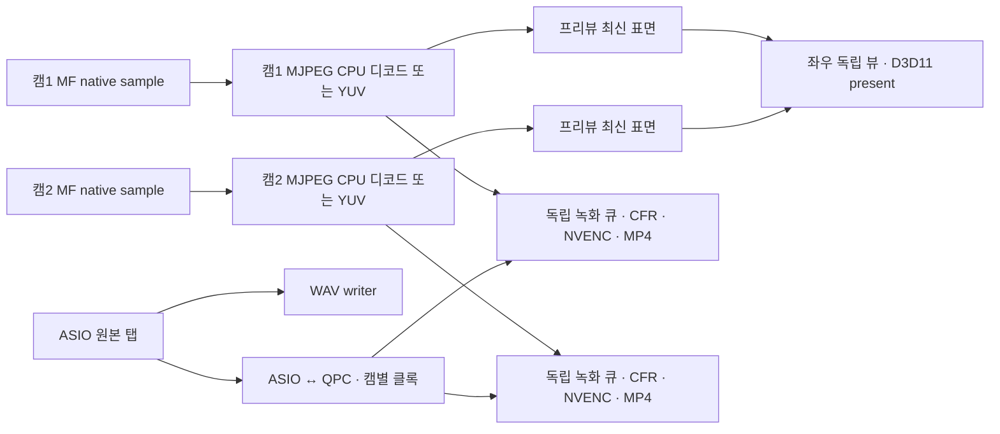

# Recorder(가칭) 설계 (2026-09-09)

웹캠 최대 2대와 ASIO 원본 최대 8채널을 녹화·녹음하고, 정지 직후 같은 앱의 타임라인에서 컷 편집하는 별도 Windows 앱이다. **P0는 녹화·녹음 중 캠1·캠2 프리뷰가 동시에 낮은 지연으로 끊김 없이 보이는 것과 ASIO 원본을 빠짐없이 기록하는 것이다.** 이 기준을 통과하지 못하면 후속 기능이 완성되어도 출시할 수 없다.

CEO의 2026-09-09 확정 요구와 13:20~13:35의 내보내기·더빙·독립 오디오 편집 정정을 기준으로 한다. 구현 계획은 [Recorder 라운드 계획](../plans/2026-09-09-recorder.md)에 있다. 이 세션의 산출물은 이 설계서와 계획서뿐이며 코드·CMake·설치기·SDK는 수정하지 않는다.

## 1. 근거와 확인 상태

### 1.1 읽은 자료와 적용 범위

| 자료 | 확인 결과·적용 |
|---|---|
| `C:/Users/claude/tools/claude_harness/avrec_feasibility_OUT.txt` | 1차 자문 있음. ASIO 마스터, QPC 연결, 원본 탭, WAV 청크·저널·복구, 재사용 경계를 가져온다. 이전의 OBS 대조 우선·MKV·48kHz 고정·1캠 한정 권고는 이번 확정 요구로 대체한다. |
| `C:/Users/claude/tools/claude_harness/avrec_timeline_OUT.txt` | 파일 없음. 건너뛰었으며 2차의 상세 설계·견적을 확인했다고 쓰지 않는다. |
| `C:/Users/claude/tools/claude_harness/avrec_multicam_OUT.txt` | 3차 자문 있음. 12세션, 5060 Ti의 NVENC 1개, MJPEG CPU 부담, hybrid MP4, WAV/AAC, 유리수 FPS·짧은 GOP, 카메라별 시각 보정, 복구·정지 응답 목표만 채택한다. 3~4캠 하드웨어 표·앵글 선택 모델·DeckLink·PCIe 논의는 폐기한다. |
| [LiveMix 설계](2026-09-04-livemix-design.md), [계획](../plans/2026-09-04-livemix.md), [Stream Deck 설계](2026-09-08-livemix-streamdeck-design.md) | 결정·인터페이스·스레드·테스트 근거와 체크리스트 형식을 따른다. 다른 기능의 승인 절차·비목표·구현 이력을 Recorder에 자동 적용하지 않는다. 끝의 빈 `Claude 검토 반영` 절만 마련한다. |
| 현재 `recorder` 브랜치의 `livemix/src/`, `src/`, 루트 CMake, `tools/release.py`, `installer/`, `site/` | 아래 재사용 표의 근거. 설계 시작 시 작업 트리는 깨끗했다. `build/`는 조사·실행 대상에서 제외했다. |

**표기 규칙:** “확인”은 이 세션의 읽기·명령 결과 또는 명시한 공식 자료의 사실이다. “결정”은 앞으로 구현할 계약이다. 지연·처리량·복구 수치는 **합격 목표이며 실측 결과가 아니다.** 확인하지 못한 항목은 `미확인 → 스파이크 N`으로 연결한다. 스파이크 번호는 §14와 계획서에서 공통으로 사용한다.

### 1.2 개발 환경과 버전 고정

| 항목 | 고정값·확인 범위 |
|---|---|
| 앱 기반 | Windows x64, C++17, MSVC, JUCE **8.0.15**. 루트 `CMakeLists.txt`와 `C:/Users/claude/JUCE/modules/juce_core/system/juce_StandardHeader.h`에서 확인. |
| FFmpeg 배포 계열 | **BtbN n8.1 win64-lgpl-shared**. 개발 SDK 루트 `C:/Users/claude/SDKs/ffmpeg-lgpl/`. n9.0·master로 자동 갱신하지 않는다. |
| 실제 SDK 디렉터리 | `C:/Users/claude/SDKs/ffmpeg-lgpl/ffmpeg-n8.1-latest-win64-lgpl-shared-8.1/` |
| 실제 바이너리 버전 | `ffmpeg -version`: **n8.1.2-51-g7ba069f4f1-20260908**. 폴더명의 `latest`를 버전 식별자로 사용하지 않는다. |
| 라이브러리 ABI | avcodec 62.28.102, avformat 62.12.102, avutil 60.26.102, swscale 9.5.102, swresample 6.3.102. 같은 아카이브의 헤더·import library·DLL을 묶는다. |
| 아카이브 | `ffmpeg-n8.1-win64-lgpl-shared.zip`, SHA-256 `B74C95A1976622F93F9C3CE73551683F4167646B155D9BFE9F2E132E5503E7EB` — 로컬 계산 확인. |
| 기능·라이선스 | `h264_nvenc`, `d3d11va`, MP4 `hybrid_fragmented` 옵션 있음. `--enable-shared --disable-static --enable-version3`, `--disable-libx264 --disable-libx265 --disable-libfdk-aac` 확인. `-L` 및 동봉 LICENSE는 **LGPL v3-or-later**. 옵션 존재와 실제 GPU 처리 성공은 구별한다. |
| ASIO | HKLM의 `SOFTWARE/ASIO/FlexASIO` 등록을 다시 확인. **FlexASIO 1.10b·WASAPI 백엔드는 Claude가 2026-09-09 13:33 설치 후 레지스트리로 확인한 사실**이다(CEO 제공 사실이 아님). “설치 예정”이라는 이전 제약을 대체한다. 실제 장치 열기·시간정보 품질은 미확인 → 스파이크 2. |
| 카메라 | 개발 PC에 웹캠 없음. GC311G2를 UVC 대체 입력으로 쓴다. NV12/YUY2/MJPEG 1080p60 제공은 CEO 제공 사실이며 MF에서의 조합별 열거·실제 전달 cadence는 미확인 → 스파이크 1. 웹캠 2대 연결 후 검증은 스파이크 3. |
| GPU·스튜디오 인터페이스 | 스튜디오는 NVIDIA 전제. 5060 Ti의 엔진 수는 공식 사양이고 이 PC의 GPU·드라이버·ASIO 하드웨어 성능 인증은 아니다. 실제 조합·드라이버 버전·유효 입력 비트수는 미확인 → 스파이크 1·2·3. |

핵심 DLL의 로컬 SHA-256도 고정 식별에 사용한다: `avcodec-62.dll = B5D79DDAF7186D8F07BD33D14EC0ADF1E6DC54B576A86D7E900A2638D0B44D7F`, `avformat-62.dll = 454F6E59EE61316BD8F522753E1C4B49042A4320EAD7B21A27B318C58E35E07B`, `avutil-60.dll = 4BC98F2E69FDDFE8685CCE641B7399D58BB2B1F71D4D9C88055DBE71B42E11A0`. 전체 의존 DLL·대응 소스·빌드 레시피 잠금은 미확인 → 스파이크 8. 빌드 배포 형태의 근거는 [BtbN 저장소](https://github.com/BtbN/FFmpeg-Builds)다.

## 2. 목표·비목표와 핵심 계약

| 구분 | 확정 범위 |
|---|---|
| 카메라 | **웹캠 1~2대**, 우선 승인 조합 Logitech StreamCam + C920. 모든 저장 영상은 1920×1080. 프로젝트에서 **30 또는 60fps** 선택. 캠2 없음·끔은 정상 세션이다. |
| 원본 오디오 | ASIO 장치 1대 독점, 선택한 물리 입력 최대 8개를 각각 mono PCM 24bit WAV로 저장. 샘플레이트는 인터페이스가 실제 연 값. 입력 간 동일 샘플 위치·개수를 유지한다. |
| 재생 출력 | 사용자가 **ASIO 출력 L/R 채널을 각각 선택**한다. 비연속 채널도 허용하고 같은 물리 채널 중복 선택은 거부한다. 모노 출력 선택 시 L/R 평균을 한 채널로 보낸다. 선택하지 않은 출력은 0이다. |
| 녹화 포맷 | 캠별 MP4, H.264, 1080p, SDR 8bit 4:2:0. 녹화 중 fMP4, 정상 정지 후 일반 MP4. MP4의 오디오는 **AAC-LC 48kHz stereo 192kbps 한 스트림**. WAV가 마스터다. |
| 편집 | 영상·오디오 클립의 스플릿, 앞뒤 트림, 삭제, 구간 삭제, 이동, 순서 바꾸기, 마커, undo/redo. 기본은 테이크 링크. **링크 해제 후 오디오도 트랙별·클립별로 같은 컷 연산**을 한다. |
| 보기 | 녹화 프리뷰와 타임라인 재생 모두 캠1·캠2가 **좌우 나란히** 보인다. 영상 트랙은 세로 2행, 시간 눈금·플레이헤드는 하나다. 화면에 두 뷰를 표시하는 것은 녹화·내보내기 화면 합성 기능이 아니다. |
| 일반 녹화 | 정지한 테이크를 현재 타임라인의 **마지막 활성 클립 끝**에 붙인다. 번호+시각 자동 이름. 원본 파일은 타임라인 편집으로 수정·삭제하지 않는다. |
| 더빙 | 완성 오디오 파일을 불러와 ASIO 출력으로 재생하면서 영상 녹화. 플레이헤드의 **정수 샘플 시작 위치에 배치**한다. 마이크 원본 녹음은 선택·기본 꺼짐. 같은 구간 재녹화는 복원 가능한 테이크 버전으로 쌓는다. |
| 내보내기 | ① 소재 뽑기: 캠별 MP4·마이크별 WAV. ② 최종본 뽑기: 캠 하나 + 오디오 소스 하나를 선택한 MP4 하나. 두 모드 모두 편집한 타임라인을 사용한다. |
| 저장 | 로컬 프로젝트 폴더. 앱의 녹화 시간·파일 크기·프로젝트 용량 제한 없음. 남은 실제 공간만 표시하고 디스크가 쓰기를 거절하면 오류 처리한다. 완료 테이크와 저장 확인된 편집 상태 복구. |

**비목표:** 3대 이상 카메라, 앵글 선택·스위칭 편집/출력, 화면 합성·PIP, 외부 영상 파일 편집기, 4K·HDR·HEVC·다른 영상 컨테이너, 비 NVIDIA 성능 폴백, 웹캠 마이크·WASAPI 직접 입력, 여러 ASIO 장치 합치기, LiveMix 동시 사용, PluginHost/VST·사용자 볼륨·페이드 곡선·이펙트·팬, 타임스트레치, 오디오 펀치인·컴핑·오디오 오버더빙, 프록시 생성, 스마트컷, 네트워크 저장·온라인 백업·Stream Deck/원격 제어. 더빙의 **기존 오디오 재생+영상 녹화와 선택적 동시 원본 마이크 수집은 필수 범위**다.

## 3. 사용자 흐름과 버튼 동작

### 3.1 프로젝트 준비·일반 녹화

1. `새 프로젝트`에서 이름·로컬 폴더·`프레임레이트 30 / 60`을 고른다. `설정 > 오디오 장치`에서 ASIO와 출력 채널, `카메라`에서 캠1·선택적 캠2를 고른다. 첫 미디어 생성 시 인터페이스 샘플레이트와 프로젝트 fps를 고정한다.
2. `녹화` 화면에 들어가면 카메라를 미리 열고 프리뷰·클록 매핑을 준비한다. 카드에 `캠1 · 1080p 60 입력 / 프로젝트 60`, `캠2 · 1080p 30 입력 / 프로젝트 60`처럼 실제 입력과 출력 격자를 구분한다. 각 마이크의 `녹음` 스위치·입력 번호·이름·미터를 확인한다.
3. `녹화 시작`은 선택한 웹캠과 암된 원본 마이크를 하나의 테이크로 시작한다. 일반 녹화에서는 캠1과 최소 1개 마이크가 준비되어야 한다. 장치·입력 매핑·fps 변경은 녹화가 끝난 뒤 가능하다. 처음부터 입력 없는 더빙은 §3.3을 따른다.
4. `마커 추가`는 현재 테이크의 샘플 위치를 남긴다. 녹화 중 두 프리뷰는 계속 살아 있다. 화면 탭을 바꾸어도 상단 두 뷰는 라이브이고 `녹화 중` 표시를 유지한다. 기존 영상의 타임라인 재생·스크럽·컷 편집은 녹화 중 비활성화한다. 더빙에서 필요한 기존 **오디오 재생만** 예외다.
5. `정지`는 입력 수집 종료 샘플을 확정하고 현재 클립들의 최대 끝 샘플에 테이크를 배치한다. 간격을 자동 삽입하지 않으며 마커·비활성 리테이크는 마지막 클립 계산에서 제외한다. 녹화 중 구조 편집을 막으므로 시작할 때 예약한 배치 위치가 바뀌지 않는다.
6. 버튼 입력부터 **250ms 이내 클립 표시**, 정지 직후 `방금 테이크 재생` 요청 시 **정지부터 2초 이내 첫 화면+오디오**가 목표다. 클립의 `마무리 중`은 파일 작업 상태이며 표시·재생의 선행 조건이 아니다. 표시 후 저장 확인 전에는 `저장 중`을 보인다. 정상 종료 완료는 미디어·저널 flush 후에만 선언한다.

### 3.2 타임라인 편집

| 조작·문구 | 동작 |
|---|---|
| `재생 / 일시정지 / 정지`, Space | 하나의 transport. 재생 시 ASIO 출력에 오디오를 한 번만 렌더하고 두 영상은 같은 시각을 따른다. `정지`는 현재 위치 유지, `처음으로`는 프로젝트 0으로 이동. |
| 시간 눈금 클릭·드래그 | 플레이헤드 이동/스크럽. 드래그 중 오디오는 무음. 놓은 위치의 두 영상·파형을 표시한다. |
| 클립 클릭 | 링크가 있으면 연결된 클립도 선택. 테두리·체인 아이콘으로 실제 편집 대상을 보여 준다. 선택·플레이헤드 이동만으로 저장 이력을 만들지 않는다. |
| `스플릿`(S) | 플레이헤드에서 선택 클립과 링크 구성원을 함께 나눈다. 링크 해제된 오디오는 해당 오디오만 나눈다. |
| 좌우 끝 드래그, `앞 트림 / 뒤 트림` | 원본 In/Out만 바꾼다. 앞 트림은 클립 시작도 움직여 남은 내용의 절대 위치를 보존한다. 원본 밖으로 확장할 수 없다. |
| `삭제`(Delete) | 선택 클립/선택 구간을 제거하고 빈 시간을 남긴다. 파일은 보존한다. |
| `구간 삭제하고 당기기` | 기본 대상은 모든 트랙. 선택 구간을 잘라내고 뒤의 클립·마커·테이크 버전을 같은 길이만큼 당긴다. 오디오만 독립으로 당길 때는 §9의 대상 규칙을 사용한다. |
| 클립 드래그, `앞으로 / 뒤로` | 이동은 빈 공간으로 위치 변경. 순서 바꾸기는 지정한 인접 클립/묶음 앞뒤에 삽입하며 관련 묶음의 길이만큼 시각을 재계산한다. 허용하지 않는 겹침은 드롭 전에 표시하고 확정하지 않는다. |
| `링크 해제 / 선택 클립 링크` | 원본 테이크의 출처는 유지하고 편집 연결만 변경한다. 다시 링크해도 자동으로 과거 시각을 맞추거나 이동하지 않는다. |
| 트랙 `음소거 / 솔로` | 타임라인 청취 상태. 파형은 유지한다. 원본 녹음 암과 별개다. 사용자 페이더·페이드 핸들은 없다. |
| `마커 추가`(M), 마커 목록 | 샘플 위치·이름·색을 저장. 더블클릭으로 이동, 이름 변경·삭제는 undo 가능. |
| `실행취소 / 다시실행`(Ctrl+Z / Ctrl+Shift+Z) | 한 제스처를 한 단계로 복원. 예: `실행취소: 마이크 2 트림`. 테이크 배치를 취소해도 테이크 목록에서 원본을 다시 넣을 수 있다. |

### 3.3 더빙과 리테이크

1. `더빙` 모드의 `오디오 파일 불러오기`로 WAV/MP3/M4A 등을 고른다. 원본을 프로젝트로 복사하고 기존 JUCE 포맷 및 `MediaFoundationAudioFormat`으로 디코딩한다. 파일 하나를 독립 오디오 트랙의 현재 플레이헤드 위치(새 프로젝트 기본 0)에 배치하며 파형·컷 연산·음소거·솔로를 동일하게 제공한다. 다른 샘플레이트 파일은 파생 재생 캐시만 프로젝트 레이트로 변환한다.
2. 오디오 트랙과 ASIO 출력을 선택하고 플레이헤드를 둔다. `오디오 재생`으로 청취할 수 있다. `영상 녹화 + 재생`은 준비된 오디오 재생과 카메라 기록을 같은 ASIO 출력 예정 샘플에서 시작한다. `마이크도 녹음`은 기본 꺼짐이고 켰을 때만 암된 최대 8채널의 새 원본 WAV를 추가한다.
3. `Pstart`는 버튼을 누르기 전에 보이는 플레이헤드 샘플이다. 실제 소리가 출력되는 클록 원점 `O0`와 카메라 시각의 대응은 §7에서 정한다. 녹화 시작 준비에 걸린 벽시계 시간이나 카메라 콜백 도착 지연을 배치 위치에 더하지 않는다.
4. `정지`하면 영상 클립은 **Pstart**에 나타난다. 일반 녹화처럼 끝으로 보내지 않는다. 기존 완성 오디오를 자르거나 새로 녹음하지 않는다. 새 테이크 링크에는 캠1·캠2·선택적 마이크만 포함한다. 재생한 완성 오디오는 독립 트랙이며 사용자가 필요하면 명시적으로 링크할 수 있다.
5. `같은 구간 다시 녹화`는 방금 녹화한 구간의 시작으로 되돌아가 같은 범위를 녹화한다. 새 버전이 위에 놓이고 두 캠 및 선택적 마이크의 활성 버전이 **한 번에** 바뀐다. `테이크 목록 > 이 테이크 사용`으로 이전 버전을 전체 구간 단위로 되살린다. 시간에 따른 캠 선택 이벤트는 없다.
6. 첫 녹화의 정지점이 리테이크 범위 끝이다. 이후 리테이크는 해당 끝에서 자동 정지하며 조기 정지는 허용한다. 조기 정지한 새 버전의 남은 구간은 빈 영상/무음으로 표시하고 옛 버전을 몰래 섞지 않는다. 다른 구간을 녹화하려면 새 시작/끝 범위를 잡는다. 전체 범위 교체 규칙과 원본 보존은 §9.4를 따른다.
7. 더빙 녹화 중 완성 오디오의 편집·seek·출력 변경은 잠근다. 재생 underrun이나 ASIO 재설정은 동기 정상 녹화로 숨기지 않고 테이크를 중단·부분 완료 처리한다. 마이크 소프트웨어 모니터는 기본 꺼짐이며 완성 오디오 재생과 ASIO 입력 녹음은 서로 별도 경로다.

## 4. 아키텍처와 재사용 경계

### 4.1 모노레포 배치

별도 앱 폴더 `recorder/`, 타깃 `Recorder`, 내부 namespace `gocue::recorder`를 쓴다. 표시명·설정 폴더·확장자·설치기 이름·업데이트 식별자를 `ProductIdentity` 한 곳에서 공급한다. 초기 제안은 `%APPDATA%/Recorder/`, `.recorder`, `Recorder.Project`이며 표시명 변경 때 마이그레이션 별칭을 남긴다. 외부 공개 이후 AppId·프로젝트 UUID는 이름 변경 때문에 새로 만들지 않는다.

현재 `GoCueCore`는 INTERFACE 타깃이며 Cue 모델·PluginHost까지 소스를 전파한다. **새 앱이 기존 AudioEngine과 MixEngine을 동시에 생성하여 ASIO 장치를 두 번 열지 않는다.** 미래 구현에서 `RecorderCommon`에 필요한 기존 파일만 명시적으로 연결하고 `RecorderCore`에 신규 모델·엔진을 넣는다. 재사용을 이유로 Cue·플러그인 데이터 모델 전체를 타임라인 모델로 삼지 않는다.

| 기존 후보 | 소스에서 확인한 역할·제약 | Recorder의 사용 |
|---|---|---|
| `livemix/src/MixEngine.*`, `MixModel.*` | ASIO 타입 선택·전 입출력 열기·설정 실패 복원·최대 8개 논리 마이크. `renderBlock`은 그래프 try-lock 실패 시 반환, 모노를 stereo로 복제하고 플러그인을 처리한다. | 장치 관리·채널 이름·실패 복원 패턴만 재사용. 원본 탭·저장·클록은 신규. 그래프 뒤에서 녹음하지 않는다. |
| `MixDocument.*`, `LiveMixSettings.*` | 문서→엔진 반영, 변경 알림, 앱별 settings 폴더 | 문서 소유·상태 알림·설정 패턴. MixSession 직렬화는 타임라인 저장에 쓰지 않는다. |
| `ControlServer.*` | 공개 메서드 message-thread 전용, MixDocument/MuteGroups 의존 | MVP 연결하지 않음. 향후에도 Recorder 명령 모델은 별도여야 한다. |
| `AudioEngine.*`, `CuePlayer.*` | 큐 재생·출력·포맷 등록·리샘플러/플러그인 소유 | 포맷 등록·출력 채널 정책·오프라인 렌더 분리 패턴. CuePlayer를 영상 클립마다 생성하지 않는다. |
| `ReadAheadSource.*` | worker read-ahead, generation 무효화, 캐시 부족 시 무음. rangeLock/readLock 존재 | 캐시·generation 패턴과 worker 측 소스 어댑터 재사용. 엄격한 ASIO 콜백에서는 자체 사전 할당 SPSC 재생 큐를 소비한다. 기존 lock을 RT 무잠금이라고 부르지 않는다. |
| `RegionLoopSource.*` | 파일 In/Out·가상 위치 변환, 루프/슬라이스·스핀락 | 단일 파일 구간 reader의 worker 측 어댑터로 사용 가능. 다중 트랙 위치·리테이크·리플 편집 모델은 신규. |
| `ProjectHistory.h`, `ProjectDocument.*` | message-thread 스냅샷 이력, `perform`, 깊이 200, 병합 창 700ms | 메타데이터 스냅샷·트랜잭션 패턴. 기존 Project/Cue에 종속된 타입은 그대로 연결하지 않는다. |
| `ProjectSerializer.*`, `SafeFileWrite.*` | JSON 검증, 미래 버전 거부, 임시 파일 바이트 검증→교체 | 신규 schema serializer + 작은 checkpoint의 검증 쓰기. 미디어 append·다중 파일 내구성은 별도 구현. |
| `MediaFoundationAudioFormat.*`, `HighQualityResampler.*` | MF는 float PCM 오디오 reader이며 writer 없음. M4A 등의 seek는 preroll 버림. 고정 비율 리샘플러 있음 | 완성 오디오 import·파생 PCM 캐시. 카메라 캡처기나 원본 오디오 클록 보정기로 사용하지 않는다. |
| `WaveformView.*`, `TransportBar.*`, `TimeLoopsPanel.*` | Cue 기반 단일 파형·트림/슬라이스·GO/큐 transport | 그리기·zoom·드래그 확정 방식·룩앤필 재사용. 공통 시간축을 가진 다중 트랙 컴포넌트와 transport 바는 신규. 루프·볼륨 곡선 UI는 가져오지 않는다. |
| `Updater.*`, `AppSettings.*` | WinSparkle `canShutdown/requestShutdown`, 앱별 저장소 | 녹화·더빙·복구·export·미저장 작업 중 업데이트 종료를 지연하는 연결. |
| CMake·release.py·installer·site | 앱별 릴리스 표, Inno per-user, 별도 appcast/site, 게시 플래그 | Recorder 독립 등록·FFmpeg 의존물 포함·다른 앱 링크 보존. 현재 세션에서 변경하지 않는다. |

### 4.2 신규 모듈 계약

아래 인터페이스 이름과 경로는 **구현 제안이며 아직 존재하는 코드가 아니다.** `publish`는 불변 상태/사전 할당 메시지 전달, `Result`는 오류를 호출자에게 돌려준다는 계약이다.

| 모듈 (`recorder/src/` 기준) | 책임·주요 공개 인터페이스 | 의존 | 실행·소유 스레드 |
|---|---|---|---|
| `app/ProductIdentity`, `RecorderSettings` | 제품 식별·장치/출력/보정값 설정, `load/save`, `resolveIdentity` | JUCE properties, device descriptor | message; 저장은 작업 스레드 |
| `model/RecorderModel`, `RecorderSerializer` | Project/Asset/Take/Track/Clip/TakeStack, `validate`, `read/writeCheckpoint` | JUCE core, SafeFileWrite | message / 파일 worker |
| `app/RecorderDocument`, `EditHistory` | `performEdit`, `undo/redo`, `placeTake`, `selectTakeVersion`, revision 발행 | 모델, 저널, RenderPlanCompiler | message; 디스크 완료를 비동기 수신 |
| `audio/RecorderAudioEngine` | ASIO 하나, `openDevice`, `setOutputMap`, `prepare`, `processBlock`, `startAt/stopAt` | AsioTimingBridge, RawAudioTap, playback queue | 장치 전환 message; 실시간 callback |
| `audio/AsioTimingBridge`, `RawAudioTap` | native PCM 뷰·시간정보, `onAsioBlock(BlockStamp, NativeViews)`, bounded enqueue | 좁은 JUCE ASIO 확장 | ASIO callback; 해제·진단 집계는 외부 |
| `sync/ClockMapper`, `CameraClockMapper` | `observe`, `mapToSample`, `resetEpoch`, `quality`, 고정 지연 보정 | ASIO·QPC·MF 시각 관측 | sync worker; 읽기는 immutable snapshot |
| `capture/CameraCatalog`, `MfCameraCapture` | `enumerateDevices/types`, `open/start/stop`, `onSample`, 장치 generation | MF SourceReader, UVC | MTA 제어 worker + MF 비동기 callback |
| `video/CaptureFrameDecoder`, `VideoSurfacePool` | MJPEG→YUV, 업로드/색 변환, `decode`, 프레임 수명 | FFmpeg CPU MJPEG, D3D11 | 캠별 decode worker + GPU 작업 소유자 |
| `video/PreviewPresenter` | `publishLatest(camera, surface, stamp)`, 좌우 live/playback 뷰, pacing | D3D11/DXGI, HWND host | GPU/present thread; UI는 상태/크기만 전달 |
| `record/VideoCfrScheduler`, `NvencEncoder` | 원래 시각→공통 CFR, `selectFrame`, `submit`, `drain` | 클록 mapper, FFmpeg h264_nvenc | 캠별 record/encode worker |
| `record/WavTrackWriter`, `ReferenceMixWriter`, `Mp4TakeWriter` | WAV 청크·AAC 한 믹스·MP4 packet 기록, `append/flush/finalize`, 오류 | raw PCM queue, FFmpeg, durable file I/O | 오디오 writer 1개 + 캠별 mux worker |
| `record/TakeController` | `arm/start/stop`, 일반/더빙 배치 원점, 상태 전이 | audio/capture/writers/document | message coordinator, callback에서는 예약 샘플만 채택 |
| `storage/RecordingJournal`, `DurableFile`, `RecoveryScanner` | `appendCommit`, `checkpoint`, `scan/recover`, 세대·CRC·유효 끝 | Win32 파일 I/O, serializer, FFmpeg | 전용 journal/recovery worker |
| `playback/RenderPlanCompiler`, `TimelineAudioRenderer` | `compile(revision)`, `renderAudio(sampleRange, sourceMask)`; 실시간 준비와 offline 공통 | 모델, JUCE 포맷/구간 reader, 자동 microfade | compile/read/render worker; 콜백은 결과 큐 소비 |
| `playback/VideoPlaybackEngine`, `TimelineTransport` | `prepare/seek/play/pause`, `requestFrame(camera, sample, generation)` | FFmpeg H.264 d3d11va, 공통 ASIO cursor | 캠별 decode worker, transport 예약은 callback |
| `media/AudioImport`, `PeakCache`, `ThumbnailCache`, `MediaIndex` | `import`, source 샘플/프레임 인덱스, 점진 파형·썸네일 | 포맷 reader, 파일, capture 참조 | 낮은 우선순위 worker; 녹화 중 후순위 |
| `export/ExportController`, `TimelineExporter` | `prepare(job)`, `render/cancel`, 소재/최종 소스 선택·공통 구간 | 불변 RenderPlan, FFmpeg, offline audio renderer | export worker; 녹화와 동시 실행 금지 |
| `diagnostics/CaptureTelemetry` | drop 원인·지연·큐·xrun·durable watermark, `readSummary` | POD 이벤트 큐 | 집계 worker, UI 10Hz |
| `ui/RecorderLookAndFeel`, `RecordView`, `TimelineView`, `ExportDialog` | 한국어 버튼·상태·파형·두 영상 host | document/transport의 공개 명령 | JUCE message thread |

### 4.3 스레드·수명 규칙

- ASIO callback에서 메모리 할당, 파일 I/O, JSON, COM 호출, GPU 대기, mutex, 디코드/인코드, shared_ptr 최종 해제를 하지 않는다. 입력 원본 복사→예약 transport 채택→준비된 재생 블록→선택 ASIO 출력 순서다. 큐의 슬롯·최대 블록 크기는 장치 준비 시 할당한다.
- MF callback은 시각·샘플 참조만 캡처 큐에 전달하고 다음 ReadSample을 요청한다. 샘플의 Release와 큰 버퍼 반환은 소유 worker에서 한다. 드라이버 버퍼를 오래 잡지 않도록 자체 풀로 옮기는 경로를 측정한다.
- 각 카메라가 자신의 디코더·CFR·인코더·mux 상태를 소유한다. 프리뷰 최신 슬롯과 녹화 FIFO의 참조/여유 슬롯은 분리한다. 인코더가 표면을 오래 붙잡아도 프리뷰가 풀 고갈로 정지하지 않게 예약 슬롯 또는 encode 전용 GPU 복사를 둔다.
- D3D11 immediate/video context의 다중 스레드 호출은 무보호로 공유하지 않는다. PreviewPresenter의 context와 decoder/encoder context 수명·공유 texture/fence를 명시하고 비동기 완료를 확인한다. FFmpeg D3D11 context lock은 GPU worker 내부에서만 사용한다. 공유 장치·표면의 실제 동작은 미확인 → 스파이크 1·5.
- 종료는 새 명령 차단→마지막 수집 경계→callback 분리→queue drain→파일/저널 flush→worker join→COM/D3D/DLL 해제 순서다. 늦게 도착한 callback·seek·마무리 결과는 project/device/take generation으로 폐기한다.

## 5. P0: 캡처→프리뷰 파이프라인과 지연 보장

### 5.1 캡처·디코드 결정

**캡처는 Media Foundation 비동기 SourceReader, MJPEG의 기본 디코드는 고정 FFmpeg의 CPU MJPEG 디코더로 결정한다.** SourceReader에서는 가능하면 장치의 native NV12/YUY2/MJPEG를 요청한다. MJPEG는 compressed sample을 받아 캠별 worker에서 한 번만 디코딩하고 프리뷰·인코딩이 그 결과를 공유한다. 두 소비자를 위해 각각 MJPEG 디코드를 반복하지 않는다.

이 결정의 이유는 NVDEC 공식 지원 코덱에 MJPEG가 없어 NVDEC 예산에 넣을 수 없고, FFmpeg를 이미 고정 배포하므로 디코더 선택·스레드 수·처리 시간·타임스탬프 보존을 앱에서 제어할 수 있기 때문이다. MF 내장 디코더가 더 빠르다고 확인된 사실은 없다. **MF 디코드 비교는 스파이크 1의 대안 실험**으로 유지하고 P0·정확한 원래 시각·색 변환을 통과하면 해당 장치 프로파일만 MF 경로로 바꿀 수 있다. MF가 하드웨어 디코더를 허용한다고 MJPEG GPU 디코드를 보장하지 않는다. [NVIDIA NVDEC 코덱 표](https://docs.nvidia.com/video-technologies/video-codec-sdk/13.1/nvdec-application-note/index.html), [Microsoft Source Reader](https://learn.microsoft.com/en-us/windows/win32/medfound/source-reader)

SourceReader는 `MF_LOW_LATENCY`를 요청하고 일반 소프트웨어 RGB32 video-processing 경로를 피한다. YUV를 보존해 D3D11에서 미리보기용 RGB로 변환하고 encoder에는 NV12를 공급한다. YUY2/MJPEG의 full/limited range·색행렬 정보를 확인해 **BT.709 limited, SDR 8bit 4:2:0**로 정규화하며 메타데이터만 바꾸지 않는다. MF timestamp·sample attribute는 디코드 전에 별도 보존한다. [저지연 속성](https://learn.microsoft.com/en-us/windows/win32/medfound/mf-low-latency), [D3D manager 속성](https://learn.microsoft.com/en-us/windows/win32/medfound/mf-source-reader-d3d-manager)

| 장치 | 준비 전제와 프로젝트 CFR |
|---|---|
| StreamCam | 자료상 1080p60은 MJPEG에서만 가능하다는 **CEO 제공 전제**를 채택한다. 제조사 페이지에서 최대 60fps는 확인했으나 모든 subtype×fps 조합은 확인되지 않음 → 스파이크 3. 1080p60을 무압축 모드로 강제하지 않는다. |
| C920 | 제조사 사양상 1080p30 최대. 프로젝트 60에서는 **30 native 프레임을 시간에 맞게 반복해 60 CFR**로 만든다. 새 움직임 정보가 60개 생기는 것은 아니다. |
| 프로젝트 30 | 두 장치의 안정된 1080p30 native 모드를 우선. 입력이 유리수 29.97/59.94 등이면 실제 분자/분모를 읽어 30/1로 시간 보존 CFR 변환. |
| 프로젝트 60 | StreamCam 60 + C920 30 native가 승인 시험 대상. 출력은 두 MP4 모두 60/1. 2×60=120fps 인코딩을 예산으로 잡는다. |

근거: [StreamCam 사양](https://support.logi.com/hc/en-001/articles/360042528854-StreamCam-Technical-Specifications), [C920 사양](https://www.logitech.com/en-au/shop/p/c920-pro-hd-webcam). GC311G2 결과만으로 웹캠을 승인하지 않는다.



라이브 프리뷰를 방금 기록한 H.264의 디코드 결과로 만들지 않는다. 프리뷰는 최신 입력을 보여 주며 CFR 녹화 스케줄·오디오 지연 맞추기·다른 캠의 도착을 기다리지 않는다. 두 카메라의 노출 위상을 동일하게 만드는 기능도 아니다.

### 5.2 수치 예산과 합격 정의

지원 프로파일의 조건은 로컬 저장, 선택한 ASIO 버퍼, 60Hz 이상 모니터, 승인 USB 포트·노출 설정, 녹화 중 export 없음이다. 아래 표는 **단계별 설계 예산**이며 단계 p95를 더하면 전체 p95가 된다는 통계 주장이 아니다. 전체 광학 지연을 별도 측정한다.

| 단계 | native 60fps 예산 | native 30fps 예산 | 계측 |
|---|---:|---:|---|
| 노출·센서·웹캠 내부·USB·MF native callback 도착 | 50ms | 85ms | 광학 이벤트/촬영 시험과 callback QPC 비교. 장치 종속, 미확인 → 스파이크 3 |
| callback 전달·decode worker 대기 | 2ms | 2ms | 큐 입력/작업 시작 QPC |
| MJPEG CPU decode | 8ms | 12ms | sample별 decode 시작/끝. NV12/YUY2는 해당 단계 거의 없음 |
| 색 변환·GPU 업로드 | 4ms | 4ms | CPU 및 GPU timestamp query |
| 최신 슬롯 선택·다음 present 기회 | 17ms | 17ms | 60Hz present, swapchain 대기열 최소화 |
| 스캔아웃·디스플레이 | 17ms | 17ms | 광학 실측, 모니터 조건 기록 |
| **예산 합계** | **98ms** | **137ms** | 합계는 계획값 |

**P0 합격 목표:** native 60 프리뷰의 glass-to-glass p95 ≤100ms·p99 ≤150ms, native 30은 p95 ≤150ms·p99 ≤200ms. OnReadSample 진입부터 Present 제출까지는 각 p95 ≤35ms / ≤45ms. C920을 프로젝트 60으로 변환해도 C920의 지연 기준은 native 30 기준이다. 달성 여부 전부 미확인 → 스파이크 1·3.

끊김은 평균 fps만으로 판정하지 않는다. 승인 부하의 1시간 시험과 스튜디오 3시간 시험에서 **의도하지 않은 캡처·decode·encode 누락 0, ASIO xrun/누락·중복 0, 큐의 지속 증가 0**을 요구한다. 원래 프레임 ID가 준비되어 있는데 `2×native frame period + 1 display period`를 넘겨 화면이 갱신되지 않으면 프리뷰 stall로 센다. 30→60 반복, 독립 클록의 CFR 보정, 화면 refresh와 native cadence 차이는 별도 카운터다. 불변 장면의 픽셀 동일성으로 손실을 판정하지 않는다.

### 5.3 구현으로 지키는 경계·부하 초과 시 정책

| 자원·우선순위 | 결정 |
|---|---|
| 프리뷰 | 캠당 최신 mailbox 1개 + present 중 표면. 오래된 표시 요청은 덮어쓴다. 60Hz present 루프는 JUCE의 파형·미터 repaint timer와 분리한다. 창을 줄여도 두 뷰의 native cadence를 임의로 낮추지 않는다. |
| 캡처 decode 큐 | 캠당 대기 native sample 2개를 초기값으로 한다. decode 중 1개는 별도. 늦어진 sample을 누적하지 않고 최신성을 복원하되 손실을 `captureDecodeOverflow`로 기록한다. 정상 합격 시험에서는 이 동작이 발생하면 실패다. |
| encode 표면 큐 | 초기 250ms(60fps 15개/30fps 8개) 상한. encoder reference용 별도 풀을 포함해 계수화한다. 프리뷰 예약 표면을 가져다 쓰지 않는다. |
| 압축 packet·오디오 큐 | 영상 packet 큐 초기 3초, 원본 오디오 큐 초기 4초. 큐는 레이트·최대 bit rate로 준비 때 할당한다. 2초 writer stall 시험에서 callback을 막지 않고 회복해야 한다. 메모리 한도는 녹화 시간/프로젝트 용량 제한과 다르다. |
| 정상 자원 여유 | 2캠60 encode 합산 120fps의 **1.3배인 156fps 이상**을 캡처 없는 별도 부하 시험의 초기 합격 목표로 둔다. 실제 capture+preview+8ch 동시 시험을 추가 통과해야 한다. |
| 우선순위 | ASIO 원본·더빙 오디오 출력, live preview/capture, 녹화 encode/write를 보호한다. 파형 상세화·썸네일·파일 해시·일반 MP4 후처리부터 중지/감속한다. 녹화 시작 전 진행 중 export를 정지된 체크포인트까지 멈춘다. |
| 지속 과부하 | 프리뷰 해상도는 창 크기로 축소할 수 있으나 갱신율을 먼저 낮추지 않는다. encode 큐가 넘치면 해당 캠을 부분 실패로 표시하고 마지막 안전 지점까지 보존한다. 프리뷰와 원본 오디오를 계속 유지한다. capture 손실은 표시·기록하고 정상 녹화로 위장하지 않는다. |
| 샘플 원본 위협 | 오디오 queue overflow·쓰기 실패·ASIO reset은 테이크 전체 수집 중단. 완성된 자료는 보존하고 원인을 알린다. 무음 삽입으로 정상 원본 파일인 척하지 않는다. |
| 설정 변경 | 실행 중 프로젝트 60을 30으로 몰래 바꾸지 않는다. P5가 여유 시험에 실패하면 녹화 밖에서 P3 프로파일을 비교한 뒤 동일 화질·P0 시험 결과로 결정한다. |

설계의 “보장”은 **검증한 장치·포트·드라이버 프로파일에 대한 출시 gate와 런타임 감시**다. 센서 지연이나 임의의 다른 프로그램 부하까지 소프트웨어 큐만으로 보장하지 않는다. 1초 이내 `처리 지연이 발생했습니다`를 표시하고 어떤 스트림의 원본/영상에 문제가 있는지 구분한다. 측정에 실패하면 P0 완료 표시를 하지 않는다.

## 6. 오디오 엔진·원본 녹음 탭

### 6.1 ASIO 장치 소유와 원본 보존

`RecorderAudioEngine`만 장치를 소유한다. 실제 물리 입력 중 최대 8개를 논리 마이크 ID에 매핑한다. JUCE의 활성 채널 배열 번호와 물리 채널 번호를 혼동하지 않도록 `activeIndex→physicalIndex` 표를 준비 때 고정한다. 녹음 암·입력 선택·프로젝트 샘플레이트는 한 테이크 동안 바꾸지 않는다.

**원본 탭은 ASIO native 입력 버퍼에서 JUCE float 변환·미터·모니터·음소거·믹스보다 앞**에 둔다. 좁은 확장이 native sample type/valid bits/stride와 채널별 뷰를 전달하고 callback에서는 선택 채널의 bytes와 stamp를 사전 할당 큐에 복사한다. writer가 PCM24 little-endian으로 packing한다. 24bit integer 입력은 부호·정렬을 보존한다. signed 16bit는 값에 256을 곱해 PCM24에 담아 부호와 정규화 진폭을 유지하며 하위 8bit를 0으로 채운다. 인터페이스가 32bit integer 또는 float만 제공하면 PCM24 변환이 필요하며 **24bit보다 많은 유효 비트를 bit-perfect 보존한다고 주장하지 않는다**. 변환 정책(반올림·포화·비유한 값 오류)과 원래 포맷을 take metadata에 기록한다. 형식별 결과는 미확인 → 스파이크 2.

실제 24bit 원본의 bit-perfect 판정은 0·최대/최소값·1 LSB·음수와 채널별 PRBS 패턴을 native fixture로 넣고 WAV PCM과 비교한다. JUCE float 왕복이 정확할 것이라는 가정만으로 native 탭을 생략하지 않는다. 드라이버가 노출하지 않는 자체 내부 손실은 버퍼 수 누적만으로 탐지할 수 없으므로 하드웨어 연속 신호·시간정보 검증을 병행한다.

### 6.2 믹스·청취·오디오 파일

| 경로 | 처리 |
|---|---|
| 원본 WAV | 암된 입력 각각 mono PCM24, 인터페이스 Fs. 리샘플·게인·페이드·음소거 없음. 모든 트랙 동일 `N0/Nstop`와 유효 샘플 범위. |
| 녹화 MP4 참조 오디오 | 일반 모드: 암된 마이크 M개의 동일 가중 평균 `sum/M`을 L/R에 복제한다. M은 테이크 시작 시 고정한다. WAV 탭 뒤 별도 worker에서 AAC-LC 48kHz 192kbps로 한 번 인코딩하고 두 MP4에 동일 시각의 packet 참조를 각각 mux한다. |
| 더빙 MP4 참조 오디오 | 선택한 완성 오디오 트랙의 해당 타임라인 구간을 사용한다. 원본 마이크도 녹음했더라도 참조 믹스에 중복 합산하지 않는다. 파일이 mono면 L/R 복제, stereo면 채널 유지. |
| 일반 타임라인 청취 | mute/solo로 선택된 오디오 track K개의 편집 결과를 동일 가중 평균한다. mono는 L/R 복제, stereo import는 유지한다. K는 발성/clip 공백에 따라 바꾸지 않고 mute/solo 선택이 바뀔 때만 ramp로 전환한다. 선택 track이 0개면 무음. |
| 재생·더빙 출력 | 프로젝트 샘플레이트의 준비된 PCM을 사용자가 선택한 ASIO 출력에 보낸다. 더빙 때는 선택한 완성 오디오만 재생하고 optional mic의 실시간 청취는 기본 꺼짐. 최종본 창의 소스 청취는 §11의 source mask를 사용한다. |
| 일반 소프트웨어 모니터 | `입력 소리 듣기`는 기본 꺼짐. 켜면 선택 마이크 평균을 ASIO 출력으로 보내지만 녹음 bytes·암 상태는 바뀌지 않는다. 플러그인·개별 게인 UI 없음. |
| import | 원본 파일을 `media/imports/`로 복사 완료→검증→등록. WAV/MP3는 JUCE, M4A/AAC 등은 기존 MF reader 사용. 읽을 수 없는 codec/DRM 파일은 사유를 표시하고 부분 등록하지 않는다. 실제 Windows별 codec·gapless 동작은 미확인 → 스파이크 6. |

AAC 선택은 MP4 단독 재생·인계 호환성을 위한 결정이다. 임의의 인터페이스 레이트를 AAC에 그대로 요구하지 않고 **파생 믹스만 48kHz**로 리샘플한다. AAC priming·마지막 padding을 codec metadata/edit list로 처리하고 presentation 0 및 실제 유효 길이를 별도로 검증한다. MP4 AAC를 다시 디코딩해 타임라인 마스터로 삼지 않는다. 지원 형식 근거는 [Adobe 포맷 목록](https://helpx.adobe.com/premiere/desktop/organize-media/import-files/supported-file-formats.html)이며 우리 생성 파일의 정확한 읽기 결과는 미확인 → 스파이크 7.

### 6.3 내부 클릭 방지

편집 결과 렌더에서만 불연속 경계 양쪽에 **기본 3ms 선형 microfade**를 적용한다. 길이는 각 인접 유효 조각 길이의 절반 이하로 제한하고 파일을 늘리거나 겹쳐 재생하지 않는다. 원본상 연속하고 같은 gain인 클립을 단순 스플릿한 경계에는 적용하지 않는다. mute/solo 전환·seek 시작/정지에도 짧은 ramp를 쓴다. 사용자 조절 UI·곡선·크로스페이드 기능은 없다.

실시간 청취·소재 WAV·최종 AAC 직전 PCM이 **같은 TimelineAudioRenderer**를 사용한다. 따라서 컷 주변 수 ms의 소재 WAV는 내부 페이드에 의해 원본과 다를 수 있다. 원본 청크는 그대로 보존되고 소스 연속 구간의 PCM은 변경하지 않는다. 변화 위치·길이와 golden 렌더 비교는 스파이크 6·7 및 컷 편집 라운드의 기준이다.

## 7. 클록·A/V 동기·더빙 지연 보정

### 7.1 시간 표현과 장치 매핑

- 프로젝트 오디오 레이트 `Fs`는 인터페이스 값, 모든 편집 좌표는 **int64 샘플**과 반개구간 `[start,end)`다. fps는 `{num,den}` 유리수로 저장하고 선택값은 `30/1`, `60/1`이다. native `30000/1001`, `60000/1001`을 정수 30/60으로 재해석하지 않는다.
- 카메라의 원래 MF PTS(100ns), `MFSampleExtension_DeviceTimestamp`, callback 도착 QPC, 프레임 번호, device epoch를 함께 기록한다. 문서상 DeviceTimestamp는 QPC와 epoch를 공유하지만 실제 센서 노출 시각인지·속성이 존재하는지는 미확인 → 스파이크 1·3. [Microsoft 시각 속성](https://learn.microsoft.com/en-us/windows/win32/medfound/mfsampleextension-devicetimestamp)
- `S(q)=a·q+b`를 ASIO↔QPC 관측으로 추정한다. 5~10초 관측 창·outlier 제거·완만한 slope 갱신을 초기안으로 하고 매 callback 지터로 영상 PTS를 흔들지 않는다. 추정 주기·임계값·드라이버별 의미는 미확인 → 스파이크 2.
- 캠 i마다 `q_i(p)=a_i·p+b_i`와 고정 잔여 지연 `Lcam_i`를 따로 둔다. 유효 DeviceTimestamp가 있으면 직접 QPC 단위 변환을 우선한다. 없으면 native PTS와 도착 QPC의 관계·지연 분포를 교정하고 낮은 clock quality를 기록한다. 콜백 도착시각을 노출시각으로 단정하지 않는다.
- 보정된 촬영 샘플은 `Nv = S(q_i(p) - Lcam_i)`다. 양의 Lcam은 timestamp가 물리 촬영보다 늦다는 뜻으로 정의한다. 지연값에 센서/MF·입력/출력 지연을 이중으로 포함하지 않는다. 보정 프로파일 키는 카메라 ID·native mode·fps·노출·ASIO driver·Fs·buffer·출력 mapping이다.

### 7.2 JUCE 시간정보 해결안

현재 JUCE 8.0.15 ASIO 소스에서 `kAsioSupportsTimeInfo=0`, `bufferSwitchTimeInfoCallback` 인자 무시, 상위 `AudioIODeviceCallbackContext {}` 전달을 확인했다. `hostTimeNs`만 읽으면 해결되지 않는다.

**좁은 JUCE ASIO 확장 + Recorder 전용 bridge를 선택한다.** 구현 단계에서 `tools/juce-patches/0002-recorder-asio-timing-tap.patch`로 재현하고 별도 준비한 JUCE 소스 사본에 적용한다. 공유 `C:/Users/claude/JUCE`를 수동 수정하는 절차는 피한다. Recorder 빌드 정의에서만 hook을 켜고 Enqueue/LiveMix의 기본 동작은 유지한다.

확장은 유효성 flags가 있는 `ASIOTime.samplePosition/systemTime`, callback 진입 QPC, buffer index, sample rate, native 입력 sample type/뷰, 장치가 보고한 input/output latency와 reset/xrun 사건을 **POD BlockStamp**로 전달한다. time-info 지원 협상을 하고 미제공 드라이버의 `getSamplePosition` 관측은 지연 비용을 검증한다. systemTime의 단위·epoch·버퍼 기준을 QPC라고 가정하지 않는다. native PCM 탭과 float 출력 변환 책임도 분리한다.

전용 ASIO host 어댑터로 JUCE 장치 구현 전체를 교체하면 열거·버퍼·포맷·재설정·제어판·출력까지 새로 검증해야 하므로 기본안으로 고르지 않는다. 단, 좁은 hook으로 time/PCM을 신뢰성 있게 얻을 수 없다는 재현 가능한 차단 사유가 나오면 어댑터로 바꾸고 근거를 기록한다. **미확인 → 스파이크 2**. FlexASIO 성공은 이 분기 결정과 경로 시험에는 유용하지만 실제 인터페이스 클록 정확도 인증은 아니다.

### 7.3 일반 녹화와 CFR

준비된 카메라·인코더·ASIO가 안정된 뒤 공통 입력 시작 `N0`를 예약한다. WAV는 정확히 `[N0,Nstop)`의 입력을 보존한다. 캠 i의 테이크 시각은 `(Nv-N0)/Fs`다. CFR 격자 `k·den/num`에 가장 가까운 유효 촬영 프레임을 선택한다. 이를 위해 녹화 쪽만 최대 native 1프레임의 제한된 미래 대기를 허용한다. live preview는 대기하지 않는다.

부족한 격자는 반복하고 과잉 native 프레임은 생략하되 `nativeRateConversion`, `clockCorrection`, `captureLoss`, `encodeLoss`를 구별한다. drift는 영상에서만 보정한다. 녹음 중 원본 오디오를 리샘플하거나 샘플을 늘려 clock에 맞추지 않는다.

정지점이 프레임 경계가 아니면 영상 파일은 `ceil((Nstop-N0)·num/(Fs·den))`개 프레임을 갖는다. 논리 테이크의 유효 끝은 **실제 Nstop**이고 마지막 영상의 남은 1프레임 미만은 presentation padding이다. 원본 WAV를 프레임 길이에 맞추려고 잘라 버리지 않는다. 내부 재생은 논리 끝에서 정지하고 내보내기는 §11의 공통 끝 규칙을 사용한다. 절대 위치에서 유리수 rescale하여 매 프레임 반올림 오차를 누적하지 않는다.

### 7.4 더빙에서 출력 지연 보정

ASIO callback에 출력을 제출한 순간과 연주자가 소리를 듣는 순간은 다르다. bridge가 제공한 버퍼 기준과 보고/실측 output latency로 **프로젝트 Pstart 샘플이 출력 단자에 도달할 예정인 master sample O0**를 계산한다. output latency는 여기서 한 번만 반영한다. 헤드폰/아날로그 출력의 잔여 지연도 교정 프로파일에 기록한다.

더빙의 영상 위치는 `Pvideo = Pstart + (Nv - O0)`다. 파일 시간 0의 공통 origin을 O0로 잡고 클립 anchor 자체는 **Pstart 그대로** 둔다. 준비 중 프레임을 유지해 시작 격자의 최근접 이미지를 확보하고, 정지 후 이미 촬영되었으나 늦게 전달된 프레임도 제한 시간 안에 drain한다. optional 마이크는 input latency를 이미 보정한 입력 샘플 좌표에서 같은 `[O0,Ostop)` 범위를 취한다. 출력 버퍼를 입력 WAV로 녹음하지 않는다.

완성 오디오 파일은 Pstart에서 정상 재생하며 latency 보정 때문에 원본 내용을 미리 자르거나 이중으로 앞당기지 않는다. mic OFF에서도 ASIO **출력 callback이 계속 sample clock을 제공**한다. output-only 시 ASIOTime 유효성, 입력/출력 samplePosition 관계, 실제 루프백과 LED 이벤트의 부호 검증은 미확인 → 스파이크 2·6.

### 7.5 동기 합격·불연속

승인 실물에서 시작·중간·끝의 반복 물리 이벤트를 사용한다. 목표는 보정 후 각 카메라 A/V 절대 오차 **native 1프레임 이내**, 두 캠 사이 차이는 느린 쪽 native 1프레임 이내다. 따라서 C920과 프로젝트 60의 혼합 시험은 33.33ms 기준이며 16.67ms를 무조건 약속하지 않는다. 3시간의 추가 drift 잔차는 ≤10ms 목표다. 30fps 영상 한 번의 슬레이트로 10ms 정확도를 판정하지 않고 다위상 반복 펄스/계측장비를 쓴다. 전부 미확인 → 스파이크 2·3·6.

ASIO reset·sample-rate/buffer 변경·sample position 역행·시간 큰 점프·카메라 timestamp 불연속은 새 epoch다. 테이크 도중 이를 은폐한 연속 보정을 하지 않는다. ASIO 장애는 테이크 중단, 한 캠의 장애는 해당 스트림 gap으로 처리한다. 실제 노출 동시성은 UVC에 없는 보증이므로 프로젝트의 공통 시간축 정렬과 구분한다.

## 8. 프로젝트·미디어 저장·크래시 복구

### 8.1 폴더 구조와 원본 수명

```text
프로젝트 폴더/
  project.recorder                 schemaVersion·projectId·checkpointRevision
  project.recorder.bak             직전 검증 checkpoint
  journal/
    edits-000001.log               편집 transaction·CRC·commit
    takes-000001.log               수집·chunk·durable·finalize 사건
  media/
    takes/<take-uuid>/
      take.json                     원점·배치모드·장치/포맷·가용 범위
      cam1.recording.mp4             녹화 중 hybrid fMP4
      cam1.mp4                       정상 마무리 후 같은 자산의 일반 MP4
      cam2.recording.mp4 / cam2.mp4  사용한 세션에만 존재
      audio/mic01/000001.wav         mono PCM24 청크
      audio/mic01/000002.wav
      audio/mic02/...                최대 mic08
      index/                        fragment·packet·PCM 경계와 source 시각
  media/imports/<asset-uuid>/        복사한 완성 오디오 원본
  cache/                            peaks·thumbnails·파생 PCM, 재생성 가능
  recovery/<attempt-uuid>/           복구본·검증 보고, 원본 덮어쓰기 없음
  exports/<job-uuid>/                기본 출력 폴더, 다른 로컬 폴더도 선택 가능
```

`cam1.recording.mp4`와 `cam1.mp4`가 정상 경로에서 항상 두 벌의 payload라는 뜻은 아니다. hybrid 완료·flush·검증 후 rename으로 전환한다. take/asset UUID와 인덱스가 경로 변경을 숨기므로 클립 ID·undo 스냅샷은 바뀌지 않는다. 사용자 이름은 `테이크 001 · 2026-09-09 14:32:10`, 폴더 키는 UUID다. 경로는 프로젝트 상대 경로로 기록한다.

WAV 청크는 **초기 30초**마다 모든 마이크가 동일 sample boundary에서 교체한다. 이는 복구·파일 관리 내부 단위이며 사용자 클립을 30초로 쪼개지 않는다. 길이 제한 없는 가상 source가 여러 청크를 연결한다. 헤더 갱신/OS flush/checkpoint는 초기 1초 주기다. 큰 단일 소재 WAV 내보내기는 RF64 자동 전환을 사용하고 전체 프로젝트 크기를 제한하지 않는다. RF64 읽기/내보내기·4GiB 이상 시험은 미확인 → 스파이크 4·7.

### 8.2 MP4 기록과 빠른 정지

인코딩 초기 프로파일: h264_nvenc, P5, VBR, 1080p, NV12, GOP 약 1초(30/60프레임), **주기적 IDR·닫힌 GOP, B-frame 0, rc-lookahead 0, multipass off**, BT.709 limited. 초기 화질 시험값은 30fps 평균 20Mbps/상한 30Mbps, 60fps 평균 35Mbps/상한 50Mbps다. 고정 제품 품질로 인증된 수치가 아니라 스파이크 1·3·7에서 P5 처리 여유와 실제 장면으로 확정할 출발값이다.

MP4 mux는 `+hybrid_fragmented+frag_keyframe+empty_moov+default_base_moof`를 우선 검증한다. `frag_keyframe`은 IDR을 생성하는 인코더 옵션이 아니다. 복수 분할 조건으로 비키프레임 fragment를 만들지 않도록 시작 설정을 단순화한다. **hybrid와 faststart는 함께 쓰지 않는다.** n8.1 소스에 이 조합 거부 및 trailer의 일반 moov 작성 경로가 있고 로컬 바이너리에 해당 옵션이 있다. 정확한 고정 빌드의 crash·장시간 동작은 미확인 → 스파이크 4. [FFmpeg MP4 문서](https://ffmpeg.org/ffmpeg-formats.html#Fragmentation), [n8.1 movenc 소스](https://raw.githubusercontent.com/FFmpeg/FFmpeg/n8.1/libavformat/movenc.c)

정지 경로는 다음처럼 분리한다.

1. message-thread는 즉시 `정지 중` 표시. audio callback이 Nstop/Ostop을 확정하고 원본 수집만 끝낸다.
2. 이미 누적한 duration·peak·첫 thumbnail·인덱스로 테이크/클립 메타데이터를 배치한다. 미디어 전체 scan·WAV 합치기·MP4 stream-copy·해시를 기다리지 않는다.
3. encoder/mux worker는 남은 frame/AAC를 drain하고 완료 fragment를 닫는다. 첫 재생은 raw WAV/확정 PCM tail과 기록 중 만든 packet index의 H.264를 읽는다. full moov가 아직 없으면 **완료 packet만 제공하는 GrowingTakeReader**를 사용한다. packet의 파일 offset은 mux 직전 AVPacket에서 추측하지 않는다. custom AVIO의 완료 fragment 경계에서 moof의 tfhd/trun과 mdat를 검사하여 실제 offset/size/PTS를 색인하고, codec extradata와 함께 보관한다. 진행 중인 mux 파일을 일반 FFmpeg demuxer가 안전하게 읽는다고 가정하지 않는다.
4. hybrid trailer가 헤더를 바꾸는 동안 reader는 초기 codec extradata 및 append 시 수집한 packet offset/length/PTS 인덱스를 사용한다. 쓰기 중 영역은 읽지 않는다. 정상 완료 후 generation을 바꿔 일반 MP4 reader로 넘긴다. 이 인덱스는 encoded payload 위치만 참조하며 자체 비디오 컨테이너를 만드는 것이 아니다. 실제 in-place rewrite와 concurrent read 안전성은 미확인 → 스파이크 4·5.
5. trailer·WAV/미디어·저널을 flush하고 검사한 다음 `완료`를 기록한다. 배치 이후 마무리 상태 변경은 사용자 undo 단계를 만들지 않는다. 전체 재인코딩 없이 일반 MP4가 되며 moov를 끝에 두어도 된다.

hybrid가 고정 빌드에서 복구/읽기 요구에 실패하면 **일반 fMP4 녹화→백그라운드 stream-copy 일반 MP4**로 바꾼다. 두 경로 모두 사용자 결과는 일반 MP4이고 250ms/2초 경로는 동일하다. fallback에서는 I/O와 추가 공간이 필요하지만 임의의 “원본 2배 공간이 없으면 녹화 금지” 제한을 두지 않는다. 마무리 쓰기가 실패하면 원본 fMP4를 보존하고 `마무리 재시도`를 제공한다. 녹화를 허용할지 판단하는 근거는 실제 쓰기 성공·장치 상태다.

### 8.3 저널·저장 순서

저널은 길이·schema·연속 sequence·transaction UUID·payload checksum·commit marker를 가진 append 레코드다. 여러 파일의 rename이 한 transaction이라고 가정하지 않는다. 편집 저널과 미디어 durable journal은 별도 순서를 갖되 takeId/assetId/revision으로 연결한다.

| 사건 | 내구성 순서·UI 의미 |
|---|---|
| take 시작 | 생성된 파일·PCM 포맷·N0 또는 O0·Pstart·장치 매핑·예정 경로를 저널에 기록/flush. 이후 수집 시작. |
| 주기 checkpoint | 미디어 데이터 write 성공→WAV 헤더/완료 fragment 갱신→`FlushFileBuffers`→파일별 유효 byte/sample/PTS 위치 journal append→journal flush. 앱 버퍼 flush와 OS durable flush를 구분한다. |
| 편집 확정 | 새 유효 모델을 메모리에 반영하고 `저장 중` 표시→entity delta와 새 revision/검증 hash를 journal worker가 append/flush→`저장됨` 표시. 완료된 제스처의 미확인 저장 상태를 숨기지 않는다. |
| 편집 checkpoint | 최신 durable revision을 작은 project 파일로 검증 저장하고 직전 `.bak` 보존→저널에 checkpoint commit. 이전 journal은 두 checkpoint가 검증될 때까지 남긴다. 자동 checkpoint 초기 10초 및 명시적 저장/정상 종료. |
| take 정지 | 논리 배치는 먼저 표시 가능. `TakeStopped`와 배치 edit를 연계하여 재실행 시 한 번만 배치한다. 미디어 finalization/flush 이후 `TakeFinalized`를 별도 기록한다. |

`SafeFileWrite`의 기존 검증 쓰기/원자 교체를 작은 checkpoint에 재사용한다. 추가 durable file wrapper로 Win32 handle flush 결과를 수집하고 실패를 문서 상태까지 전파한다. JUCE WAV writer의 header flush나 `ThreadedWriter`만으로 전체 오류·정전 보존 계약을 충족했다고 보지 않는다. [Windows FlushFileBuffers](https://learn.microsoft.com/en-us/windows/win32/api/fileapi/nf-fileapi-flushfilebuffers)

저장 확인된 편집과 완료 테이크는 프로세스 크래시 후 보존되어야 한다. 정상 I/O의 현재 테이크 손실은 **최근 2초 이내**를 오디오·영상 공통 목표로 한다. 진행 중인 제스처/저장 전 revision·RAM tail은 보장 구간 밖이며 마지막 저장 확인 revision을 UI에서 식별한다. 디스크 stall·장치 cache·정전은 별도 조건이다. 전원 차단까지 같은 상한을 입증한 상태는 미확인 → 스파이크 4. 강제종료 성공을 정전 인증으로 표기하지 않는다.

### 8.4 재실행 복구 절차

1. 프로젝트에 단일 writer lock을 얻고 primary/backup checkpoint 중 checksum·schema가 유효한 최신 세대를 고른다. 회복 불가능하면 원본 보존 상태로 진단 보고를 만든다.
2. 편집 journal을 검증된 commit까지 순서대로 재생한다. 잘린 tail/CRC 오류 이후는 적용하지 않는다. 중복 transaction은 무시하고 take registry를 재구성한다.
3. 완료 take는 manifest·파일의 존재/길이를 대조한다. 끝난 정상 파일을 무조건 remux하지 않는다. 시작만 기록되었거나 finalization 중 끊긴 take를 복구 대상으로 찾는다. 파일만 있고 등록이 없는 orphan도 보고하되 자동 삭제하지 않는다.
4. WAV는 저널에 보존한 fmt/data 시작 offset·정렬·마지막 durable sample과 실제 유효 PCM bytes를 대조한다. header가 오래됐으면 **새 복구본**에서 갱신한다. 완전한 샘플까지만 취하고 트랙별 유효 구간을 기록한다.
5. MP4는 초기 codec 정보·완료 moof/mdat·packet index를 대조한다. 불완전 fragment/패킷 꼬리를 제외한 검증 구간을 새 일반 MP4로 remux하고 전체 decode로 검사한다. hybrid finalization 중 초기 헤더가 바뀐 경우도 index/extradata로 후보를 찾는 시험을 포함한다. 파일이 읽힌다는 사실만으로 손실 0으로 판정하지 않는다.
6. 한 캠이 짧으면 **그 캠의 gap만** 남긴다. 정상 캠·WAV를 짧은 파일에 맞춰 일괄 자르지 않는다. 재생/내보내기에서 해당 시간은 검정/무음이고 가용 범위가 보고된다.
7. recovered asset 세대를 journal에 commit한 뒤 문서에 연결한다. 복구 중 재차 종료되어도 원본·이전 완료 연결을 보존하고 재실행이 중복 클립을 만들지 않아야 한다.
8. `복구 완료: 테이크 007, 캠2 마지막 1.2초 없음`처럼 실제 손실 범위와 마지막 편집 revision을 알린다. 부분 자료를 정상 완료와 같은 표시로 섞지 않는다.

## 9. 타임라인 모델·편집 연산·undo

### 9.1 모델과 불변식

| 객체 | 필드·불변식 |
|---|---|
| `RecorderProject` | schemaVersion, projectId, Fs, rational fps, tracks, markers, editRevision. fps/Fs는 첫 미디어 후 고정. ASIO 장치를 같은 Fs로 열지 못하면 재생/녹화 준비 오류; 원본을 자동 변환하지 않는다. |
| `MediaAsset` | assetId, kind(camera/mic/import), 상대 경로/청크 목록, original format, content identity, 유효 source 범위·gap, mediaGeneration. 녹화가 끝난 자산은 append-only registry에 보존. |
| `Take` | takeId, 자동 번호/시각, mode(normal/dub), source origin N0/O0, placementSample, logicalLength, 카메라 1~2·마이크 0~8 asset 참조, 장치/보정 snapshot, 상태. |
| `Track` | trackId, kind(cam1/cam2/mic/importAudio), name, mute, solo, clips. 캠 lane은 두 개까지, 마이크 논리 lane은 최대 8. import 오디오는 마이크 입력 한도와 별개. |
| `Clip` | clipId, trackId, assetId, sourceIn, lengthSamples, timelineStartSample, linkGroupId(optional), takeStack/version 참조. sourceIn은 프로젝트 Fs에서 표현한 source logical sample 좌표, 실제 오디오 sample/영상 frame 접근은 asset의 유리수 매핑으로 변환한다. `[start,end)`로 빈 클립 금지, 원본 유효 범위와 겹침 검증. |
| `LinkGroup` | 클립 ID 집합. **takeId와 다르다.** 출처가 같은 오디오라도 링크 해제 후 편집은 독립. 출처가 달라도 선택하여 링크 가능. |
| `TakeStack` | stackId, anchorSample, spanSamples, versions, activeVersionId. 버전은 전체 camera pair+optional mic의 클립 배치 집합. 시각별 캠 선택 필드는 없음. |
| `RenderPlan` | 특정 editRevision의 활성 클립·source mapping·gap·mute/solo·microfade 경계. realtime/offline가 동일한 정수 계산을 사용. UI 객체·파일 handle·codec state는 포함하지 않음. |

일반 녹화의 배치 위치는 `max(activeClip.timelineEnd)`다. independent audio를 영상보다 뒤로 이동했다면 그 오디오 끝도 포함한다. 더빙과 리테이크는 이 계산을 쓰지 않는다. 미디어 logical source의 chunk 경계가 clip 경계로 노출되지 않는다.

### 9.2 정밀도·선택 범위·이동 충돌

영상이 포함된 컷은 프로젝트 프레임 격자로 스냅하고 그 실제 sample boundary를 **링크된 모든 오디오**에도 사용한다. 링크 해제된 오디오 편집은 샘플 단위이며 Alt 드래그/숫자 입력으로 정확히 지정할 수 있다. frame→sample 변환은 원점에서 유리수 반올림하여 ≤0.5 sample 오차로 정한다. 더빙의 Pstart anchor는 그리드 밖이어도 보존한다. 영상은 source PTS와 clip mapping으로 출력 격자에 평가하고 audio anchor를 몰래 반올림하지 않는다.

재생/내보내기의 영상 oracle은 출력 격자 시각 `t`에 활성 clip이 있으면 `u=sourceIn+(t-timelineStart)`를 계산하고, **PTS≤u인 가장 마지막 source frame**을 선택한다. 같은 위치의 split 전후에는 같은 frame이 나와야 한다. clip/gap 경계가 그리드 밖이면 최초로 경계에 도달한 출력 frame에서 상태가 바뀌며 이 양자화는 영상에만 적용한다. 컷 정확도는 이 규칙에서 지정한 frame과 일치한다는 뜻이고 오디오 1sample 편집을 영상의 subframe 영상 생성으로 확장하지 않는다.

| 연산 | 모델 변환·경계 규칙 |
|---|---|
| 스플릿 | 선택 구간 내부에서 2개의 새 clip을 만들고 sourceIn/length/position을 연속 분할. 연결 구성원도 같은 timeline sample에서 분할하며 좌/우 각각 새 linkGroup. split 지점이 해당 구성원 범위 밖이면 그 구성원은 유지. |
| 트림 | source 핸들 내에서 In/Out·배치를 함께 계산. 링크 구성원의 유효 핸들 교집합 안에서만 적용. 독립 오디오의 트림은 다른 track의 source/position을 바꾸지 않음. |
| 삭제 | clip 또는 부분 구간을 제거. 가운데 삭제는 두 조각으로 남길 수 있음. 기본은 시간 공백 유지. |
| 전 트랙 구간 삭제하고 당기기 | 동일 `[a,b)`를 전체 track·모든 take version·marker에서 제거, 이후 시각을 `b-a`만큼 당김. 링크 해제되어도 이 명시적 전역 연산의 시간 이동에는 포함. |
| 선택 오디오 구간 삭제하고 당기기 | 대상 audio track의 뒤 클립만 당김. 영향을 받는 clip에 다른 track과의 링크가 있으면 대상 표시를 확대하거나 먼저 `링크 해제`하도록 한다. 조용히 링크를 깨지 않음. global marker는 유지. |
| 이동 | 선택 집합과 링크 구성원에 같은 delta. audio-only는 sample 이동, 영상 포함은 frame snap이 기본. 같은 track의 다른 활성 clip과 겹치면 확정 거부; 임의 오디오 겹침 믹싱/자동 덮어쓰기 기능 없음. |
| 순서 바꾸기 | 테이크 묶음/선택 오디오 clip을 같은 대상 목록 앞뒤에 삽입, 제거·삽입의 길이 차를 한 transaction으로 반영. 관련 track의 대응 클립을 같이 이동. 비대칭 링크나 충돌은 미리 표시하고 해제/대상 정리를 요구. |
| 링크 해제·재링크 | 메타데이터만 변경. 오디오만 편집하는 데 녹음 take의 출처를 지우지 않음. 재링크 시 기존 상대 offset 보존. |

캠2가 없는 take도 같은 연산을 하며 가짜 캠2 asset을 만들지 않는다. 프로젝트에서 캠2를 한 번도 사용하지 않았다면 소재 export 목록에서도 제외한다. 일부 take에만 캠2가 있으면 해당 lane의 공백은 공통 시간축에 남는다.

### 9.3 스냅샷 undo 선택

**메타데이터 스냅샷 undo를 채택한다.** 컷·리플·버전 교체는 여러 clip/link/marker를 원자적으로 바꾸므로 역연산 커맨드마다 모든 경우를 재구현하는 것보다 검증하기 쉽고 기존 ProjectHistory/Document의 패턴과 맞는다. 명령 이름은 UI와 진단에 쓰지만 undo를 그 명령의 역실행에 의존시키지 않는다.

`RecorderDocument.performEdit`는 이전 편집 상태·선택을 보관하고 새 모델 전체의 불변식을 검사한 뒤 publish한다. 미디어 bytes·파형·decoder·writer·take registry의 가용 상태는 스냅샷에 넣지 않는다. 구조를 공유하는 immutable collection으로 바뀐 clip 목록만 복사한다. 초기 undo 최대 200단계, drag start~end를 하나로 병합하며 숫자 연속 입력은 같은 키의 700ms 창을 참고한다. 10,000 clip의 시간·메모리 측정은 미확인 → 스파이크 5.

디스크 journal은 모델의 **결과 entity delta/commit**를 저장한다. 이것은 undo용 역커맨드가 아니며 checkpoint+delta로 동일 revision을 복원한다. undo/redo도 새 revision의 저장 대상이다. 재실행 후 최종 편집 상태 보존은 필수, undo stack 자체의 재실행 보존은 MVP 비목표다. 테이크 완료·파일 마무리·cache 갱신은 사용자 이력을 추가하지 않는다.

### 9.4 단순 테이크 레인

리테이크는 한 구간의 **전체 버전 선택**이다. 두 카메라는 항상 같은 버전의 자기 lane을 재생하며, optional mic도 해당 버전의 source를 쓴다. 완성 오디오 트랙은 버전 교체 대상에서 제외한다. inactive version은 믹스·소재·최종 출력·타임라인 끝 계산에서 제외한다.

새 더빙 구간이 기존 영상과 겹치면 대상 구간 경계에서 기존 배치를 나누고 그 구간의 기존 배치를 이전 버전으로 보관한다. 구간 밖은 유지하고 새 배치가 활성 버전이 된다. 서로 다른 take stack을 걸치는 경우에는 해당 구간의 기존 배치 집합을 하나의 이전 버전으로 보관한다. 이것은 사용자가 구간마다 소리를 조합하는 컴핑 UI가 아니라 덮인 자료의 복원 단위다.

split/trim/리플이 stack에 적용되면 모든 버전의 **timeline 좌표**에 동일 변환을 적용하여 나중에 복원해도 프로젝트 시간이 되돌아가지 않게 한다. 링크 해제된 optional mic를 별도로 편집한 경우 활성 버전의 해당 clip 배치를 편집하고 이전 버전은 보존한다. stack span은 다음 리테이크의 녹화 범위이며 독립 마이크 clip을 그 범위 밖으로 이동하는 것을 금지하는 경계가 아니다.

링크 해제는 컷/이동의 연결만 바꾸고 take version 소속은 유지한다. 따라서 명시적 `이전 테이크 사용`은 **그 버전의 영상과 선택적 마이크 배치 전체**를 교체하며 독립 편집된 마이크도 포함한다. 구간 밖으로 옮긴 마이크까지 실제 영향 범위를 UI에서 표시하고, 다른 활성 clip과의 충돌 검증 후 하나의 undo 단계로 적용한다. 활성 버전 변경만으로 완성 오디오를 바꾸지 않는다.

## 10. 타임라인 재생·스크럽·두 스트림

**H.264 파일 디코드는 FFmpeg의 기본 H.264 decoder + `AV_HWDEVICE_TYPE_D3D11VA`로 결정한다.** NVIDIA 장치에서 D3D11 video decode 하드웨어를 사용하고 결과 texture를 PreviewPresenter로 전달한다. CUDA/NVDEC API를 직접 운용하는 경로보다 Windows D3D11 표시·NVENC 표면 수명과 연결이 단순하다는 설계 판단이다. NVDEC 하드웨어 사용과 FFmpeg의 CUDA decoder 명칭을 동일시하지 않는다. 이 고정 빌드의 실제 두 스트림 가속·surface interop는 미확인 → 스파이크 5. 비 NVIDIA 폴백은 만들지 않으며 가속 초기화 실패를 CPU 경로로 몰래 덮지 않는다.

| 동작 | 규칙 |
|---|---|
| 재생 준비 | 이전 IDR index에서 각 cam decoder를 준비, audio worker가 최소 250ms PCM을 채움. 시작 예정 ASIO output sample을 정해 같은 cursor를 publish. 정지 직후 짧은 take는 있는 길이만 준비. |
| 공통 시간 | 최종 화면 시각은 제출한 오디오 샘플 수 자체가 아니라 **큐와 출력 지연을 반영한 audible cursor**다. 예상 display presentation 시각을 포함하여 각 cam의 frame을 선택. 2개의 플레이어 자체 시계를 따로 돌리지 않는다. |
| 오디오 | 활성 WAV/import source를 타임라인 구간대로 한 번 렌더. 두 MP4의 참조 AAC를 동시에 틀어 오디오를 두 배로 만들지 않는다. |
| 두 영상 | decoder/소스 큐는 독립, audio cursor는 공통. 초기 display-ready 큐는 캠당 3프레임, decoder DPB는 별도 계산. 늦은 frame은 다음 표시에서 보정하고 UI timer로 audio clock을 대체하지 않는다. |
| 스크럽 | 요청 generation을 올려 오래된 seek 결과 폐기. 드래그 중 최신 목표만 약 15Hz로 처리·썸네일 즉시 표시, 놓으면 정확한 양쪽 frame 요청. decoder는 이전 IDR부터 필요한 frame까지 실제 디코드. |
| 스크럽 목표 | mouse release→양쪽 정확한 화면 p95 ≤250ms, 큰 cold seek ≤500ms 초기 목표. 캐시 hit/miss 구분. 1초 GOP의 2×60은 최악 약 120frame decode이므로 연속 재생 fps로 seek 응답을 보장하지 않음. 미확인 → 스파이크 5. |
| gap·장치 없음 | camera clip 없는 구간은 `영상 없음` placeholder, export는 검정. 캠2 off의 live 상태는 `캠2 사용 안 함`, 분리는 `캠2 연결 끊김`. 다른 source를 시간 이동해 채우지 않음. |
| underrun | 일반 재생은 공통 transport를 buffering 상태로 멈추고 재준비 후 같이 시작. ASIO callback은 기다리지 않고 무음 출력. 더빙 녹화에서는 연속 동기 실패이므로 take 중단. |
| 재생 중 편집 | 새 revision의 plan·prefetch를 준비한 뒤 block boundary에서 교체하고 microfade. 준비가 안 되면 일시정지/준비 상태를 명시하며 오래된 cache를 새 모델의 소리로 재생하지 않음. 녹화 중 구조 편집은 금지. |

원본을 축소 표시해도 H.264 decoder는 1080p를 처리한다. 프록시는 MVP에 만들지 않고 짧은 GOP·index·cancellable seek·bounded cache로 시작한다. 문서상 NVDEC의 다중 context 지원이 실제 우리 seek latency의 인증은 아니다. [NVIDIA 디코드 문서](https://docs.nvidia.com/video-technologies/video-codec-sdk/13.1/nvdec-application-note/index.html)

## 11. 내보내기: 소재와 최종본

### 11.1 공통 시간 구간과 독립 오디오 편집의 해석

두 모드는 같은 **고정 editRevision의 RenderPlan**을 받는다. 기본 범위는 프로젝트 0부터 마지막 활성 clip 끝까지, 명시적 선택 구간도 가능하다. 모든 출력의 원점은 범위 시작을 0으로 재기준화한다. 시작/끝을 영상 frame grid로 확장한 최종 범위를 화면에 표시하고 그 **같은 범위**를 모든 파일에 적용한다. 마지막에 필요한 확장은 1frame 미만이며 소리는 무음으로 pad한다. WAV의 공통 길이는 `round(frameCount·Fs·den/num)` samples, 영상은 같은 frameCount다. 유리수 변환 차이는 최대 0.5 audio sample이며 packet의 물리 길이와 presentation 길이를 구분한다.

**“같은 컷”은 링크/전역 컷을 모든 대상이 공유한다는 뜻이다.** 링크 해제로 만든 오디오의 독립 트림·이동·삭제는 그대로 존중한다. 이를 영상의 source In/Out으로 덮어쓰지 않는다. 각 track은 자신의 편집 구간을 공통 타임라인에서 평가하고 빈 곳을 채우므로 **내용의 컷이 달라도 시작·종료 길이와 정렬은 동일**하다. `-shortest` 또는 가장 짧은 카메라 기준 절단을 사용하지 않는다.

예: 10초 take의 마이크2에서 `[2,3)`만 삭제하면 캠1·캠2는 계속 10초 영상, 마이크2 WAV는 해당 1초가 무음인 같은 10초 파일이다. 마이크2만 당기기 삭제하면 해당 track의 이후 내용이 당겨지고 마지막 1초가 무음이다. 전 트랙 `[2,3)` 삭제하고 당기기는 모든 파일이 같은 9초가 된다. 모두 microfade 정책을 공유한다.

### 11.2 소재 뽑기

`소재 뽑기`→범위·출력 폴더·존재하는 캠/마이크 목록→`내보내기`다. 카메라는 `cam1.mp4`, `cam2.mp4`, 마이크는 `mic01.wav`…`mic08.wav`로 출력한다. 모든 파일은 0 시작·동일 timeline end를 갖는다. import 오디오가 있으면 `불러온 오디오도 WAV로 포함`을 제공하여 편집된 독립 파일로 함께 넘길 수 있다.

소재 WAV는 PCM24·프로젝트 Fs·모노이고 **mute/solo와 무관하게 해당 track의 컷 결과**를 출력한다. 음소거된 마이크도 소재 인계에서 누락하지 않는다. MP4는 해당 카메라 lane의 H.264+참조 AAC 한 믹스를 갖는다. 완성 오디오가 기본 재생 소스인 더빙 프로젝트면 그 소스를, 일반 프로젝트면 전체 마이크 믹스를 참조 AAC로 사용한다. 소재 source 목록과 참조 오디오 선택을 시작 전에 보여 준다. 이 AAC는 별도 WAV의 대체물이 아니다.

캠2를 사용하지 않은 프로젝트는 캠1만 출력한다. 일부 take의 캠2 유실은 해당 구간 검정으로 렌더한다. `export-manifest.json`에는 revision·공통 범위·fps/Fs·파일별 frame/sample count·gap·microfade policy·원본 asset ID를 기록한다. 외부 편집기에서 각 파일을 0에 놓으면 정렬되는 방식이며 파일 생성시각 자동 동기화를 약속하지 않는다.

### 11.3 최종본 뽑기

`최종본 뽑기` 창은 다음 두 선택을 각각 **하나만** 받는다.

| 선택 | 의미 |
|---|---|
| `영상 소스: 캠1 / 캠2` | 전체 범위에서 고른 camera lane만 렌더한다. 한 lane에 없는 구간은 검정. 캠1/캠2를 시간에 따라 교대하거나 합성하지 않는다. |
| `오디오 소스: 마이크 전체 믹스` | 마이크 track의 현재 컷·mute/solo 상태를 적용한 고정 가중 평균. 렌더 구간 도중 발성 여부에 따라 가중치를 바꾸지 않는다. import 오디오는 포함하지 않는다. |
| `오디오 소스: 개별 마이크` | 선택한 마이크 track의 편집 결과만 사용. 다른 track의 solo는 무시하고 선택 track의 mute는 적용. `선택한 마이크가 음소거되어 있습니다`를 표시한다. |
| `오디오 소스: 완성 오디오 파일` | 선택한 import asset에 속한 **타임라인 clip들의 편집 결과**를 사용. 파일 원본 전체를 편집 무시하고 붙이지 않는다. 다른 track의 solo는 무시하고 선택 track의 mute는 적용한다. |

출력은 일반 **MP4 하나: H.264 1080p 프로젝트 fps + AAC-LC 48kHz stereo 192kbps 한 스트림**이다. mono 소스는 L/R 복제, stereo 완성 파일은 유지한다. 마이크 믹스에 포함할 track이 0개면 무음이며 시작 전에 상태를 표시한다. `선택 소스 미리 듣기`는 이 표의 source mask로 재생한다. 2채널을 넘는 import 파일의 자동 downmix는 MVP 지원하지 않고 오류 문구로 지원 채널을 알린다. 파일 해독/길이/선택 asset 존재 검사를 끝낸 뒤 시작한다. 별도 마이크·영상 스트림을 더 넣는 옵션은 없다.

### 11.4 컷 정확도·속도·실패

임의의 컷을 맞추기 위해 **기본은 전 구간 decode→H.264 NVENC 재인코딩**이다. B-frame 0이어도 P-frame 의존성은 남으므로 임의 frame에서 `-c copy` 컷을 정확하다고 부르지 않는다. 모든 AAC도 경계마다 재시작하지 않고 하나의 연속 PCM 결과를 인코딩한다. 프레임 번호 영상·sample 패턴을 사용해 출력 source mapping과 delay/padding을 검사한다.

소재 출력도 카메라별로 같은 계획을 각각 렌더하며 초기 구현은 캠별 순차 처리한다. 최종본 인코더는 1개다. **내보내기와 녹화는 동시 실행하지 않는다.** 취소는 출력 worker를 멈추고 `.partial`만 처리하며 원본/완료 출력에는 손대지 않는다. 성공 시 전 파일 검증→manifest commit→완료 이름으로 publish한다. 기존 파일을 덮어쓸 경로는 export job 생성 시 충돌을 해결한다.

성능 근거: 공식 SDK 13.1의 Blackwell H.264 P5 VBR/HQ 예시는 **엔진당 317fps**이며 RTX 5070 Ti에서 측정한 수치다. 따라서 2캠60 녹화의 encode 요구량 120fps와 비교할 근거는 되지만 **5060 Ti 실측이나 전체 export 속도 보장은 아니다**. 5060 Ti의 NVENC는 1개다. **비인증 GeForce GPU 전체 합산 시스템당 12세션**은 생성 한도이며 GPU마다 12개 또는 12스트림 실시간 성능 보장이 아니다. 다른 앱의 인코더 점유도 포함해 실제 session open을 검사한다. [NVIDIA 성능·조건](https://docs.nvidia.com/video-technologies/video-codec-sdk/13.1/nvenc-application-note/index.html), [엔진 수 지원표](https://developer.nvidia.com/video-encode-decode-support-matrix)

실효 encode/decode/render/I/O를 합친 처리량을 R fps로 측정하면 한 소스의 예상 시간은 `출력 frameCount/R`다. **가정 예시** R=180fps에서 60fps 1시간 최종본은 약 20분, 두 캠 소재는 순차 합계 약 40분이고 파형·AAC·파일 마무리는 추가될 수 있다. 이 수치를 UI의 고정 약속으로 쓰지 않고 실제 진행률/ETA를 표시한다. 1캠60 export ≥실시간 2배를 초기 목표로 측정하되 정확도·P0 게이트와 구분한다. 실제 속도·화질·Premiere/Resolve 가져오기 결과는 미확인 → 스파이크 7.

## 12. 설정·장치 선택·한국어 UI

| 위치 | 구성·동작 |
|---|---|
| 상단 | `프로젝트`, 이름, `녹화 / 타임라인`, `일반 / 더빙`, `설정`, `내보내기`. 녹화 경과시간·`남은 공간 123.4GB`·저장 상태 표시. quota·최대 분량 입력란 없음. |
| 녹화 중앙 | 16:9 캠1·캠2 좌우 뷰, 실제 native/프로젝트 fps, 연결/꺼짐 표시. 캠2 없음은 어두운 카드와 `캠2 사용 안 함 · 설정에서 연결`. 자동 연결 오류 modal을 띄우지 않는다. |
| 녹화 하단 | 최대 8개 입력 strip: 이름, 물리 입력, `녹음`, peak, `입력 소리 듣기`. `녹화 시작 / 정지 / 마커 추가`. 더빙에는 `오디오 파일 불러오기`, 대상 파일, `마이크도 녹음`, `영상 녹화 + 재생`. |
| 타임라인 상단 | 동일한 두 영상 뷰, transport·현재 시각·zoom·snap·편집 버튼·undo/redo. 녹화 중에는 live임을 명시. |
| 타임라인 하단 | 캠1·캠2 video rows와 마이크/완성 오디오 waveform rows. 가로 scroll/zoom·세로 track scroll·한 playhead. 우측 선택 속성: 시작·끝·source In/Out·링크·테이크 버전 목록. |
| `오디오 장치` | ASIO만 나열, 실제 Fs, buffer·reported 입출력 지연, `ASIO 제어판`, `재생 출력 왼쪽 / 오른쪽` 또는 모노 채널, 입력 mapping. 장치 명칭 변경/누락 시 다른 장치로 자동 치환하지 않음. |
| `카메라` | 캠별 on/off·device symbolic link/식별·1080p native modes·프로젝트 fps 읽기. 같은 장치를 두 slot에 선택하면 거부. 캠2 해제는 다음 테이크부터 적용. |
| `동기 보정` | 캠별 고정 offset·측정일·장치/모드, input/output latency 잔여 보정, `보정 결과 없음 / 측정됨 / 설정 변경으로 재측정 필요`. 상세 값은 ms+sample로 표시. |
| 오류 띠 | `캠2 연결이 끊겼습니다. 캠1과 원본 녹음은 계속됩니다.`, `저장 장치에 쓸 수 없어 녹화를 멈췄습니다.`, `오디오 재생이 끊겨 더빙을 중단했습니다.`, `일반 MP4 마무리 실패 · 재시도`. |
| 도움말/정보 | 지원 장치/포트 프로파일, 저장 위치·복구 결과, 실제 앱/FFmpeg 버전, 라이선스·대응 소스 링크. CPU/GPU 진단 상세는 도움말의 진단 화면에 둔다. |

룩앤필은 기존 LiveMixPalette/GoCueLookAndFeel의 어두운 배경·카드·큰 한글 글꼴·파란 선택·빨간 녹화 상태를 재사용한다. 반응형에서도 캠 두 뷰를 세로 스택으로 바꾸지 않는다. 초기 최소 창 크기 960×640 논리 픽셀에서 좌우 비율을 유지하며 필요하면 트랙 영역을 스크롤한다. 100/150/200% DPI·한글 긴 장치명·1280×720 화면의 사용성은 미확인 → 스파이크 5.

카메라·오디오 장치 설정은 사용자 settings, 프로젝트 fps/Fs·take 캡처 프로파일 snapshot은 프로젝트, 출력 장치 선택은 이 PC settings와 프로젝트의 선호 mapping을 구분한다. 다른 PC에서 이름/채널이 안 맞으면 선택을 요청하는 비모달 준비 상태로 두며 엉뚱한 출력으로 자동 재생하지 않는다. 실행 시 프로젝트를 복원해도 자동 녹화·자동 더빙 재생은 하지 않는다.

## 13. 라이선스·설치·업데이트

### 13.1 FFmpeg LGPL 공유 배포

**LGPL FFmpeg DLL 동적 링크, GPL/nonfree 구성 금지**를 유지한다. 이 PC의 선택 아카이브는 LGPL v3-or-later임을 반영한다. LGPL v3가 GPL v3 본문을 함께 참조하는 것은 `--enable-gpl` codec 구성을 허용한다는 뜻이 아니다. x264·x265·fdk-aac를 대체 인코더로 슬쩍 추가하지 않는다. native FFmpeg AAC와 h264_nvenc를 사용한다. NVENC는 GPL 구성을 요구하지 않는다.

릴리스에는 정확히 일치하는 FFmpeg 및 포함된 제3자 library의 소스·패치·configure/build recipe·툴체인 버전·라이선스·NOTICE·SBOM·SHA-256 manifest를 제공한다. 앱 정보·다운로드 페이지에서 **같은 릴리스의 대응 소스**로 연결한다. LGPL library 수정·디버깅을 위한 권리를 앱 EULA로 막지 않고 호환 DLL 교체가 가능한 배치를 유지한다. 다운로드 받을 때마다 변하는 upstream `latest` 링크만으로 대응 소스 제공을 대체하지 않는다. [FFmpeg 배포 안내](https://ffmpeg.org/legal.html)

로컬 아카이브에는 여러 optional dependency가 포함되어 있어 파일 몇 개만 복사하면 배포가 완성된다고 가정하지 않는다. 실제 PE import의 전이 DLL 목록과 `/MT` 앱↔MinGW DLL ABI를 검사한다. FFmpeg 할당 메모리는 `av_*_free`로 반환하고 CRT `FILE*`·STL 객체를 DLL 경계로 전달하지 않는다. NVIDIA driver DLL은 설치 조건이며 앱에 복사해 넣지 않는다.

JUCE·ASIO의 회사 보유 계약이 새 앱에 적용되는 범위, H.264/AAC 배포에 필요한 권리, BtbN 바이너리 전체에 대응하는 소스 묶음 확보는 **미확인 → 스파이크 8**. 무료 배포라는 사실만으로 해결되었다고 쓰지 않는다. 이는 기술 아키텍처를 GPL로 바꾸는 근거가 아니며 배포 담당이 실제 계약·산출물로 확인할 항목이다.

### 13.2 기존 배포 방식의 적용

미래 구현에서 `installer/Recorder.iss`에 독립 AppId·per-user 설치 폴더·프로젝트 확장자·한국어 문구를 넣고 필요한 FFmpeg/WinSparkle DLL·고지 파일을 포함한다. `Updater`의 종료 callback은 녹화·더빙·복구·내보내기·미저장 revision이 있는 동안 false다. 사용자 프로젝트는 설치 폴더 밖이며 업데이트·제거가 삭제하지 않는다.

`tools/release.py`의 APPS에 `recorder`를 등록하되 Recorder repo/remote/tag prefix/appcast/site 경로는 ProductIdentity와 맞춘다. 현재 도구에는 `--app enqueue/livemix`, `--publish`, `--site-only`가 있고 Recorder·dry-run은 아직 없다. 준비 단계에서 **게시 없는 package verification 경로**를 추가하고 다중 앱 site 링크·latest.json 보존을 검증한다. Recorder 공개 repo·최종 표시명·사이트 URL은 미확인 → 스파이크 8의 배포 설정 점검/CEO 확정.

`site/recorder/`(제안)에 한국어 소개·다운로드·지원된 환경·소스/고지 링크를 제공한다. 기존 설치기의 최소 OS 값을 그대로 복사해 새 미디어 DLL까지 Windows 10 전체에서 지원한다고 선언하지 않는다. Win10/11 지원 최소 빌드·드라이버 조합은 깨끗한 PC 설치/실행 결과로 확정한다. **미확인 → 스파이크 8.**

## 14. 테스트 전략과 스파이크 목록

### 14.1 검증 층

| 층 | 검증 범위·증거 |
|---|---|
| 순수 단위 | rational frame/sample 변환·overflow·역행/epoch, CFR source 선택·dup/drop 분리, clip/link/stack 불변식, 독립 오디오 편집·리플·순서·undo, serializer 미래 버전·잘린 journal/CRC/중복 commit. 장치 없이 결정적으로 실행. |
| 오프라인 렌더 | 캠별 frame 번호/색 표식, mic별 PCM impulse/PRBS fixture로 모델과 렌더 독립 oracle 비교. no-op split은 동일 PCM, 불연속 microfade 범위만 허용 차이. 30→60·59.94→60 장시간 계산, import sample-rate/priming, gap·RF64·소재 길이 일치. |
| 개발 PC | GC311G2 MF native 열거·1시간 capture/NVENC·D3D11 표시, synthetic 두 스트림·writer fault injection·강제종료·FlexASIO 경로·ASIO 출력 선택·1캠 조기 시연. **실제 8개 마이크가 없으면 synthetic 8ch를 실물이라고 표기하지 않음.** |
| 웹캠 연결 후 개발 PC | StreamCam+C920 native mode·USB topology·혼합 native fps·광학 preview 지연·2캠1시간·원본 오디오 동시 실행. 두 가상 source가 실물 2캠의 대역폭·지연 검증을 대체하지 않음. |
| 스튜디오 실물 | 실제 인터페이스 최대 8ch·출력 루프백·LED/beep 동기·재시작 반복·3시간 두 프리뷰/원본 녹음·저조도/동작·장치 분리. 최소 buffer와 승인 포트별 xrun, DPC 영향, calibration·더빙 출력 지연 측정. |
| 배포·인계 | frozen SDK의 LGPL 자료·의존 DLL·새 PC 설치/업데이트·한글 경로·DPI·Premiere/Resolve의 생성 MP4/WAV/RF64·AAC padding·두 모드 결과 비교. |

### 14.2 공통 스파이크 번호

| 번호 | 실험·완료 증거 | 장소·판정 |
|---|---|---|
| **스파이크 1** | GC311G2 native type 열거, FFmpeg CPU MJPEG 대 MF decode, NV12/YUY2 비교, D3D11 preview→h264_nvenc **1시간**, P5·GOP·색·PTS·queue 로그. ffprobe/전체 decode 및 frame-pattern 비교. | 이 PC. §5의 소프트웨어 지연·예상외 손실 0·큐 안정. 실제 camera 광학 부분은 스파이크 3에서 확정. |
| **스파이크 2** | 좁은 ASIO timing/native tap, FlexASIO input/output·samplePosition 유효성·QPC 오차·PCM24 왕복·출력 routing. 실제 인터페이스 input/output latency와 3시간 drift/물리 이벤트. | 경로는 이 PC, 클록 정밀도/8ch는 스튜디오. 실패하면 narrow 확장 vs 전용 어댑터 결정을 근거로 재검토. |
| **스파이크 3** | 먼저 synthetic 2×1080p60+8ch 부하, 이어 StreamCam+C920 실제 native modes·USB 경로·MJPEG CPU·P0 광학 지연·1시간, 스튜디오 3시간. encode 여유 ≥156fps 별도 측정. | 웹캠 연결 후 이 PC + 스튜디오. native30 반복과 장애 손실 구별. P0 미통과면 출시 blocker. |
| **스파이크 4** | hybrid/fMP4·WAV chunk·저널, fragment/헤더 교체/clip placement/finalize/checkpoint 중 강제종료 100회, 2초 I/O stall·disk full·4GiB 이상·반복 복구. | 이 PC 강제종료·fault injection. 정전은 별도 시험용 스튜디오 환경. 완료 take/edit 보존·정상 I/O tail 손실≤2초·원본 불변. |
| **스파이크 5** | GrowingTakeReader, 정지 표시≤250ms·첫 재생≤2초, FFmpeg H.264 d3d11va 2스트림·seek/latest generation·10,000clip UI·DPI. | 이 PC synthetic/GC311G2, 실제 2캠 재확인. concurrent hybrid rewrite 읽기·정확한 scrub·memory cap 증거. |
| **스파이크 6** | WAV/MP3/M4A decode·cache·샘플레이트/encoder delay, 독립 audio cut·microfade, ASIO 완성 파일 출력→영상 녹화 placement, same-range retake·optional mic OFF/ON. | 이 PC와 스튜디오 루프백/광학. Pstart·O0 부호·지연 이중 보정 없음·오디오 cache underrun 감지. |
| **스파이크 7** | source frame/sample oracle 기반 두 export 모드, 독립 audio edits·gaps·모든 파일 공통 길이·AAC priming/padding·RF64·장시간·재인코딩 속도/화질·NLE import. | 이 PC offline/NVIDIA, 실제 설치된 Premiere/Resolve 환경. 설치 유무·해당 버전 결과 미확인은 그대로 남김. |
| **스파이크 8** | exact SDK/빌드 recipe·소스/고지·전이 DLL·라이선스 계약 확인, 독립 identity·appcast/site·설치/upgrade·OS/driver 지원표. | 개발/깨끗한 배포 PC + 배포 담당/CEO. 계약·브랜드/URL은 코드 실험으로 확정할 수 없는 확인 항목으로 분리 기록. |

### 14.3 출시 판정

- P0 표의 지연·cadence·원본 보존을 승인 실물 1/2캠, 프로젝트 30/60에서 충족한다. 카메라2 없음/끔·기록 중 분리·ASIO 오류가 상태 정의대로 동작한다.
- 1캠+ASIO→정지→클립 표시→첫 재생을 조기 시연하고, 같은 응답 시간을 마지막 2캠 hardening에서 다시 측정한다. 장시간 테이크를 짧은 파일 테스트로 대체하지 않는다.
- 링크 컷과 독립 오디오 컷이 실시간 재생·소재·최종본에 동일한 범위로 반영된다. 1,000회 seed 고정 편집/undo property test, 10,000clip 문서 동작을 검증한다.
- 더빙의 정수 Pstart 배치·출력 지연 보정·mic 기본 OFF·optional 원본·리테이크 전체 버전 복원·완성 오디오 보존을 필수 시연한다.
- 완료 take/edit 크래시 보존, 현재 tail/gap 보고, 손상 원본 불변·복구 중 재크래시 멱등성을 확인한다.
- 정확히 일치하는 DLL·소스·고지와 독립 설치/업데이트/제거·외부 인계 결과를 확보한다. 이번 문서 작성은 어느 실측 gate의 통과도 뜻하지 않는다.

## 15. 리스크·미결 목록

| ID | 위험·미결 | 결정·확인 경로 |
|---|---|---|
| U-01 | StreamCam 1080p60 MJPEG와 C920 1080p30의 정확한 MF type/드라이버·USB 공유·저조도 fps | 미확인 → 스파이크 1·3. 실제 열거/광학 기록으로 장치 프로파일 확정. 60fps를 허위 native 표기로 표시하지 않음. |
| U-02 | CPU MJPEG 2개가 ASIO callback·프리뷰 budget을 침범 | 미확인 → 스파이크 1·3. bounded worker·MF 비교·포트/노출 프로파일로 판정. P0 미통과를 화질/편집 기능으로 상쇄하지 않음. |
| U-03 | JUCE 확장의 ASIOTime·native PCM 부호/valid bits·driver clock 품질 | 미확인 → 스파이크 2. FlexASIO는 path 증거이며 studio clock 증거 별도. 검증된 차단이면 host 어댑터로 변경 근거 작성. |
| U-04 | 혼합 native fps에서 물리 동기·프리뷰 지연·더빙 실제 출력 지연 | 미확인 → 스파이크 2·3·6. native frame 기준 오차·3시간 잔차·출력 loopback으로 교정. |
| U-05 | n8.1 hybrid trailer 크래시/동시 읽기·긴 take finalize 시간 | 미확인 → 스파이크 4·5. GrowingTakeReader/파일 세대, 실패 시 fMP4+비동기 remux. 일반 MP4 마무리 요구는 유지. |
| U-06 | 디스크 full·오래된 WAV header·RF64·OS/장치 cache·정전 | 미확인 → 스파이크 4·7. durable watermark·부분 복구·원본 보존. quota·자동 원본 삭제 금지. |
| U-07 | two d3d11va decoder와 D3D11 present/NVENC 표면 공유·DPI | 미확인 → 스파이크 1·5. actual GPU/driver·texture 수명·동시 context 접근을 계측. |
| U-08 | 독립 오디오 컷·리플·리테이크·undo의 상호작용 | 미확인 → 스파이크 5·6·7. immutable 모델 불변식과 oracle 렌더로 검증. 앵글 편집으로 확대하지 않음. |
| U-09 | import codec·MP3/M4A gapless·AAC presentation 길이·NLE 인계 | 미확인 → 스파이크 6·7. 기존 reader 재사용만으로 sample 정확성을 가정하지 않음. |
| U-10 | P5 실효 여유·export 속도/화질·동시 앱 NVENC 점유 | 미확인 → 스파이크 1·3·7. 12세션 한도와 처리량을 구별. 백그라운드 NVENC 점유가 있는 승인 조건도 기록. |
| U-11 | BtbN exact 소스·전이 의존성·회사 JUCE/ASIO·AVC/AAC 계약 | 미확인 → 스파이크 8. 배포 자료·계약 확인으로 해소, LGPL DLL 결정을 유지. |
| U-12 | 최종 표시명·확장자 공개명·release repo/remote·사이트·지원 최소 OS | 미확인 → 스파이크 8. ProductIdentity로 변경 가능하게 구현하고 공개 전 CEO/배포 담당 값으로 고정. |

Claude 고정 결정에 대한 현재 차단 사유는 확인되지 않았다. 구체화한 부분은 CPU MJPEG 기본 경로, D3D11VA 재생, 좁은 ASIO timing/native 확장, 실제 LGPL v3 빌드 고정, AAC 참조 오디오, 두 export 모드와 독립 오디오·더빙의 명시적 시간 규칙이다. 스파이크가 반증하면 해당 결정·측정 근거·영향 라운드를 본문에서 갱신한다.

## Claude 검토 반영

2026-09-09 14:30, Claude(Fable)가 CEO 확정 요구·아스트라 1~3차 자문(2차 `avrec_timeline_OUT.txt`는 설계 세션이 읽지 못함)·저장소 관례와 대조한 결과. **이 절이 본문과 다르면 이 절이 우선한다.**

1. **2차 자문 보완(재생 엔진).** ①컷 경계를 통과하는 재생은 현재 클립과 **다음 클립의 디코더·첫 프레임을 미리 준비**(선행 디코딩)해 검은 화면·무음 없이 넘어간다(§10 표 "재생 준비"에 포함). ②파형은 정지 후 WAV 전체 재스캔이 아니라 **녹화 writer worker가 저해상도 peak를 누적**한다(§8.2 2단계와 동일 의미, JUCE `AudioThumbnail::addBlock` 참고). ③화면 표시의 CPU 복사(`juce::Image`) 경로는 **진단·조기 시연 대체용으로만** 허용하고, P0 지연 판정은 D3D11 present 경로에서만 한다. ④JUCE `VideoComponent`(Windows = DirectShow, `IMediaPosition`)는 어떤 라운드에서도 쓰지 않는다.
2. **JUCE 패치 방식은 저장소 관례를 따른다.** 이미 `tools/juce-patches/0001-wasapi-exclusive-channel-masks.patch`가 **공유 클론 `C:/Users/claude/JUCE`에 커밋(1918f10)으로 적용**되어 있고 모든 앱이 그 클론을 `FETCHCONTENT_SOURCE_DIR_JUCE`로 쓴다. 따라서 §7.2의 "별도 사본 + `prepare_juce.ps1`"은 폐기하고, ASIO 시간정보/native 탭 확장은 **`0002-recorder-asio-timing-tap.patch`를 같은 클론에 커밋**하되 hook은 Recorder 전용 compile definition에서만 켠다(기본 OFF, Enqueue/LiveMix 회귀 G 유지). 빌드 configure에 두 번째 JUCE 경로를 지정하지 않는다.
3. **GrowingTakeReader(§8.2 3~4단계)는 실측 게이트 뒤에만 만든다.** 라운드 11 착수 시 먼저 hybrid 마무리(trailer) 시간을 1분·30분·3시간 테이크로 실측한다. 마무리가 항상 1초 이내면 **마무리 완료 후 일반 MP4를 여는 단순 경로**로 "첫 재생 2초" 목표를 측정하고 GrowingTakeReader·packet index는 만들지 않는다. 실측이 이를 넘을 때만 본문 설계대로 구현한다(정지 후 클립 표시 250ms는 파일과 무관하므로 그대로).
4. **일반 녹화에서 마이크 0개를 허용한다**(§3.1 3항의 "최소 1개 마이크" 조건 완화). 카메라 점검·영상만 필요한 세션을 막지 않기 위해서다. 이때도 더빙과 같은 ASIO 출력 콜백이 클록을 제공하며, 시작 시 `녹음 중인 마이크가 없습니다` 경고를 띄운다.
5. **증거 폴더는 저장소 밖.** 계획서의 `$recEvidence`는 `C:\Users\claude\tools\claude_harness\recorder_validation\`로 둔다(세션 scratchpad는 사라지고, 저장소에 미디어를 넣지 않는다).
6. **§1.2 출처 정정.** FlexASIO 설치·확인, LGPL FFmpeg 아카이브 다운로드·옵션 확인, GC311G2의 NV12/YUY2/MJPEG 1080p60 열거(dshow)는 전부 Claude의 9/9 실측이다. 스트림캠 1080p60=MJPEG·C920 1080p30 최대는 웹 자료(Claude 검색)이며 실물 열거 전이다.
7. **라운드 수 해석.** 34라운드는 아스트라 세션 기준이고 결함 수정 여유는 별도(1차 자문 관례 +0~8)다. 보고에는 "34 + 결함 여유"로 쓰고, 라운드 소요는 실측(아스트라 세션 20~60분 + Claude 빌드·검증 10~15분)으로만 환산한다.
8. **제품 이름·확장자·설정 폴더는 CEO 확정 전까지 가칭**(`ProductIdentity` 한 곳)이며 공개 전에 바꾼다.
9. **착수 조건.** 라운드 01은 지금 시작 가능(GC311G2·FlexASIO·고정 SDK·작업 트리 `gocue-rec` 준비됨, 기존 빌드·8,553 테스트 통과 확인). 스트림캠+C920은 라운드 05 전까지 개발 PC에 연결되어야 하고, 라운드 04·29·30은 스튜디오 실물이 필요하다.
