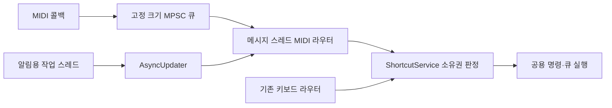

# Enqueue MIDI 트리거 — 설계 (2026-09-20)

gom 요구: MIDI 입력(노트·CC 둘 다, 특정 장치 전제 없는 일반형)으로 앤큐의 명령(0.11.0에서 커스터마이징 가능한 75개)과 큐별 트리거를 발사한다. 0.11.0 단축키 시스템 위에 "입력 종류 하나 더"로 붙인다. 아스트라 감시(설계 → 구현 → 리뷰 반복) 하에 진행.

아래 "설계 원문"은 아스트라(코덱스 GPT-6, 읽기 전용 설계 라운드, 2026-09-20 08:08~08:26)가 main 0.11.0(b5f12dc)을 읽고 쓴 것이다. 그 위에 클로드(구현 관리자)가 정한 **범위·순서 결정**은 다음과 같다.

## 클로드 결정 (설계 원문보다 우선)

1. **1차 릴리스(0.12.0) 범위** = MIDI 1.0 Note + 7비트 absolute CC(원문 §1 지원 범위 그대로: Program Change·relative·14비트·NRPN·Pitch Bend·Aftertouch·SysEx·Clock·MMC·Thru 제외). 명령 75개 전부 + 큐별 트리거, 복수 트리거, 키와 MIDI 병행. 트리거 구조(source/kind/channel/number/minVelocity/edge/high/low/behavior/debounceMs)·Note 규칙·CC 규칙(히스테리시스, gate/pulse, 프리셋 4종)은 원문 그대로 채택.
2. **2차로 미루는 것**: **프로젝트의 "논리 입력"(UUID 이름 → PC별 장치 연결)**. 1차에서 큐 트리거의 `source`는 **허용된 모든 장치("any")만** 지원한다(프로젝트 이동성은 이것으로 충족). 명령 매핑의 `source`는 `any` 또는 특정 PC 장치(identifier). 논리 입력 UI·저장·연결 규칙은 넣지 않되, 데이터 모델의 `source` 필드는 나중에 확장할 수 있게 둔다.
3. **저장**: 원문대로 — 키보드 `keyboardShortcuts`(v1)는 그대로, `midiShortcuts`/`midiShortcutsLastGood`/`midiInputSettings`/`midiInputSettingsLastGood` 추가(`ENQUEUE_MIDI_SHORTCUTS schemaVersion="1"`), 통합 교환(내보내기/가져오기) v2, 프로젝트 저장 버전 **6→7**(`Cue::midiTriggers` 배열, v1~v6 열면 빈 배열, 0.11.0은 v7 거부 — 기존 정책), 복제·붙여넣기·템플릿은 새 큐의 MIDI 트리거를 비움(핫키와 동일).
4. **장치 관리**: 원문대로 — 설정 탭 이름 "단축키·MIDI", 상단에 접을 수 있는 "MIDI 입력 — 이 PC" 영역(활성 입력 선택, 새로고침, `모든 MIDI 입력 자동 사용`(기본 끔), `백그라운드에서 재생 조작 허용`(기본 켬)), identifier 기준 저장·이름 자동 대체 금지·`MidiDeviceListConnection` 핫플러그, 상태 표시(연결/미연결/사용 불가/준비 대기). 초기 기본: 활성 입력 없음, 명령 MIDI 매핑 없음.
5. **라우팅·스레드**: 원문대로 — MIDI 콜백은 복사·기록만(블록 금지), 고정 크기 MPSC 큐 → 메시지 스레드 라우터, 알림 방식은 구현이 정하되 **콜백에서 블록 가능 호출 금지·수신→실행 p95 10ms 목표**, 순서·관측 시각·과부하 정책(100ms 초과 일반 입력 폐기·진단, 패닉 예약 용량), `resolveMidiOwner`(캡처→패닉→명령→큐→없음), 공용 실행 인자(입력 종류·ID·활성/해제·토큰·관측 시각; 가짜 KeyPress 변환 금지), `CueController` ID 기반 공용 트리거 함수(핫키 동작 이관), 백그라운드·창 상태 표(§3), 공용 GO 눌림 관리자(`InputActivationTracker`), `PanicGestureGate` 추출(키·MIDI·버튼 공용 500ms 판정, `panicFromAnywhere` 유지), 연결 세대·라우팅 세대로 유령 입력 차단, **첫 Note on 즉시 실행·CC 첫 값 기준화**(세션 ①-c 결정: off 선행은 경계에서 이미 눌린 Note의 격리에만 요구), 종료 순서.
6. **학습·표시·충돌·문서**: 원문 §4·§5·§6 그대로(공용 `KeyCapture` 확장, 후보 고정·재학습, CC 프리셋 제안은 자동 확정 아님, 토글·노브 200ms 재기준화, Esc=취소만; 교집합 충돌 판정표; 명령 우선·큐 바인딩 전체 비활성·자동 복구; 메뉴 단축키 열은 키만; 설명서·README 항목). 단, 논리 입력 관련 UI·문구는 2차.
7. **구현 세션 2개 + 각 세션 뒤 빌드·테스트·읽기 전용 리뷰(FIX면 수정 세션 → 재리뷰)**: ① 모델·장치·라우팅·저장·공용 실행·테스트(종료 기준 = 가짜 입력으로 명령·큐·패닉이 정확히 한 번, 저장 실패·캡처·재연결 경계에서 미실행) ② 학습 UI·설정 탭·인스펙터·가져오기/내보내기·툴팁·문서. 워크트리 `C:\Users\claude\gocue-midi`, 브랜치 `enqueue-midi`(main 0.11.0 = b5f12dc). 버전 0.12.0·릴리스 노트는 클로드가.
8. **실측**: loopMIDI 가상 포트 2개(`Enqueue Test A/B`) + `python-rtmidi` 송신(원문 §7 절차·메시지 표). 설치는 gom 승인(UAC) 필요 시 요청.

---

## 설계 원문 (아스트라)

**추천안은 기존 `ShortcutService`에 MIDI 소유권 판정을 추가하고, 키보드와 MIDI가 같은 명령·큐 실행 경로를 사용하는 구조입니다.** PC 저장은 기존 키보드 v1을 보존하면서 MIDI 값을 별도로 추가하고, 통합 내보내기는 v2, 프로젝트는 v7로 확장합니다.

읽기 전용으로 확인했습니다. HEAD는 `b5f12dc`, 앱 버전은 `0.11.0`, 작업 트리는 깨끗합니다. **브랜치 이름은 `main`이 아니라 `enqueue-midi`입니다.** 파일 수정·빌드·테스트·설치는 하지 않았습니다. 아래의 숫자 기본값과 처리 정책은 설계 결정이며, 성능·장치 동작을 확인하지 못한 부분은 추정 또는 실측 대상으로 구분했습니다.

**1. 데이터 모델**

**현재 구조 재확인**

제시한 구조는 대체로 맞습니다. 특히 다음 사항을 설계의 기준으로 삼습니다.

| 항목 | 코드 확인 결과 |
|---|---|
| 설정 가능한 명령 | 종료 명령을 포함해 75개입니다. 고정 컴포넌트 키는 별도이며 읽기 전용입니다. |
| MIDI 입력 | 앱의 `src`에는 입력 장치 개방·수신·라우팅 코드가 없습니다. |
| JUCE | CMake 기본 태그와 로컬 헤더 모두 8.0.15입니다. 필요한 MIDI 클래스가 있습니다. |
| 큐 핫키 범위 | 현재 보이는 리스트뿐 아니라 **프로젝트의 모든 리스트·카트**를 대상으로 합니다. |
| 키보드 프로필 | 엄격한 XML v1입니다. MIDI 요소를 기존 값에 추가하면 0.11.0 파서가 거부합니다. |
| `LastGood` | 현재 값의 복제본이 아니라 **변경 직전에 적용 중이던 정상 프로필**입니다. |
| 프로젝트 미래 버전 | **경고 후 열기가 아니라 열기 거부**입니다. 헤더 주석과 README의 일부 설명이 구현과 다릅니다. |

근거: [명령 목록](/C:/Users/claude/gocue-midi/src/app/ShortcutCatalog.cpp:30), [프로필 저장 트랜잭션](/C:/Users/claude/gocue-midi/src/app/ShortcutService.cpp:423), [큐 핫키 실행](/C:/Users/claude/gocue-midi/src/app/CueController.cpp:1811), [프로젝트 버전 검사](/C:/Users/claude/gocue-midi/src/model/ProjectSerializer.cpp:916).

**지원 범위**

1차는 **MIDI 1.0 Note와 7비트 absolute CC**를 지원합니다.

- 75개 명령 모두 MIDI 지정 가능.
- 큐마다 MIDI 트리거 지정 가능.
- 명령·큐 모두 여러 MIDI 트리거 지정 가능.
- 기존 키와 MIDI를 동시에 유지할 수 있음.
- Program Change는 1차에서 제외. 현재 요구를 충족하는 데 필수는 아니며, 별도의 메시지형 트리거 정책이 필요합니다.
- relative encoder, 14비트 CC 결합, NRPN/RPN 해석, Pitch Bend, Aftertouch, SysEx, MIDI Clock, MMC는 제외합니다. 개별 CC 메시지는 지정한 CC 규칙에 따라서만 해석합니다.
- 입력 MIDI를 플러그인이나 다른 포트로 전달하는 MIDI Thru는 추가하지 않습니다.

**트리거 구조**

키 문자열에 MIDI 표현을 넣지 않습니다. `Cue::hotkey`도 그대로 둡니다.

| 필드 | 설계 |
|---|---|
| `source` | 허용된 모든 입력 / 특정 PC 입력 / 프로젝트의 논리 입력 |
| `kind` | `note`, `cc` |
| `channel` | `any` 또는 1~16. 저장에서도 1~16을 사용합니다. |
| `number` | 노트 또는 CC 번호, 0~127 |
| `minVelocity` | Note 전용, 1~127, 기본 1 |
| `edge` | CC 전용, `rising`, `falling`, `both` |
| `highThreshold` | CC의 높은 영역 진입값, 기본 64 |
| `lowThreshold` | CC의 낮은 영역 복귀값. 반드시 `0 ≤ low < high ≤ 127` |
| `behavior` | CC 전용, 누르고 놓는 입력인 `gate` / 변화마다 한 번 발사하는 `pulse` |
| `debounceMs` | 동일 실제 입력의 최소 재발사 간격. 기본 20ms, 0~500ms 조정 |

노트 이름은 표시값이고 **번호가 저장·비교 기준**입니다. 앱 표시는 `C4=60`으로 고정하고 `노트 C3 (48)`처럼 번호도 함께 보여 외부 장치의 옥타브 표기 차이를 피합니다.

**Note 규칙**

- `note-on`이고 velocity가 최소값 이상이면 한 번 발사합니다.
- 명시적인 `note-off`와 velocity 0인 `note-on`은 모두 해제입니다.
- 해제는 입력 상태만 풀며, 실행한 큐를 정지시키지 않습니다.
- 해제 없이 같은 노트의 `note-on`이 반복되어도 재발사하지 않습니다.
- 최소 velocity 미만의 `note-on`도 물리적으로 눌린 상태로 기록합니다. 뒤따른 반복 `note-on`이 갑자기 실행되지 않게 합니다.
- 상태는 **실제 입력 포트·연결 세대·채널·노트 번호별**로 관리합니다. `모든 장치`, `전체 채널` 설정이라고 상태를 하나로 합치지 않습니다.
- CC 64의 sustain 상태는 노트 트리거의 해제 시점을 연장하지 않습니다.
- 1차 Note 입력은 off 메시지가 있는 방식으로 한정합니다. Note On만 보내는 장치는 Note On/Off 또는 CC 토글 출력으로 설정해야 합니다. 시간 경과만으로 가짜 note-off를 만들지 않습니다.

마지막 제한의 이유는 반복 패킷과 실제 다음 누름을 구별할 정보가 없기 때문입니다.

**CC 규칙**

`high=64`, `low=60`이라면 낮은 상태에서 64 이상이 되는 순간 상승, 높은 상태에서 60 이하가 되는 순간 하강입니다. 61~63에서는 이전 상태를 유지합니다.

| 입력 형태 | 추천 프리셋 | 실행 |
|---|---|---|
| 누를 때 127, 놓을 때 0인 페달·버튼 | `gate`, 상승, high 64 / low 63 | 누를 때 1회, 놓으면 해제 |
| 반대로 값을 보내는 페달 | `gate`, 하강, high 64 / low 63 | 낮은 영역 진입 때 1회 |
| 누를 때마다 0/127이 번갈아 오는 토글 | `pulse`, 양쪽, high 64 / low 63 | 각 전환마다 1회 |
| 연속 노브·페이더 | `pulse`, 상승, high 64 / low 60 | 문턱을 넘을 때 1회, 반대 영역까지 돌아와야 재발사 |

- 같은 값 반복 수신은 발사하지 않습니다.
- 노브가 64 이상에서 계속 움직여도 반복 발사하지 않습니다.
- `both`는 양방향 전환을 각각 발사합니다. 일반 페달에 선택하면 누름과 놓음에서 각각 실행될 수 있음을 표시합니다.
- `gate`는 상승 또는 하강만 허용합니다. 양쪽은 `pulse`로 표현합니다.
- 바운스 억제 중에도 원시 값·해제 상태는 갱신합니다. 해제 패킷을 버려 입력이 계속 눌린 상태로 남게 하지 않습니다.
- CC 120·123 등의 번호를 수신했다는 이유로 자동 패닉을 실행하지 않습니다.

**PC 명령 매핑 저장**

**기존 키보드 저장값은 v1 그대로 두고, MIDI 프로필을 별도 값으로 추가하는 방식을 추천합니다.** 메모리상의 서비스·편집·충돌 처리는 통합하되, 저장 호환 경계를 분리합니다.

| 설정 값 | 내용 |
|---|---|
| `keyboardShortcuts` | 기존 키보드 XML v1 |
| `keyboardShortcutsLastGood` | 기존 키보드의 직전 정상 프로필 |
| `midiShortcuts` | 신규 MIDI 명령 프로필 |
| `midiShortcutsLastGood` | MIDI 명령의 직전 정상 프로필 |
| `midiInputSettings` | 활성 입력, 장치 식별 정보, 백그라운드 옵션, 프로젝트 논리 입력의 PC 연결 |
| `midiInputSettingsLastGood` | 장치 설정 복구용 정상 값 |

MIDI 전용 저장 형식은 `ENQUEUE_MIDI_SHORTCUTS schemaVersion="1"`로 시작하고, 키와 MIDI를 합친 교환 형식은 6절의 v2를 사용합니다. 서로 다른 형식의 버전입니다.

이 선택의 이유는 다음과 같습니다.

- 기존 `keyboardShortcuts`를 v2로 바꾸면 0.11.0으로 돌아갔을 때 전체 키보드 설정이 거부됩니다.
- MIDI만 편집했다고 키보드 복구 이력이 밀려나면 안 됩니다.
- MIDI 설정이 손상돼도 키보드 GO·패닉을 정상 복구할 수 있어야 합니다.
- 단순한 “v2 본문 + v1 복제본” 방식은 구버전에서 수정한 키와 v2 키 중 무엇을 채택할지 추가 조정 규칙이 필요합니다.

메모리 모델에는 키보드와 MIDI의 덮어쓰기 목록을 독립적으로 둡니다.

- 항목 없음: 기본값 상속.
- 빈 목록: 명시적 미지정.
- MIDI 기본값: 모든 명령에서 빈 목록. 업데이트가 특정 장치 번호를 자동 배정하지 않습니다.
- 알 수 없는 명령 ID: 문법이 유효하면 보존하되 실행하지 않습니다.

저장 순서는 **후보 작성 → 전체 검증 → 필요한 설정 값들을 한 번에 저장 → 성공 후 유효 매핑 교체**입니다. 저장 실패 시 값·dirty 상태·유효 매핑을 모두 되돌립니다.

MIDI만 바꿀 때는 키보드 current/LastGood을 건드리지 않습니다. 통합 가져오기처럼 양쪽을 바꾸는 작업은 두 쌍을 같은 저장 트랜잭션으로 처리합니다. 기존 Base64 원문 보호와 “복구 과정에서 거부된 원문을 정상값으로 덮어쓰지 않는다”는 규칙도 유지합니다.

0.11.0에서 MIDI 설정 값을 무시하면서 키보드를 계속 사용하는 것이 목표입니다. **구버전 실행·저장 후 신규 값 보존까지의 실제 왕복 동작은 아직 미검증**이며 호환 테스트에 포함합니다.

**프로젝트 큐 트리거 저장**

`Cue`에 `midiTriggers` 배열을 추가합니다. 기본은 빈 배열입니다.

기본 source는 **허용된 모든 장치**입니다. 따라서 프로젝트를 옮겨도 채널·번호·CC 규칙은 유지되고, 목적지 PC에서 입력 장치만 선택하면 됩니다.

선택적 장치 제한은 **프로젝트의 논리 입력**으로 표현합니다.

- 프로젝트: `무대 페달`, `효과 패드` 같은 이름과 안정적인 UUID.
- PC 설정: 해당 UUID를 실제 MIDI 입력 identifier에 연결.
- 큐: 실제 장치 이름 대신 논리 입력 UUID 참조.
- 다른 PC: 미연결로 표시하고 실행하지 않음. 자동으로 모든 장치로 넓히지 않음.

예를 들어 프로젝트의 `무대 페달`은 원래 PC에서 장치 A, 다른 PC에서 장치 B에 연결할 수 있습니다. 이름은 사용자 설명이고 UUID가 참조 기준입니다.

**프로젝트 버전은 6→7로 올립니다.**

- v1~v6을 열면 MIDI 배열·논리 입력 목록은 비어 있습니다.
- 새 앱에서 저장하면 v7입니다.
- 0.11.0은 v7을 거부하므로 MIDI 필드를 모른 채 재저장해 지우는 일을 막습니다.
- v7을 v6으로 조용히 저장하는 동작은 제공하지 않습니다.

신규 MIDI 필드는 엄격하게 검증합니다. 잘못된 채널·번호·규칙을 `전체 채널`, `모든 장치`, 노트 0으로 보정하면 안 됩니다. 형식이 잘못되면 임시 프로젝트의 파싱을 실패시키고 현재 프로젝트를 유지합니다. 반면 문법은 유효하지만 충돌하는 트리거는 보존하고 비활성 진단을 붙입니다.

복제·붙여넣기·템플릿 적용 시에는 기존 핫키처럼 **새 큐의 MIDI 트리거를 비웁니다**. 일반 큐 속성 붙여넣기에도 포함하지 않습니다. 원본 큐의 트리거와 실행 취소·다시 실행 기록은 정상 보존합니다.

---

**2. 장치 관리**

**UI는 프로젝트 설정의 네 번째 탭을 `단축키·MIDI`로 확장합니다.**

탭 상단에 접을 수 있는 `MIDI 입력 — 이 PC` 영역을 둡니다. 학습과 입력 선택을 같은 곳에서 할 수 있고, 오디오 장치를 바꾸는 작업과 구별하기 쉽습니다.

오디오 출력 설정의 `AudioDeviceSelectorComponent`에서 MIDI 표시를 켜는 방식은 사용하지 않습니다. MIDI 입력 수명은 오디오 장치 재시작·출력 설정과 독립적으로 관리합니다.

**초기 기본값**

- 활성 MIDI 입력: 없음.
- 명령 MIDI 매핑: 없음.
- `백그라운드에서 재생 조작 허용`: 켬.
- `모든 MIDI 입력 자동 사용`: 끔.

백그라운드 동작은 공연용 기본값으로 켜되, 처음 연결된 임의의 장치를 바로 듣지는 않는 선택입니다.

`모든 입력 자동 사용`은 별도 옵션으로 제공합니다. 이 옵션을 켜면 나중에 연결한 입력도 대상이 된다는 점을 표시합니다. 트리거의 `모든 장치`와는 다릅니다.

- 장치 설정: 어떤 포트를 열 것인가.
- 트리거 source: 열린 포트 중 무엇과 일치하는가.

**장치 식별·재연결**

- 저장 기준은 `MidiDeviceInfo.identifier`.
- 이름은 화면 표시와 재연결 후보 안내용.
- 장치 목록 순번은 저장하지 않음.
- 이름만 같은 장치로 자동 대체하지 않음.
- identifier도 영구적인 하드웨어 시리얼이라고 가정하지 않음.
- identifier가 달라졌으면 기존 매핑을 유지한 채 `다시 연결` UI를 제공.

JUCE도 장치 이름의 유일성을 보장하지 않으며 특정 장치 지정에는 identifier 사용을 안내합니다. [로컬 JUCE 장치 정보 정의](/C:/Users/claude/JUCE/modules/juce_audio_devices/midi_io/juce_MidiDevices.h:118).

장치 상태는 다음을 구별합니다.

| 상태 | 표시·동작 |
|---|---|
| 연결·사용 중 | 수신 표시, 현재 준비 상태 |
| 연결됨·선택 안 함 | 수신하지 않음 |
| 저장된 장치가 없음 | 이름과 매핑 유지, `미연결` |
| 장치를 열지 못함 | `사용 불가`, 오류와 재시도 |
| 논리 입력의 PC 연결 없음 | `장치 지정 필요` |
| 과부하·동기화 대기 | 이유와 `입력 준비` 상태 |

다른 프로그램의 포트 점유 여부와 동시 사용 가능성은 드라이버에 따라 달라 **실측 대상**입니다.

**핫플러그**

`MidiDeviceListConnection::make()`를 주 경로로 사용합니다. 변경 알림을 받으면 메시지 스레드에서 목록을 다시 조회하고 차이만 반영합니다.

- 변경 알림은 짧게 합쳐 중복 개방을 방지.
- 동일한 입력 객체를 중복 생성하지 않음.
- 선택된 장치가 사라져도 선택·매핑은 보존.
- 같은 identifier가 돌아오면 자동 개방하되 입력 상태는 새 연결로 시작.
- 사용자가 누르는 `새로고침` 제공.
- 정기 재조회는 1차 기본 경로로 추가하지 않음. 드라이버의 알림 누락이 재현될 때 보조 수단으로 검토.

쇼 모드에서는 입력 선택·장치 재지정·매핑 편집을 잠급니다. 이미 선택된 장치의 자동 재연결과 상태 표시는 계속 동작합니다.

---

**3. 라우팅·스레드**

**실행은 메시지 스레드 한 곳에서 처리합니다.**



JUCE MIDI 콜백은 우선순위가 높은 시스템 스레드에서 호출됩니다. 이곳에서는 다음만 수행합니다.

- 지원 메시지의 짧은 데이터 복사.
- 미리 배정한 입력 ID·연결 세대·입력 세대·수신 시각 기록.
- 큐에 기록.
- 수신·과부하 카운터 갱신.

문자열 생성, 장치 목록 조회, 프로필 접근, UI 접근, 명령 실행, 프로젝트 조회, 파일 기록은 하지 않습니다.

**큐와 깨우기**

여러 포트의 콜백이 동시에 들어올 수 있으므로 **고정 크기 MPSC 큐**를 사용합니다. JUCE `AbstractFifo` 하나에 여러 콜백이 쓰는 구조는 채택하지 않습니다. 해당 클래스는 단일 생산자·단일 소비자용입니다. [JUCE AbstractFifo](https://docs.juce.com/master/classjuce_1_1AbstractFifo.html).

`AsyncUpdater::triggerAsyncUpdate()`도 OS 메시지 게시 중 블록될 수 있습니다. 따라서 MIDI 콜백에서 직접 호출하는 대신 알림용 작업 스레드가 pending 상태를 보고 호출하도록 합니다. 작업 스레드는 최대 약 1ms 간격을 목표로 확인하되, 이는 Windows 스케줄링상 **보장 지연이 아니라 실측할 설계 목표**입니다. [JUCE AsyncUpdater](https://docs.juce.com/master/classjuce_1_1AsyncUpdater.html).

- 일반 큐의 초기 용량 제안: 8,192개.
- 패닉에 지정된 입력 주소의 이벤트는 별도 예약 용량 확보.
- 패닉용 분류는 사전 계산한 불변 주소 표만 사용. 실제 엣지·소유권·캡처 판정은 메시지 스레드에서 수행.
- 메시지 스레드는 처리 시간을 제한해 나누어 비우고, 잔여 입력이 있으면 다시 깨움.
- 모니터 화면만 갱신 빈도를 제한. 실행용 CC 데이터는 최신 값 하나로 합치지 않음.

**순서·시각**

- 같은 포트의 입력 순서는 보존합니다.
- 여러 포트 사이에서는 큐에 성공적으로 들어간 순서를 실행 순서로 정의합니다. 물리적으로 동시에 누른 두 장치의 절대 순서는 보장할 수 없습니다.
- 수신 시각은 단조 증가 시간축으로 기록합니다.
- 더블 GO·패닉 판단에는 입력 관측 시각을 사용합니다.
- 실제 재생·프리웨이트·페이드 예약은 기존 실행 시각 기준을 유지합니다.

입력 시각과 재생 예약 시각을 분리해야, 메시지 큐가 잠깐 지연됐다는 이유로 두 누름의 간격이 달라지지 않습니다.

**지연·과부하 정책**

유한한 큐로 무제한 입력에 대해 “드롭 없음”을 보장하지 않습니다. 대신 다음 계약을 둡니다.

- 검증된 처리량·버스트 범위에서는 유실·중복 없음.
- 용량 초과는 카운터와 상태에 반드시 남김.
- 손실로 상태가 불확실해진 일반 입력은 실행을 중지하고 재동기화.
- 밀린 GO를 뒤늦게 몰아서 실행하지 않음.
- 일반 조작의 최대 대기시간은 **100ms를 초기 설계값**으로 삼고, 초과 입력은 실행하지 않고 진단.
- 일반 큐가 포화되어도 예약된 패닉 입력 경로는 유지.
- 패닉 예약 용량까지 넘는 경우도 명시적인 입력 장애로 처리하며 무손실이라고 주장하지 않음.

패닉은 일반 GO의 지연 폐기 규칙으로 버리지 않되, 프로젝트 교체·캡처·장치 연결 변경으로 무효화된 패닉은 실행하지 않습니다.

**소유권 판정**

`ShortcutService`에 `resolveMidiOwner()`를 추가합니다. 키보드의 포커스·문자 입력 규칙을 MIDI에 억지로 대입하지 않고, 소유권·진단·저장 트랜잭션을 공유합니다.

순서는 다음과 같습니다.

1. 캡처 중이면 캡처만.
2. 일치하는 패닉 명령.
3. 일치하는 일반 명령.
4. 일치하는 큐 트리거.
5. 소유자 없음.

패닉도 명령 매핑의 일부이며 일반 실행 경로와 중복 발사하지 않습니다. 명령이 비활성·범위 밖이어도 충돌한 큐로 넘어가지 않습니다.

상승·하강 등 입력 상태 갱신은 실행 가능 여부와 별개입니다. 캡처·모달·백그라운드 억제 중에도 해제 이벤트를 계속 처리합니다.

**명령·큐 실행 경로**

MIDI를 가짜 `KeyPress`로 변환하지 않습니다. 공용 실행 인자에 다음 정보를 둡니다.

- 입력 종류: 키보드 / MIDI / 메뉴·버튼.
- 명령 또는 큐 ID.
- 활성화 / 해제.
- 실제 입력 토큰.
- 관측 시각.

기존 키보드의 `InvocationInfo` 정보는 보존합니다. MIDI GO가 메뉴 호출로 취급되어 즉시 해제되거나, `table.focusTable()` 때문에 다른 앱에서 포커스를 빼앗는 일을 막아야 합니다.

큐는 `CueController`에 **ID 기반 공용 트리거 함수**를 추가합니다. 기존 핫키의 아래 동작을 그 함수로 옮겨 키와 MIDI가 함께 호출합니다.

- armed 확인.
- 큐별 `doubleGoHotkeys`.
- 두 번째 트리거 규칙.
- 프리웨이트·시퀀스 실행.
- 플레이헤드 유지.
- 패닉 중 시작 거부.

단순히 `controller.fire()`로 연결하면 현재 큐 핫키와 시퀀스 동작이 달라지므로 사용하지 않습니다.

**백그라운드·창 상태**

모든 명령을 지정할 수 있지만 실행 범위는 다음과 같이 제한합니다.

| 상태 | MIDI 패닉 | 재생 명령·큐 트리거 | 편집·파일·설정 명령 |
|---|---|---|---|
| 메인 화면 | 허용 | 허용 | 기존 enabled 조건에 따라 허용 |
| 메인 화면의 텍스트 편집 중 | 허용 | 허용 | 편집 중인 UI와 충돌하는 조작 억제 |
| 설명서 등 보조 창 | 허용 | 허용 | 억제 |
| 플러그인 편집기 | 허용 | 허용 | 억제 |
| 다른 앱 활성, 백그라운드 옵션 켬 | 허용 | 허용 | 억제 |
| 다른 앱 활성, 백그라운드 옵션 끔 | 허용 | 억제 | 억제 |
| 앱의 모달 대화상자·파일 선택기 | 허용 | 억제 | 억제 |
| 학습 세션 | 캡처만 | 캡처만 | 캡처만 |

백그라운드 옵션의 이름은 **`백그라운드에서 재생 조작 허용`**으로 합니다. 패닉은 선택된 입력이 열려 있는 동안 포커스와 무관하게 동작합니다. 모든 MIDI 입력을 끄면 MIDI 패닉도 받지 않습니다.

모달 여부는 현재 포커스만으로 추정하지 않고, 앱이 여는 대화상자·네이티브 파일 선택기의 수명으로 관리합니다.

쇼 모드에서는 기존 `getCommandInfo()`의 활성 조건을 그대로 사용합니다. MIDI 때문에 큐 삭제·프로젝트 교체·장치 변경 등 잠긴 명령이 실행되어서는 안 됩니다.

여기서 패닉의 “항상 동작”은 **포커스·모달·플러그인 창과 독립적**이라는 뜻입니다. 메시지 스레드 자체가 멈추면 MIDI 패닉도 실행될 수 없습니다. 별도 비상 오디오 정지 경로까지 추가하는 것은 이번 범위에 포함하지 않습니다.

**GO·연타·해제**

키보드와 MIDI가 공유하는 GO 눌림 관리자를 둡니다.

- 같은 GO 명령의 키보드 별칭, MIDI Note, CC gate를 합산.
- `requireKeyUp=true`이면 관련 입력이 모두 해제되어야 다음 GO 허용.
- Space와 MIDI 페달을 함께 누른 상태에서 Space만 놓아도 MIDI 눌림은 유지.
- CC pulse는 이벤트 하나의 논리적 누름·해제로 처리. 토글·노브에는 물리적 놓음 메시지가 없기 때문.
- pulse도 다른 GO 입력이 눌려 있으면 `requireKeyUp`을 우회하지 않음.
- `doubleGoSeconds`는 입력 종류와 무관하게 같은 GO 시간창에 적용.
- `doubleGoHotkeys`는 같은 큐 ID 기준으로 키·MIDI·카트 클릭 사이에서도 공유.
- MIDI에는 키보드 자동 반복을 만들지 않음. 반복 가능한 명령도 새 누름·새 엣지마다 한 번 실행.

**패닉**

현재 `PanicKeyHook` 안의 두 번 누름 판정을 `PanicGestureGate` 같은 공용 객체로 추출합니다.

- 키보드 훅, JUCE fallback, 버튼·메뉴, MIDI가 같은 판정기를 사용.
- 첫 유효 활성화는 기존 페이드 정지.
- **500ms 이내, 경계 포함** 두 번째 활성화는 즉시 정지.
- 다른 패닉 키·다른 MIDI 트리거·키보드와 MIDI의 조합도 같은 기능의 두 번 누름으로 계산.
- Note 반복, 같은 CC 값 반복, 해제 패킷은 두 번째 누름으로 계산하지 않음.
- 관측 시각과 고유 이벤트 ID로 판정. 서로 다른 경로의 전달 순서가 뒤바뀌어도 두 유효 입력의 시간 간격을 올바르게 처리.
- 캡처·매핑 교체 시 패닉 제스처 이력 무효화.
- 최종 실행은 기존 `panicFromAnywhere()`로 연결해 자체 발음 플러그인의 출력 차단도 유지.

**유령 입력·연결 수명**

모든 입력에 연결 세대와 라우팅 세대를 붙입니다.

- 캡처 시작·종료.
- 매핑 교체.
- 프로젝트 교체.
- 입력 비활성화.
- 장치 재연결.

위 경계를 넘은 오래된 이벤트는 새 기능을 실행할 수 없습니다. 다만 살아 있는 연결의 오래된 off·값 변화는 상태 정리에 사용할 수 있어야 합니다.

연결 직후에는 입력 준비를 요구하는 쪽을 추천합니다.

- Note: 해당 노트의 off를 관측한 뒤 다음 on부터 실행.
- CC: 첫 값은 기준값으로만 기록하고, 이후 실제 전환부터 실행.
- 따라서 연결·재연결 뒤 첫 누름이 준비 동작이 될 수 있음.
- 화면에 `입력 준비: 한 번 눌렀다 놓으세요` 표시.
- 학습에서 관측한 Note off·CC 기준값은 준비 상태에 활용.

이는 연결 시 장치가 현재 상태를 보내는 것을 GO로 오인하지 않기 위한 선택입니다. 타임아웃만으로 눌림을 해제하지 않습니다.

종료 시에는 수신 차단 → 장치 알림 해제 → 입력 정지 → 진행 중 콜백 종료 확인 → 알림 스레드·pending update 종료 → 라우터 파괴 순서를 지킵니다.

---

**4. 학습·캡처**

**`KeyCapture`의 공용 세션을 확장해 키 또는 MIDI를 받도록 합니다.** 새 MIDI 전용 캡처 체계를 병렬로 만들지 않습니다.

내부 후보형은 `KeyPress | MidiTrigger`로 확장하고, 현재 세션 토큰·취소·소유권은 유지합니다.

**학습 흐름**

1. 명령 또는 큐의 `입력 추가`를 누릅니다.
2. 세션이 키보드·MIDI 실행을 모두 억제합니다.
3. 시작 버튼을 누른 키 등 기존 활성 입력이 해제될 때까지 기다립니다.
4. 첫 유효 키 또는 MIDI 입력으로 후보를 고정합니다.
5. MIDI라면 장치·채널·번호·규칙을 확인·수정합니다.
6. 등록 시 충돌 검사와 필요한 이동 확인을 수행합니다.
7. 저장 성공 후 매핑을 적용하고 세션을 종료합니다.

후보가 정해진 뒤 다른 노트나 흘러오는 CC가 후보를 계속 바꾸지 않습니다. 바꾸려면 `다시 학습`을 누릅니다.

**MIDI 후보**

- 첫 velocity>0 note-on: 노트 후보.
- note-off·velocity 0 note-on: 상태 정리에만 사용.
- 첫 CC: 주소를 후보로 고정하고, 같은 주소의 값 변화를 추가 관측.
- 다른 장치·채널·번호의 입력은 후보를 빼앗지 못함.
- Program Change 등 미지원 메시지는 후보로 만들지 않음.

명령 학습의 source 기본값은 **관측한 특정 입력**입니다. PC 설정이므로 오발사를 줄이는 쪽이 유리합니다.

큐 학습의 source 기본값은 **허용된 모든 장치**입니다. 관측한 장치명은 학습 정보로 보여주고, 필요하면 프로젝트 논리 입력을 선택하게 합니다.

채널은 관측한 특정 채널이 기본입니다. `전체 채널`은 사용자가 선택합니다.

**CC 제안**

- 0→127: 상승, 문턱 64 제안.
- 127→0: 하강 제안.
- 여러 연속 값: 노브·페이더 프리셋 제안.
- 좁은 범위를 움직였다면 관측 범위의 중간 문턱과 복귀값 제안.
- 값이 하나뿐이면 방향을 확정하지 않고 기본값과 `값 변화 미확인` 표시.

같은 0/127 데이터만으로 순간 페달과 토글을 확정할 수는 없습니다. **프리셋 제안은 자동 확정이 아닙니다.** `페달·버튼 / 토글 / 노브·페이더` 선택으로 사용자가 의미를 확인합니다.

**캡처 종료와 연속 입력**

- 키보드·Note·CC gate: 눌린 입력의 해제를 기다려 등록.
- 토글·노브: 해제가 없으므로 값을 무한히 기다리지 않음.
- 토글·노브는 등록할 수 있지만 해당 입력 흐름을 격리하고, **200ms 동안 값 변화가 멈춘 뒤 현재 값을 새 기준으로 삼아** 다음 변화부터 실행.
- 계속 움직이면 다른 입력은 사용할 수 있고 해당 입력만 `움직임 종료 대기`로 표시.
- 등록 중 충돌 확인창·저장 처리에서도 캡처 토큰 유지.
- 저장 실패 시 후보를 유지하고 재시도 가능.
- 캡처 중 생성된 이벤트는 종료 뒤 큐에 남아 있어도 실행 불가.

Esc는 항상 캡처 취소입니다. 패닉·부모 대화상자 닫기·다른 단축키를 함께 실행하지 않습니다. 기존 특수 키 선택으로 Esc를 키 후보로 지정하는 경로는 유지합니다.

캡처 내부의 CC 설정 필드·장치 선택기로 포커스가 이동하는 것은 세션 이탈로 취급하지 않습니다. 대상 큐 변경·탭 닫기·쇼 모드 전환·위젯 파괴는 취소하며, 오래된 위젯이 새 세션을 종료할 수 없게 합니다.

**표시**

설정 행에는 키와 MIDI를 나누어 표시합니다.

- 키: `Space, F13`
- MIDI: `노트 C3 (48) · ch1 · 무대 페달`
- MIDI: `CC 64 ≥64 · 상승 · ch전체`
- 상세: 복귀값, 바운스 억제값, 장치 범위, 활성·미연결·충돌 상태

큐 인스펙터 기본 탭에는 기존 핫키와 MIDI 목록을 함께 둡니다.

- `키보드: A`
- `MIDI: 노트 C3 (48) · ch1 · 허용 장치 모두`
- `입력 추가`, 항목별 변경·삭제
- `이 PC의 GO MIDI와 충돌하여 비활성`
- `무대 페달의 장치 지정 필요`

키 후보를 등록하면 기존 핫키를 변경하고, MIDI 후보를 등록하면 MIDI 배열에 추가합니다. MIDI 추가가 키 핫키를 지우지 않습니다.

---

**5. 충돌 규칙**

**문자열 일치가 아니라 입력 범위의 교집합을 계산합니다.**

기본 조건은 다음과 같습니다.

- source 범위가 겹침.
- 채널 범위가 겹침.
- 종류와 번호가 같음.
- 발사 가능한 이벤트 방향이 겹침.

| 조합 | 판정 |
|---|---|
| 모든 장치 ↔ 특정 장치 | 겹침 |
| 같은 실제 장치를 가리키는 두 지정 | 겹침 |
| 서로 다른 특정 장치 | 겹치지 않음 |
| 전체 채널 ↔ ch1 | 겹침 |
| ch1 ↔ ch2 | 겹치지 않음 |
| Note 60 ↔ CC 60 | 겹치지 않음 |
| 같은 Note, 최소 velocity만 다름 | 겹침. 높은 velocity 입력이 양쪽 조건을 만족 |
| 같은 CC의 상승 ↔ 상승 | 겹침. 문턱이 달라도 0→127이 양쪽을 넘을 수 있음 |
| 같은 CC의 하강 ↔ 하강 | 겹침 |
| 같은 CC의 상승 ↔ 하강 | 겹치지 않음 |
| 같은 CC의 양쪽 ↔ 상승 또는 하강 | 겹침 |

따라서 같은 CC의 상승을 GO, 하강을 다른 명령에 지정하는 것은 가능합니다. 양쪽 엣지 지정은 두 방향을 모두 점유합니다.

장치 이름, 바운스 억제값, 단순히 다른 문턱값을 사용한다는 이유로 충돌이 해소됐다고 판단하지 않습니다.

**명령 ↔ 명령**

- 겹치는 지정은 저장·가져오기에서 거부.
- 기존 `이동 / 취소` UI 재사용.
- 이동할 때 기존 소유자의 **겹치는 바인딩 전체**를 제거.
- 전체 채널 바인딩을 특정 채널로 옮길 때 나머지 채널만 자동 분할해 남기지 않음.
- 제거될 항목과 범위를 확인창에 명시.
- 한 트랜잭션으로 처리.
- 같은 명령에 같은 항목을 다시 학습하면 no-op. 중복 실행을 만들지 않음.

**명령 ↔ 큐**

명령 우선입니다.

- 큐의 저장값은 보존.
- 겹치는 **큐 MIDI 바인딩 전체를 비활성화**.
- 명령이 비활성·미연결·쇼 모드 제한 상태여도 그 순간 큐로 넘어가지 않음.
- 명령 지정을 제거하면 큐 바인딩 자동 복구.
- PC 명령 설정 변경으로 프로젝트를 dirty 처리하지 않음.

예를 들어 큐가 모든 채널이고 명령이 ch1이면 큐 바인딩 전체를 비활성화합니다. ch2~16에서만 작동하는 숨은 부분 활성화는 제공하지 않습니다. 표시와 실제 공연 동작을 일치시키기 위한 선택입니다.

**큐 ↔ 큐**

프로젝트의 모든 리스트·카트에서 검사합니다.

- UI에서 새 충돌은 거부.
- 파일이나 실행 취소 등으로 이미 존재하는 충돌은 값을 보존하고 관련 바인딩을 비활성화.
- 리스트 순서·현재 탭·로드 순서로 승자를 고르지 않음.
- 다른 비충돌 바인딩과 키 핫키는 계속 사용할 수 있음.

기존 키보드 큐 핫키의 예약 키·Ctrl/Alt 금지·로더 중복 삭제 정책은 유지합니다. 신규 MIDI에는 보존·진단 정책을 적용합니다.

**논리 입력 연결**

미지정 논리 입력은 실행 대상이 없습니다. 다른 PC에서 연결할 때 실제 장치 기준으로 충돌을 다시 계산합니다.

논리 입력 두 개를 같은 장치에 연결해 새 충돌이 생기면 연결 적용과 충돌 상태 갱신을 함께 수행합니다. 연결 순간에 겹친 명령 두 개가 잠깐 활성화되는 상태를 만들지 않습니다.

---

**6. 이동성·표시·문서**

**통합 교환 형식은 XML v2입니다.**

개념 예시는 다음과 같습니다.

```xml
<ENQUEUE_SHORTCUTS schemaVersion="2" platform="windows">
  <ACTION id="transport.go">
    <KEYBOARD>
      <KEY key="Space"/>
    </KEYBOARD>
    <MIDI>
      <TRIGGER kind="note"
               source="any"
               channel="1"
               number="48"
               minVelocity="1"
               debounceMs="20"/>
    </MIDI>
  </ACTION>
</ENQUEUE_SHORTCUTS>
```

- 기본 내보내기는 키와 MIDI를 모두 포함.
- 75개 명령의 유효 목록을 빈 목록까지 포함해 내보냄.
- 알려지지 않은 정상 형식의 명령 ID도 보존.
- 특정 장치 지정은 문서 내 장치 참조와 표시명·identifier 힌트로 표현.
- 활성 입력 선택과 백그라운드 옵션은 매핑 가져오기로 변경하지 않음.
- 다른 PC의 장치 힌트는 재연결 제안용. 가져왔다고 그 장치를 자동 활성화하지 않음.

파서는 버전별 문법을 명시적으로 나눕니다. 기존 XML 선검사의 허용 요소·깊이 제한도 v2 문법에 맞춰 확장해야 합니다. 임의의 태그 허용으로 해결하지 않습니다.

| 가져오기 | 동작 |
|---|---|
| v1 키보드 프로필 | 키보드 영역 전체 교체, 현재 MIDI 유지 |
| v2 통합 프로필 | 키보드·MIDI 영역 전체 교체 |
| 잘못된 문법·범위·명령 충돌 | 전체 거부 |
| 미래 스키마 | 거부, 원문 보존 |
| 장치 없음 | 매핑 보존, 미연결 표시 |

v1에는 MIDI 데이터가 없으므로 이를 MIDI 삭제 요청으로 해석하지 않습니다. 미리보기에 `키보드만 교체, MIDI 유지`를 분명히 보여줍니다.

0.11.0용 이동이 필요하면 명시적인 **`키보드만 내보내기 — v1`**를 제공합니다. 기본 통합 내보내기를 조용히 v1로 낮추지는 않습니다.

기존 마지막 패닉 키 제거 안내는 유지합니다. MIDI 패닉이 등록돼 있어도 장치가 없을 수 있으므로, 마지막 키보드 패닉 키 제거를 아무 안내 없이 통과시키는 근거로 삼지 않습니다.

**표시 위치**

- 메뉴의 단축키 열: 키보드만.
- 설정 탭: 키보드와 MIDI 모두.
- 트랜스포트 툴팁: 현재 키와 MIDI 목록.
- 큐 인스펙터: 저장된 MIDI와 이 PC의 실행 가능 상태.
- 상태 영역: MIDI 활성 입력 수·미연결·준비 대기·과부하.
- 길어진 목록: 요약과 전체 툴팁.

JUCE `KeyPressMappingSet`에는 키보드만 동기화합니다.

**설명서·README 수정 내용**

- “MIDI 미지원” 삭제.
- 키보드 활성 앱 조건과 MIDI 백그라운드 동작을 구별.
- 장치 선택 → 학습 → 규칙 확인 → 등록 → 입력 준비 순서.
- Note on/off·velocity 0·CC 페달/토글/노브의 차이.
- 명령은 PC, 큐 트리거는 프로젝트라는 저장 범위.
- 다른 PC에서 논리 입력 연결하기.
- 충돌 시 값 보존·비활성·자동 복구.
- 모달·쇼 모드·플러그인 창에서의 동작.
- Program Change·relative CC 등 1차 제외 범위.
- 연결 뒤 입력 준비와 장치 없음 표시.
- 프로젝트 v7을 0.11.0에서 열 수 없다는 설명.
- 미래 프로젝트 버전을 “경고 후 읽는다”는 낡은 설명 정정.

기존 사용법의 큐 핫키 위치는 인스펙터 기본 탭 기준으로 유지합니다.

---

**7. 테스트 계획·실측 계획**

아래는 **구현 후 실행할 계획**입니다. 이번 라운드에서는 실행하지 않았습니다.

**자동 검증**

가짜 `MidiMessage`, 가짜 입력 ID, 가짜 시계, 가짜 장치 목록을 주입합니다. 핵심 검증 대상은 최종 명령·큐·패닉의 실행 횟수와 실행 대상입니다.

| 영역 | 주요 검증 |
|---|---|
| Note | on/off 1회 발사, velocity 0 해제, 최소 velocity 경계, off 없는 반복 억제 |
| 상태 분리 | 같은 번호의 서로 다른 포트·채널을 독립 추적 |
| CC gate | 누름·놓음, 반전 페달, 초기값만 수신, 같은 값 반복 |
| CC pulse | 토글 양쪽 엣지, 노브 상승·하강, 한 번에 문턱 여러 개 통과 |
| 히스테리시스 | 경계 주변 떨림, 반대 영역까지 복귀하지 않은 재진입 |
| 바운스 | 억제 경계, 억제 중 해제 보존, 다른 입력에는 영향 없음 |
| 명령 | 75개 ID의 연결 가능성, 비활성·쇼 모드·범위 제한 |
| 큐 | 다른 리스트·카트, armed, 시퀀스·프리웨이트·두 번째 트리거, 플레이헤드 유지 |
| GO | 키+Note+CC 혼합 눌림, 전체 해제, `requireKeyUp` 켬·끔 |
| 더블 GO | 키·MIDI·카트의 같은 큐 ID 시간창 공유, 다른 큐는 독립 |
| 패닉 | 첫 누름, 반복, 해제, 두 번째 누름, 499/500/501ms, 입력 종류 혼합 |
| 지연 패닉 | 전달 지연·순서 역전에도 관측 시각 기준 판정 |
| 캡처 | 모든 실행 횟수 0, Esc 취소, 후보 고정, 연속 CC, 저장 실패 |
| 세대 경계 | 캡처 종료·매핑 교체·프로젝트 교체 전 이벤트가 뒤늦게 실행되지 않음 |
| 충돌 | 장치·채널 wildcard, CC 방향, 명령 우선, 큐 전체 바인딩 비활성 |
| 저장 | v1·MIDI 전용·통합 v2·프로젝트 v7 라운드트립 |
| 복구 | 손상된 current/LastGood, 원문 보존, 저장 실패 후 자동 저장 rollback |
| 구버전 | 0.11.0 설정 읽기, v1 가져오기 때 MIDI 유지, v7의 구버전 열기 거부 |
| 장치 | 없음·개방 실패·분리·재연결·identifier 변경·동명 장치·중복 개방 방지 |
| 편집 | 복제·붙여넣기·템플릿·Undo/Redo의 트리거 처리 |
| 종료 | 콜백 도중 종료·재연결, 늦은 updater, 파괴된 UI 접근 없음 |

**스레드·부하 검증**

정상 부하와 장애 주입을 분리합니다.

- 여러 생산자가 동시에 메시지를 주입.
- 포트별 순서와 전체 수신·처리·실행 카운터 대조.
- 정상 조건에서 누락·중복 0 확인.
- 초기 부하 목표: 8개 생산자, 합계 초당 10,000개 메시지, 60초.
- 짧은 메시지 스레드 지연을 넣어 순서·시간창 판정 확인.
- 의도적으로 큐를 넘쳐 과부하 표시·일반 입력 억제·패닉 예약 경로 확인.
- 오래된 GO가 나중에 몰아서 실행되지 않는지 확인.
- 캡처 종료와 메시지 기록이 동시에 일어나는 경계를 반복 검증.

초당 10,000개와 큐 크기는 **검증 목표·초기값**이며 처리 성능을 확인한 수치가 아닙니다.

**이 PC에서의 실측**

사용자가 알려준 대로 MIDI 장치·가상 포트가 없는 조건을 기준으로 합니다.

추천 구성은 **loopMIDI 포트 2개 + `python-rtmidi` 송신기**입니다.

1. 구현 결과를 검토한 뒤 loopMIDI 설치 단계를 진행.
2. `Enqueue Test A`, `Enqueue Test B` 포트 생성.
3. 앱에서 A만 허용하고 B가 실행되지 않는지 확인.
4. A·B를 모두 허용해 장치별 상태·충돌·전체 장치 규칙 확인.
5. 송신기에서 포트 이름을 정확히 선택.
6. 초기 off·CC 기준값을 보내 입력 준비.
7. Note로 GO·패닉·큐 각각 학습·발사.
8. CC 페달·토글·노브 시퀀스를 송신해 횟수 확인.

예시 메시지는 다음과 같습니다.

| 의미 | 바이트 |
|---|---|
| ch1 Note 60 on | `90 3C 64` |
| ch1 Note 60 off | `80 3C 00` |
| velocity 0 방식 off | `90 3C 00` |
| ch1 CC 64, 값 127 | `B0 40 7F` |
| ch1 CC 64, 값 0 | `B0 40 00` |

loopMIDI는 가상 포트를 만들기 위해 virtualMIDI 드라이버를 사용하며, 포트는 loopMIDI가 실행 중일 때 존재합니다. **설치에 관리자 승인이 필요할 것이라는 판단은 추정**입니다. 현재 PC에서 설치 요구를 확인하지 않았습니다. [loopMIDI 공식 안내](https://www.tobias-erichsen.de/software/loopmidi.html).

`python-rtmidi`의 Windows Multimedia backend는 자체 `open_virtual_port()`를 지원하지 않습니다. Python 패키지 설치만으로 가상 입력 포트가 생기지는 않습니다. [python-rtmidi 공식 문서](https://spotlightkid.github.io/python-rtmidi/rtmidi.html#rtmidi.MidiOut.open_virtual_port).

추가 시나리오는 다음과 같습니다.

- 다른 앱 활성 상태에서 GO·큐·패닉.
- 백그라운드 옵션 끔.
- 설정 모달에서 일반 실행 억제·패닉 유지.
- 플러그인 편집기에서 실행과 포커스 유지.
- 학습 중 모든 실행 억제.
- 노트 누른 상태에서 포트 삭제·재생성.
- 노브 연속 송신 중 등록·취소.
- 키보드 패닉과 MIDI 패닉을 번갈아 실행.
- 프로젝트 저장·재실행·다른 PC 연결을 흉내 낸 identifier 변경.

**지연 측정**

송신 시각, 콜백 수신 시각, 메시지 스레드 실행 시각을 공통 단조 시간축에 맞춰 기록합니다.

- 송신→수신과 수신→명령 실행을 구분.
- 평균·p95·p99·최대 지연 기록.
- 초기 목표: 수신→명령 실행 p95 10ms 이하, p99 20ms 이하.
- 프리로드된 짧은 테스트 큐로 오디오 출력 단계의 지연을 별도 기록.

이 역시 **목표이며 추정 성능**입니다. 가상 포트 실측은 실제 풋컨트롤러의 바운스·USB 지연·부팅 메시지·동명 장치 문제까지 검증하지 못합니다.

**대안**

- 드라이버 설치 전에는 테스트 전용 입력 주입으로 모델·큐·명령·스레드 전달까지 검증합니다. Windows MIDI 드라이버 경로를 거친 실측은 아닙니다.
- Python 의존성을 줄이려면 작은 JUCE `MidiOutput` 송신 도구를 사용할 수 있습니다. 가상 포트는 여전히 필요합니다.
- 실제 공연 장치가 준비되면 최종 검증은 그 장치로 반복합니다.

---

**8. 구현 단계·리스크·예상 변경 파일**

**세션 ① 모델·장치·라우팅·저장·테스트**

구현 순서는 다음을 추천합니다.

1. MIDI 타입·엄격한 codec·CC/Note 상태 모델.
2. 장치·채널·엣지 교집합과 충돌 진단.
3. PC 저장·LastGood·통합 v2 교환 형식.
4. 프로젝트 v7·논리 입력·큐 트리거 저장.
5. 입력 장치 수명·MPSC 전달·세대 무효화.
6. `ShortcutService`의 MIDI 소유권 판정.
7. 공용 큐 ID 실행·GO 눌림·패닉 제스처.
8. 실행 횟수·호환·과부하·수명 테스트.

종료 기준은 UI 완성도가 아니라 **가짜 입력으로 실제 실행 경로가 정확히 한 번 동작하고, 저장 실패·캡처·재연결 경계에서 실행되지 않아야 할 입력이 실행되지 않는 것**입니다.

세션 종료 후 읽기 전용 아스트라 리뷰 → 지적 수정 → 재리뷰를 진행합니다. GO·패닉·저장 계약의 주요 지적이 남은 상태로 세션 ②를 완료 처리하지 않습니다.

**세션 ② 학습 UI·설정 탭·인스펙터·문서**

1. 키·MIDI 공용 캡처 세션과 CC 규칙 편집.
2. 입력 선택·재연결·논리 입력 연결 UI.
3. 명령별 MIDI 추가·변경·삭제·이동 확인.
4. 큐 인스펙터 MIDI 목록과 충돌 표시.
5. 통합 가져오기 미리보기·내보내기.
6. 트랜스포트 툴팁·상태 표시.
7. 설명서·README.
8. 배율별 UI 검증과 loopMIDI 실측.
9. 아스트라 리뷰·수정·재리뷰.

**리스크 우선순위**

| 순위 | 리스크 | 우선 대응 |
|---|---|---|
| 1 | 캡처·재연결·프로젝트 교체 전 입력의 뒤늦은 실행 | 이벤트 세대, 격리, 입력 준비, 경계 테스트 |
| 2 | 키보드와 MIDI가 서로 GO 해제를 풀거나 패닉을 중복 실행 | 공용 GO 눌림·패닉 제스처·실행 횟수 검증 |
| 3 | 콜백 경쟁·큐 과부하·메시지 스레드 지연 | MPSC, 알림 분리, 예약 용량, 명시적 장애 정책 |
| 4 | wildcard·CC 엣지·논리 입력 연결의 충돌 오판 | 공용 교집합 판정과 등록·실행·표시 일치 |
| 5 | 0.11.0 키 설정·LastGood·프로젝트 데이터 손실 | 키보드 v1 유지, 통합 저장 트랜잭션, 프로젝트 v7 |
| 6 | 드라이버별 장치 식별·점유·재연결 차이 | identifier 기준, 이름 자동 대체 금지, 실측 |
| 7 | 노브의 연속 입력이 학습 종료 뒤 실행 | 후보 고정, 흐름 격리, 재기준화 |
| 8 | 기능은 동작하지만 비활성 이유를 알 수 없음 | 미연결·준비·충돌·과부하를 구별해 표시 |

**예상 변경 파일**

신규 파일명은 책임을 설명하기 위한 제안입니다.

| 파일·영역 | 변경 |
|---|---|
| `src/model/MidiTrigger.*` 신규 | 트리거 값, 범위 검증, 공용 XML/JSON 변환 보조 |
| `src/app/MidiTriggerRules.*` 신규 | Note·CC 상태, 엣지·바운스·교집합 |
| `src/app/MidiShortcutProfile.*` 신규 | MIDI PC 저장·엄격한 파서 |
| `src/app/MidiInputService.*` 신규 | 입력 선택·개방·핫플러그·수명·스레드 전달 |
| `src/app/MidiTriggerRouter.*` 신규 | 메시지 스레드 처리·세대·실행 연결 |
| `src/app/InputActivationTracker.*` 신규 | 키보드·MIDI의 GO 눌림 합산 |
| `src/app/PanicGestureGate.*` 신규 | 입력 종류를 공유하는 500ms 패닉 판정 |
| `src/app/ShortcutProfile.*` | 통합 v2 교환 형식과 독립 입력 목록 |
| `src/app/ShortcutService.*` | MIDI 매핑·소유권·편집·캡처·통합 트랜잭션 |
| `src/app/ShortcutDisplay.*` | MIDI 표시와 전체 입력 툴팁 |
| `src/app/AppSettings.*` | MIDI 프로필·장치 설정·복구·원자적 저장 |
| `src/app/PanicKeyHook.*` | 공용 패닉 판정기로 연결 |
| `src/app/CueController.*` | 공용 큐 ID 트리거·입력 시각·GO 해제 |
| `src/app/ProjectDocument.*` | 전체 큐 트리거 조회·논리 입력·변경 알림 |
| `src/model/Cue.*`, `ProjectSerializer.*` | MIDI 배열·논리 입력·v7 |
| `src/model/CueList.cpp`, `WorkspaceSettings.h`, `CuePropertyPaste.*` | 복제·템플릿·속성 붙여넣기의 고유 트리거 정책 |
| `src/ui/ShortcutRouter.*` | 공용 GO 상태·캡처와 연결, 기존 키 정보 보존 |
| `src/ui/MainComponent.*`, 필요 시 `src/Main.cpp` | 초기화·종료·공용 실행·모달·안전 모드 연결 |
| `src/ui/KeyCapture.*` | 키·MIDI 후보, CC 편집, 세션 수명 |
| `src/ui/ShortcutSettingsTab.*` | MIDI 목록·장치 관리·가져오기 |
| `src/ui/MidiInputSettingsPanel.*` 신규 | 입력 장치·논리 입력 연결 UI |
| `src/ui/WorkspaceSettingsDialog.*` | 탭명·의존성·더블 GO 설명 |
| `src/ui/CueInspector.*`, `TransportBar.*`, 필요 시 `FooterBar.*` | 큐 MIDI·툴팁·입력 상태 |
| `src/ui/ManualWindow.cpp`, `README.md` | 지원 범위·사용법·버전 설명 |
| `tests/*`, `tests/CMakeLists.txt`, `CMakeLists.txt` | 신규 검증과 기존 키보드 회귀 검증 |
| 신규 MIDI 설계 문서 | 구현 라운드에서 본 설계와 확정·수정 사항 기록 |

`Hotkeys.h`의 기존 예약 키 정책과 플러그인용 `PluginChain` MIDI 처리는 이번 기능을 위해 변경할 필요가 없습니다.

**gom에게 물어볼 것**

설계를 진행하기 위해 반드시 답이 필요한 질문은 없습니다. 장치 미선택 시작, 재생 조작의 백그라운드 기본 켬, Note/CC 지원, 프로젝트 트리거의 장치 무관 기본값, 재연결 뒤 입력 준비를 추천 기본값으로 정했습니다.

## 구현에서 확정·수정한 사항

세션 ①(2026-09-20)은 위 클로드 결정에 따라 논리 입력 없이 구현했다. 명령 source는 `any` 또는 PC identifier, 프로젝트 v7의 큐 source는 `any`만 허용한다. 앱 버전은 변경하지 않았다.

- 콜백은 짧은 MIDI 메시지를 숫자형 이벤트로 복사하고 원자적 값만 읽거나 갱신한다. MPSC 큐는 8,704칸이며 일반 입력은 8,192칸까지 사용하고 512칸을 패닉 주소에 예약한다. 예약 CAS를 최대 64회 시도하며 실패는 손실 카운터와 입력 재준비로 처리한다. 콜백에서 할당·잠금·OS 알림·명령 실행을 하지 않는다.
- 별도 알림 스레드가 약 1ms 간격으로 큐와 장치 변경 플래그를 확인한 뒤 `AsyncUpdater`를 호출한다. Windows에서는 고해상도 waitable timer를 사용하고, 사용할 수 없으면 JUCE 스레드 대기로 대체한다. OS 메시지 게시가 MIDI 콜백을 막지 않도록 분리했으며 시스템 타이머 주기를 변경하지 않는다. 메시지 스레드는 회당 256건 또는 2ms까지만 처리한다.
- 일반 입력은 관측 후 100ms를 넘으면 실행하지 않고 상태 정리만 한다. 패닉은 관측 시각으로 판정하며 지연 자체로 버리지 않는다. 같은 CC의 반대 방향을 일반 명령에 사용해도 일반 명령에는 100ms 제한을 적용한다. 일반/패닉 손실 세대를 분리해 일반 과부하가 패닉 상태를 지우지 않게 했고, 손실 이전의 off가 입력을 잘못 준비시키지 않게 했다. 카운터와 장치 준비 상태는 세션 ② 표시용 API로 제공한다.
- `InputInvocation`이 입력 종류·명령/큐 ID·활성/해제·물리 토큰·관측 시각·고유 이벤트 ID를 전달한다. `CueController::triggerCueById`에 핫키 실행을 이관했고, `InputActivationTracker`가 키·Note·CC gate의 GO 눌림을 합산한다. CC pulse의 임시 토큰은 같은 주소의 gate를 해제하지 않는다. `PanicGestureGate`는 native/JUCE/UI/MIDI의 관측 시각과 고유 ID를 공유하며 500ms 경계를 포함한다.
- 캡처·매핑·프로젝트·입력 선택·연결 변경 때 라우팅 세대를 바꾼다. 살아 있는 연결의 과거 off/CC 값은 정리에 사용하되 실행은 금지한다. 연결 세대가 다르거나 손실 이전인 상태는 사용하지 않는다. Note/gate는 해제까지, pulse는 마지막 값 변화 뒤 200ms의 안정 구간까지 격리한다. 캡처 중 관측한 off/기준값은 새 바인딩의 준비에 사용한다.
- 키보드 v1과 MIDI v1은 PC에 별도로 저장한다. 필요한 current/LastGood 쌍들을 한 저장 트랜잭션으로 기록하고 실패 시 값·dirty·유효 매핑을 복구한다. 통합 v2는 ACTION 아래 KEYBOARD/MIDI를 분리하며 v1 가져오기는 MIDI를 유지한다. 기존 `exportProfile()`은 키보드 v1, 신규 `exportCombinedProfile()`은 통합 v2다. 거부된 원문은 복구로 덮어쓰지 않는다.
- 복제·클립보드 붙여넣기·템플릿으로 만드는 큐의 MIDI는 비운다. 일반 속성 붙여넣기는 MIDI를 복사하지 않으며 대상 큐의 기존 트리거를 유지한다. Undo/Redo는 원본 배열을 보존한다. 파일 선택기 수명을 명시적으로 추적해 native 모달에서도 일반 MIDI 실행을 억제한다.
- 테스트 주입은 실제 알림 스레드·라우터·명령 실행까지 연결한다. 8개 생산자, 초당 합계 10,000건, 60초의 부하와 별도 과부하·캡처 경계·콜백 종료 경쟁을 검증한다. Windows MIDI 드라이버/loopMIDI/실제 컨트롤러·오디오 출력 지연, 실제 0.11.0 실행 파일과의 왕복은 별도 실측이 필요하다. 학습·장치 선택·설정·인스펙터·가져오기/내보내기·상태 표시 UI는 세션 ②에 남긴다.

세션 ①-b 리뷰 반영(2026-09-20):

- GO 실행 중복 제거와 눌림 집계를 분리했다. 같은 장치·연결·채널·주소의 gate를 모두 관측한 뒤 하나라도 눌렸으면 토큰을 유지하며, pulse와 gate의 등록 순서에 영향을 받지 않는다. 삭제된 바인딩은 삭제 전에 눌린 입력의 해제만 추적한다.
- 프로젝트 교체·입력 비활성화·연결 해제·손실·라우터 종료로 마지막 MIDI GO 토큰이 없어지면 공용 GO 해제를 전달한다. 매핑에서 삭제된 GO는 실제 해제까지 유지한다. 실제 `CueController` 연결로 새 프로젝트의 첫 GO를 검증했으며, 프로젝트 교체 중 키보드 GO 눌림은 실제 key-up까지 유지한다.
- 매핑 추가·통합 가져오기·복구에서 새 GO Note/gate의 `lastObserved` 눌림을 실행 없이 tracker에도 이관한다. 프로젝트 교체 시 과거 관측값은 폐기한다.
- 패닉 예약 패킷 손실은 해당 포트의 일반 손실 세대도 갱신하고 일반 규칙·GO 토큰까지 재준비한다. 손실 뒤 첫 CC 값은 실행 없는 기준값이며, 일반 손실이 패닉 상태를 지우지 않는 방향은 유지한다.
- 기본 MIDI 검증에는 가짜 시계의 짧은 8포트 전달 검증을 포함한다. 기존 60초 부하·지연 검증은 `EnqueueTests.exe --midi-load`로만 선택하며, CTest `EnqueueMidiLoadTests`에 별도 등록했다(제한 120초, 단독 실행, `midi;load` 라벨). 8개 생산자·초당 10,000건·p95 ≤10ms·stale=0 조건은 유지한다.

세션 ①-c 실측 결함·재리뷰 반영(2026-09-20):

- 0: Note의 첫 on은 연결·재연결·프로젝트 열기/새 프로젝트·입력 손실 뒤에도 즉시 실행한다(명령·큐·패닉 예약 경로 공통). 원문의 연결 직후 off 준비 규칙을 대체한다. 캡처·매핑·프로젝트 경계에서 이미 눌린 주소만 off까지 격리하며, 프로젝트 교체 때 눌린 Note 관측값은 GO 토큰을 이관하지 않고 격리용으로만 보존한다. CC의 첫 값 기준화·히스테리시스·gate/pulse 동작은 유지한다.
- 1: 삭제 후 해제를 기다리던 GO runtime을 복원할 때도 `lastObserved`와 GO 토큰을 실행 없이 동기화한다. Note/gate 각각 A 누름 → 삭제 → B 누름 → 복원 → A 해제 뒤에도 B가 GO 그룹을 닫고, B 해제 뒤에만 다음 GO가 실행되는지 검증한다.
- 2: 포트별 미처리 손실 세대를 dequeue와 독립적으로 전달하고, 원자적 손실 플래그를 notifier 처리 대상으로 포함한다. B만 큐에 남은 상태에서 A의 패닉 예약 CC 해제가 유실되고 A가 침묵해도 준비 대기·A GO 토큰 해제·컨트롤러 해제 1회를 전달한다. 일반 손실은 패닉 눌림·500ms 제스처를 보존하며, 이어지는 프로젝트 경계에서도 예약 Note의 눌림과 큐에 있던 off를 격리에 반영한다.
- 3: `InputActivationTracker::consumeRelease()`로 공용 컨트롤러 GO 해제를 눌림 묶음마다 한 번만 소비한다. 캡처 중 보류한 키보드 key-up의 원래 키·native 토큰·관측 시각은 그대로 전달하며, 캡처 종료까지 실제 `CueController` 해제 횟수를 검사한다.
- 4: 기본 CTest `vs2022-debug/release`는 기존 `load` 라벨을 제외한다. 별도 `vs2022-debug-midi-load`·`vs2022-release-midi-load` 프리셋은 부하만 선택한다. `--midi-load`, 120초 제한, `RUN_SERIAL`, 기존 부하량·지연 합격 조건은 유지하고 README의 테스트 안내 한 줄을 갱신했다.


세션 ② UI·표시·교환·문서 구현(2026-09-20):

- 공용 KeyCaptureSession 후보는 KeyPress | MidiTrigger이며 첫 후보를 고정한다. off/velocity 0은 정리만 하고 첫 CC의 실제 포트·연결 세대·채널·번호를 고정한다. 같은 주소의 값 변화로 방향·연속값·좁은 범위의 문턱을 제안하되 페달·버튼/토글/노브·페이더를 직접 선택해야 CC를 등록할 수 있다. 다시 학습은 기존 세션을 종료한 뒤 새 토큰으로 시작한다.
- KeyCapture는 규칙 편집 필드를 포함하며 숫자 범위와 gate+both 금지를 검증한다. 명령은 관측한 특정 입력, 큐는 any, 채널은 관측 채널이 기본이다. 기존 Esc 특수 키 선택은 유지한다. 규칙 필드의 키 입력은 공용 라우터에서 UI 편집에만 전달하며 실행 소유권은 캡처에 남긴다.
- 시작 전에 눌려 있던 Note/CC gate는 실제 해제를 기다린 뒤 후보를 받는다. 등록은 키·Note·CC gate 해제를 기다리고, pulse는 저장 뒤 기존 라우터의 200ms 정지·재기준화를 사용한다. 비동기 충돌 확인과 저장 동안 토큰을 유지하며 실패 시 후보를 남긴다. 대상 변경·탭/창 닫기·쇼 모드·파괴·학습 장치 분리는 취소한다. MIDI 후보 화면 갱신은 40Hz로 제한한다.
- 설정 탭 이름은 단축키·MIDI. MidiInputSettingsPanel은 활성 입력 체크, 자동 사용(이후 입력도 포함), 백그라운드 재생, 새로고침, identifier 재지정을 제공한다. 재지정은 관련 명령 MIDI와 PC 입력 선택을 같은 저장 트랜잭션으로 반영하고 충돌/저장 실패 시 전부 유지한다. 이름이 같다는 이유로 자동 대체하지 않는다. 쇼 모드에서 편집은 잠그고 상태 조회와 기존 자동 재연결은 유지한다.
- 고정 설정 콘텐츠 640×571, 탭 내용 624×514를 유지한다. 탭 좌표 기준 외곽 여백 10, 상단 안내 18, 입력 패널 접힘 28/펼침 188, 명령 행 48(키/MIDI 두 줄), 하단 작업/파일 버튼 26/28이다. 접힘에서 명령 4행 이상, 펼침에서 1행 이상과 각각의 스크롤을 확보한다. 학습 시 검색·목록·장치 영역을 대신해 604×442 규칙 편집기를 표시한다. 100~150%는 논리 좌표를 배율 변환한다.
- CueMidiPanel은 기본 인스펙터의 핫키 아래에 48px(항목 선택·추가/변경/삭제 26 + 상태 22)을 쓴다. 기본 페이지 최소 크기는 860×284로 늘리고 기존 viewport로 작은 인스펙터에서 스크롤한다. 공용 학습 callout은 600×370. MIDI는 배열 추가/변경/삭제로 프로젝트 Undo에 기록하며 키 핫키는 보존한다. 큐 source는 any만 허용한다.
- MIDI 상태는 장치 연결/선택 안 함/미연결/사용 불가와 규칙 준비/해제/움직임 대기를 구별한다. 읽기 전용 readiness 조회를 추가했으며 Note/CC 발사 규칙은 세션 ①-c 그대로다. 과부하는 현재 연결의 진단과 앱 실행 중 누계를 표시한다. 상태는 4Hz, 푸터는 기존 UI 타이머로 갱신한다. 메뉴와 버튼 키캡은 키보드만, 트랜스포트 툴팁은 키+MIDI다.
- 기본 교환 내보내기는 v2 전체 유효 키·MIDI 목록(빈 목록·알 수 없는 ID 포함), 별도 메뉴는 키보드만 v1이다. 특정 장치는 DEVICE ref/identifier/name과 TRIGGER source="device" deviceRef로 내보내며, 읽을 때 실제 identifier로 복원한다. 세션 ① v2의 직접 source identifier도 읽는다. PC 내부 MIDI v1과 프로젝트 v7 문법은 유지한다. 가져오기는 실저장과 같은 검증을 메모리에서 미리 수행하며 장치 활성 선택·백그라운드 옵션은 바꾸지 않는다.
- README·설명서에 장치 선택→학습→규칙 확인→등록→입력 준비, Note/CC 차이, 모달·백그라운드·쇼 모드, 충돌 보존과 복구, 제외 범위, 프로젝트 v7/0.11.0 호환을 기록했다. “CC는 연결 뒤 첫 값은 기준값이라 실행되지 않음, 페달·버튼은 노트 권장”을 학습/입력 패널/푸터 툴팁에도 넣었다. 기존 키보드 기본 키와 패닉 키 제거 확인은 유지한다.
- GUI 실측(loopMIDI + python-rtmidi), 실제 장치 identifier 변경, 100/110/125/150%의 OS 창 배치·팝업 가독성은 별도 확인 대상이다. 자동 테스트는 후보 고정·CC 제안·입력 시작 해제·토큰/실패/취소·재기준화, 필드 라우팅, 표시/상태 필터, v1/v2 미리보기·장치 참조·재지정 트랜잭션, 인스펙터 편집/Undo와 논리 치수를 검증한다.

- 기존 파일/Undo 충돌값을 그대로 유지하는 목록 편집은 허용한다. ProjectDocument::setMidiTriggers는 새로 도입되는 충돌만 거부하므로, 다른 항목을 삭제할 때 남아 있는 충돌값까지 먼저 지울 필요가 없다. 관련 삭제·복원·비활성 상태를 검사했다.
- 세션 ② 최종 기본 검증: local Release Enqueue·EnqueueTests 빌드 성공, 새 코드 경고 0. 631개 시나리오 / 29,513개 검사 통과 / 실패 0, 75.096초. 이 중 새 MIDI UI 검사는 11개 시나리오 / 338개 검사다. 기존 DPF 플러그인 종료 경고는 유지한다. loopMIDI 실측은 수행하지 않았다.
- 별도 최종 MIDI 부하: 17개 검사 통과 / 실패 0, 60.366초. 수신·전달 각각 600,000건, 실행 599,992회(포트별 CC 초기 기준값 8건 제외), dropped/panicDropped/stale/orderErrors 모두 0. callback→실행 p50 0.047ms, p95 1.530ms, p99 1.595ms, 최대 2.131ms.
- GUI 좌표 힌트(100% 논리 px, 네이티브 제목 표시줄 제외): 단축키·MIDI 탭 원점은 설정 콘텐츠의 (8,49). 탭 내부 MIDI 패널 (10,28,604,28 또는 188), 목록은 접힘 (10,134,604,218) / 펼침 (10,294,604,80), 항목 선택 (10,414,604,26), 변경/삭제/기본값 y=444, 가져오기/내보내기 y=476. 학습 영역 (10,28,604,442), 등록 버튼 (544,438,64,26). 인스펙터 기본 페이지 860×284 기준 MIDI 영역 (12,182,836,48), 입력 추가 (636,182,92,26), 변경 (732,182,56,26), 삭제 (792,182,56,26), 상태 y=208. 배율 적용 시 위치·크기 모두 비례한다. 실제 OS 팝업·글꼴 배치는 GUI로 확인해야 한다.
