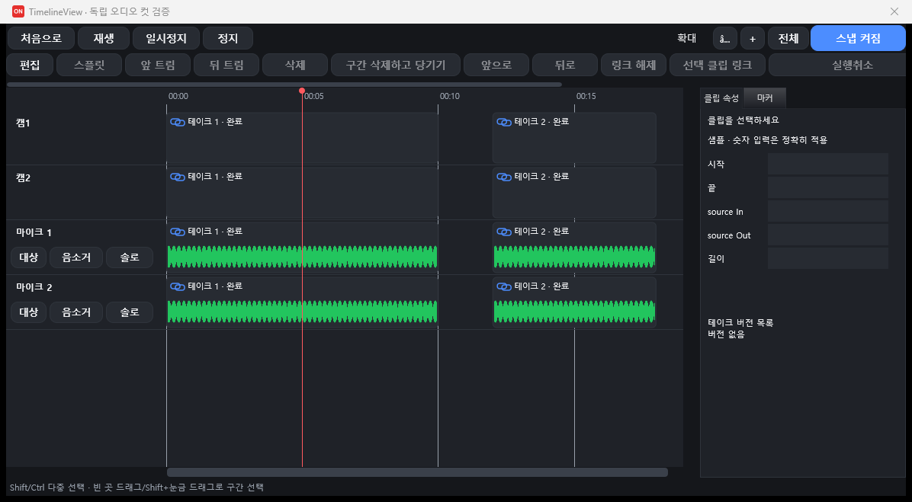
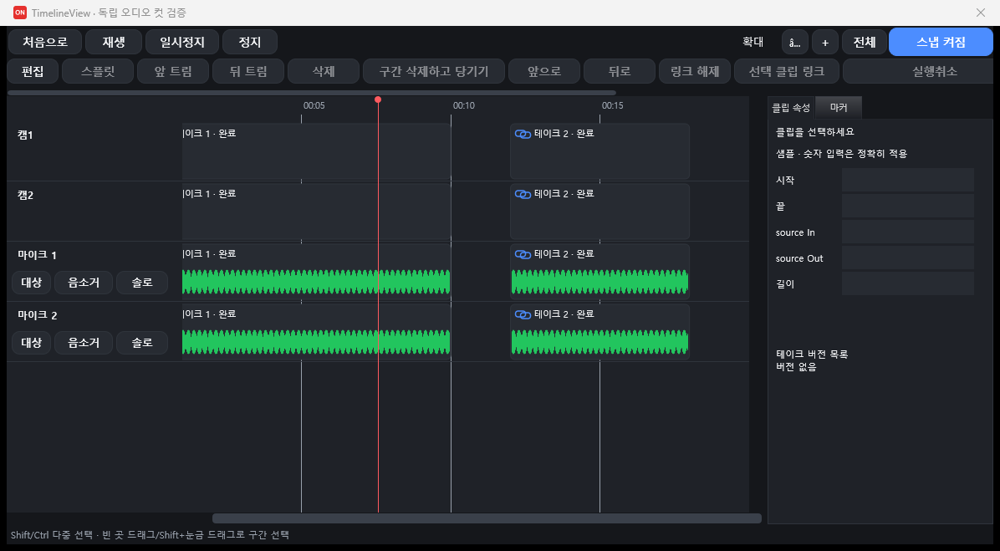
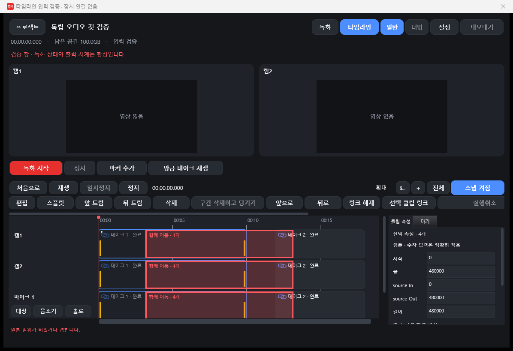
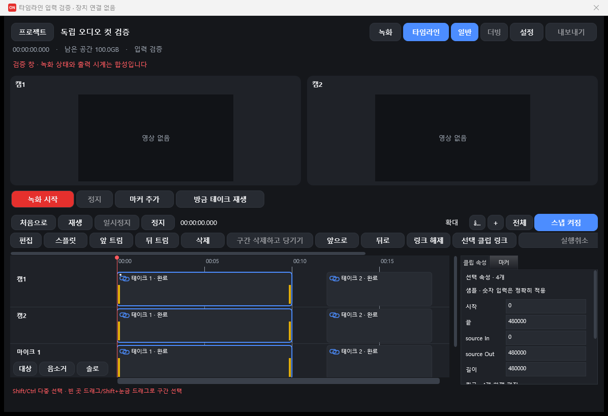
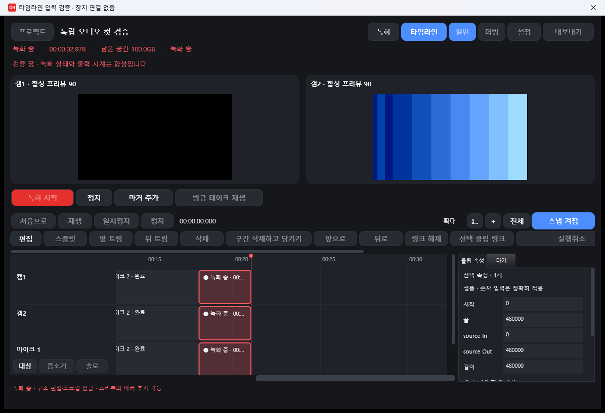
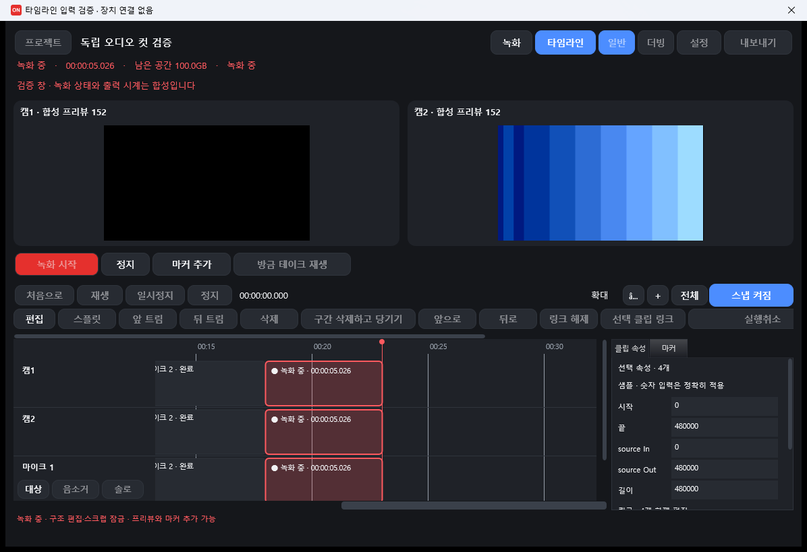
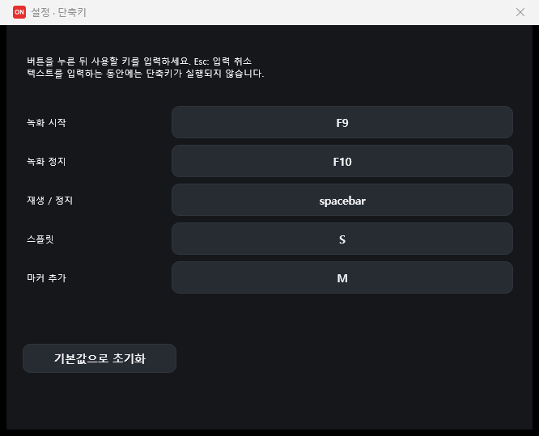

# 타임라인 입력·녹화 화면·단축키 검증

2026-09-10, `s3-timeline`, 기준 `4f21319` (Recorder 0.1.2).

## 결과와 범위

| 요구 | 결과 |
| --- | --- |
| (a) 이동·트림·스크럽 감각 | 4px 임계값, 고스트·스냅 안내선, 가장자리 스크롤, 커서, Esc 취소, 마우스 기준 줌, 화면 유지 정책 구현. 실제 창과 회귀 테스트 검증. |
| (b) 타임라인을 보면서 녹화 | 두 카메라 호스트와 녹화/정지/마커/방금 테이크 버튼을 유지하며 타임라인 공간 확대. 자라는 임시 클립 구현. 합성 상태·레이아웃 검증 완료. **두 카메라의 실제 연속 표시(P0)는 이 데스크톱에서 인증하지 못함. 더빙 연결 미완료.** |
| (c) 사용자 단축키 | 설정의 단축키 탭, 캡처 버튼, 중복·예약 키 검사, 초기화, XML 저장/복원, MainComponent 명령 연결 구현. 회귀 테스트 통과. 실제 ASIO 녹화 핫키는 장치를 사용하지 않아 미검증. |

전체 `RecorderTests`: **516 passed, 0 failed** (기준 508 + 새 8). [전체 로그](timeline-ux/tests.txt).

Git 커밋은 생성되지 않았다. `git add`가 작업 트리 외부 Git 메타데이터의 `index.lock`을 만들지 못했다. 이 실행 환경은 `.git`을 읽기 전용으로 제공한다. 구현 파일은 작업 트리에 있고, 패치와 인계 요약을 별도로 제공한다.

## 어색했던 동작과 변경

| 위치 | 확인한 원인 | 변경 |
| --- | --- | --- |
| `TimelineView.cpp`, `Rows::mouseDown/Drag/Up` | 누르자마자 편집 컨트롤러의 드래그를 열고 3px부터 미리보기 생성. 선택하려다 작은 움직임이 편집으로 이어짐. | 4px 이상 움직인 뒤에만 `beginDrag`. 3px 이하는 선택만, 드래그 한 번은 실행취소 한 단계. |
| `TimelineView.cpp`, `reveal`와 `edits.onSeek` | 스크럽을 놓을 때마다 화면 시작을 재생헤드의 5% 앞 위치로 설정. 화면에 이미 있는 위치를 눌러도 클립이 움직여 보임. | 이미 보이는 위치면 화면 유지. 화면 밖의 명시적 이동에만 최소 스크롤. 재생 중 `refresh`는 화면을 따라 움직이지 않음. |
| `TimelineView.cpp`, `zoom`/휠 | Ctrl+휠의 기준이 재생헤드. 다른 부분을 확대하면 마우스 밑 시간 위치가 달라짐. | Ctrl+휠은 소수점 마우스 좌표 기준 연속 배율. 버튼 줌은 재생헤드 기준. Shift+휠/가로 휠은 가로 이동. |
| `TimelineInteraction.h`, `Rows::updateDrag` | 기존 스냅은 영상 프레임 격자뿐. 접합점·마커에 붙이기 어려움. | 드래그 시작 시 클립 경계·마커·재생헤드의 정렬 인덱스 생성. 8px 안의 가장 가까운 점에 자석 스냅. 선택 묶음의 앞/뒤 경계를 함께 고려하고 자기 경계는 제외. |
| `TimelineView.cpp`, 고스트 페인트 | 기존 윤곽은 있었으나 원본과 이동 묶음, 스냅 상태의 구분이 약함. | 원본 흐리게, 모든 링크 대상의 고스트와 대상 수, 이동/트림 경계, 노란 스냅 안내선과 버튼 상태 표시. 충돌은 빨간 고스트. |
| `TimelineView.cpp`, Rows의 새 16ms 타이머 | 가장자리에서 포인터가 멈추면 화면을 더 이동할 수 없었음. | 32px 가장자리 영역에서 거리에 비례해 가로 스크롤. 이동·트림·구간·스크럽 공통. 포인터가 멈춰도 계속 진행, 종료/잠금/숨김 때 타이머 중지. |
| `Rows::cancelGesture` | Esc가 드래그를 버려도 스크럽 위치와 이전 선택 구간/화면을 복원하지 않음. | 스크럽 전 위치와 구간/화면 복원. 클립은 문서를 바꾸기 전 미리보기만 취소. |
| `MainComponent.cpp`, 표시 갱신 | 10ms 틱에서 `lastUi=now`로 33ms를 다시 기다리면 이상적인 틱에서도 40ms 간격이 됨. | 다음 표시 시각을 33ms 위상에 맞추고 지연분은 건너뜀. 메시지 스레드에서 밀린 프레임을 연달아 그리지 않음. |

Alt 또는 스냅 버튼 끄기로 자석과 프레임 격자를 모두 해제한다. 스냅을 켠 영상 묶음은 기존 프레임 격자를 유지한다. 마커가 격자 밖이면 실제로 일치하지 않는 자석 안내선은 숨긴다.

세로 드래그는 **원래 트랙을 유지**한다. 캠1/캠2/마이크의 원본 역할과 링크를 보존하며, 다른 행을 가리키면 상태줄에 이 규칙을 표시한다. 임의 트랙 재배치 기능은 추가하지 않았다.

수동으로 숨긴 트랙은 클립·녹화 대상·음소거·솔로 여부와 관계없이 행을 표시하지 않으며, 헤더 우클릭으로 숨기고 편집 메뉴의 숨긴 트랙 목록에서 다시 보인다. 기존 자동 표시 규칙은 유지하고 재생·믹스·내보내기·녹화에는 영향을 주지 않는다.

기준 버전의 실제 창에서 스크럽 해제 후 같은 클립의 경계가 왼쪽으로 이동하는 것을 확인했다. 아래 비교용 실행은 `4f21319`를 별도 폴더에 추출해 빌드했다. 자동 시나리오를 멈추는 옵션과 아래 설명한 CLI 공백 정규화만 검증용 복사본에 적용했다. 타임라인 코드 자체는 기준 커밋 그대로다.









3px/4px의 정확한 경계는 OS 메시지 주입의 좌표 변환과 분리해, 제품 Rows에 JUCE MouseEvent를 전달하는 회귀 테스트로 확인했다.

## 타임라인 녹화 화면

기준 코드에도 두 카메라 카드와 녹화 버튼은 타임라인 위에 남아 있었다. 큰 카메라 영역 때문에 960×640에서는 타임라인이 매우 낮아졌다. 타임라인 모드에서 카메라 영역은 120~220 논리 픽셀로 제한했다. 960×640, 1180×780, 1920×1080에서 두 호스트와 녹화 제어가 타임라인 위에 배치되고 타임라인 높이가 240px 이상임을 검사했다. 기존 100%/150%/200% DPI 페인트 검사도 통과했다.

`RecorderSession::enterTimeline(bool)`는 녹화 중이면 모드 값만 갱신하고 같은 두 HWND와 라이브 프리젠터를 유지한다. `record()`가 재생기를 정리하고 `presentLive()`를 호출하는 기존 경로를 재사용했다. **RecorderSession은 수정하지 않았다.**

녹화 임시 클립은 전달받은 배치 위치와 경과 샘플로 그리기만 한다. 기존 문서/미디어 레지스트리/실행취소를 바꾸지 않는다. 시작 시 오른쪽에 여유를 확보하고 녹화 꼬리가 화면 끝에 닿으면 연속 이동한다. 사용자가 가로 스크롤하면 녹화 꼬리 따라가기를 중지한다. 정지 후 실제 클립은 기존 TakeController의 발행으로 나타난다. `document.isRecordingStructureLocked()`는 계속 모든 편집 진입점에 적용된다.





**P0 검증 한계:** 이 환경의 화면 DC는 사용할 수 없어 PrintWindow로 캡처했다. 합성 프레임 번호와 클립 길이는 증가하지만, cam1 화면은 검고 GPU의 성공한 Present 수는 두 카메라 모두 0이다. [합성 보고서](timeline-ux/synthetic-report.json)의 상태는 PARTIAL이다. 이 스크린샷을 두 카메라 라이브 프리뷰 통과 증거로 사용하면 안 된다. 사용자 데스크톱에서 두 프리뷰가 계속 움직이는지 추가 확인해야 한다.

**더빙 미완료:** 기준 커밋은 RecordView의 더빙 버튼을 명시적으로 비활성화하며 MainComponent에 DubbingPanel/DubbingController가 연결되어 있지 않다. 일반 녹화 UI를 더빙 완료로 주장하지 않는다. 실제 더빙 시작/정지, 선택 오디오 트랙, 배치·리테이크 문맥을 세션에 연결하는 작업이 남았다. 기존 더빙·테이크 스택 회귀 테스트는 통과했다.

## 단축키 설정

| 동작 | 기본 키 | XML 필드 |
| --- | --- | --- |
| 녹화 시작 | F9 | `shortcutRecordStart` |
| 녹화 정지 | F10 | `shortcutRecordStop` |
| 재생 / 정지 | Space | `shortcutPlayStop` |
| 스플릿 | S | `shortcutSplit` |
| 마커 추가 | M | `shortcutMarker` |

`UserSettings.shortcuts`에 JUCE `KeyPress::getTextDescription()` 문자열을 저장한다. 기존 schemaVersion 1을 유지하며 필드가 없으면 기본값을 사용한다. 키 코드를 자체 파일 형식으로 저장하지 않는다. 텍스트 편집기와 그 자식에 포커스가 있으면 명령을 실행하지 않는다. MainComponent가 포커스된 자식 위젯에도 KeyListener를 붙여 버튼이 Space 등을 먼저 소비하지 않게 하고 키 반복을 막는다. 타임라인도 같은 설정 명령으로 전달하므로 기본 S/M이 별도로 중복 실행되지 않는다.

설정의 **단축키** 탭에서 버튼을 누르고 키를 입력한 뒤 **적용**한다. 충돌은 캡처 즉시 표시하고 잘못된 키로 기존 값을 덮어쓰지 않는다. Esc는 캡처 취소, 초기화는 다섯 키를 기본값으로 복원한다. Escape/Tab/Return, 기존 Delete/Ctrl+Z/Ctrl+Shift+Z, Alt+F4는 예약한다. 단축키 적용은 오디오·카메라 재연결 없이 저장하며 진행 중인 장치 설정 완료가 최신 단축키를 되돌리지 않도록 처리했다.



이 사진은 검증 창에서 같은 패널을 연 것이다. 제품 SettingsForm의 오디오·카메라 탭까지 실제 장치 열기 없이 통합 실행한 사진은 아니다. AudioSettingsPanel과 CameraSettingsPanel은 수정하지 않았다.

## 측정과 재현

실제 미디어는 제공된 `demo-f0ad256141554a16bf14d905d8a1d710` 프로젝트 전체를 `build/timeline-ux/media-project`로 복사해 사용했다. 원본 프로젝트는 변경하지 않았다. 오디오 출력은 합성 콜백이며 캡처 장치와 ASIO는 열지 않았다.

[화면 표시와 분리한 실제 미디어 실행](timeline-ux/media-offscreen-report.json): H.264 디코딩 342프레임, 합성 출력 콜백 1075회, PCM 에너지 0.000139537866666, 언더런 0회. 이 수치는 실제 소스 디코딩·렌더링 증거이며 DAC 청취 검증은 아니다. 검증 창의 BlockStamp 초기화 누락도 수정한 후 측정했다.

[네이티브 프리뷰를 연결한 실행](timeline-ux/media-report.json)에서도 초기화 수정 후 343프레임 디코딩·PCM 렌더링·언더런 0회를 확인했다. GPU 표시 완료 응답은 여전히 없어 이 실행의 보고서는 PARTIAL이다. 초기 재생 정체를 모두 GPU 표시 문제로 해석하면 안 된다.

표시 타이머의 33ms 위상을 적용한 검증 창은 이 실행에서 평균 32.77ms, p95 43.58ms 페인트 관찰 간격이었다. 합성 녹화 실행은 약 32.8ms 평균이다. 평균 약 30Hz 갱신은 확인했으나 50ms 초과 간격도 있어 무프레임드랍으로 인증하지 않는다. 이 값은 10ms 관찰 타이머로 측정한 JUCE Rows 페인트 간격이며 GPU 표시/실제 디스플레이 주사 간격과 다르다. 이상적인 10ms 틱의 구식 게이트는 40ms마다 갱신하는 것이 코드상 확인된다.

```powershell
cmake --preset local
cmake --build --preset local-release --target Recorder RecorderTests -- '-m:2' '-nr:false' '-v:m' '-nologo'
build/vs2022/recorder/RecorderTests_artefacts/Release/RecorderTests.exe
build/vs2022/recorder/RecorderTests_artefacts/Release/RecorderTests.exe --suite timeline-ux
```

이 머신에서는 CMake의 전체 경로 `C:\Users\claude\tools\cmake\bin\cmake.exe`를 사용했다. MSBuild 노드 재사용 시 접근 거부가 발생해 `MSBUILDDISABLENODEREUSE=1`, `-nr:false`로 해결했다.

검증 창은 `Recorder.exe --automation <config.json>`으로만 열린다. 예:

```json
{"schemaVersion":1,"scenario":"timeline-ux","runId":"local-check","report":"C:/absolute/report.json","seconds":45}
```

복사한 프로젝트 경로를 `project`에 지정하면 실제 미디어를 사용한다. `offscreenPlayback:true`는 네이티브 프리뷰 호스트를 연결하지 않고 영상·PCM 재생을 검사한다. `tools/recorder-timeline-ux-smoke.ps1`은 해당 프로세스의 창만 UIA/Windows 메시지로 조작하고 PrintWindow 캡처를 남긴다. `Main.cpp`의 CLI 토큰화에는 실행기에서 붙은 끝 공백 때문에 자동 실행을 거부하던 문제를 한 줄 정규화로 수정했다.

## 병합·잔여 검증

- `TimelineView::showEditMenu()`는 기준 커밋과 동일함을 문자열 비교로 확인했다. 우클릭 메뉴 위치 변경은 본선 작업에 맡긴다.
- ProductIdentity/버전/릴리스 노트/release.py/site, AudioSettingsPanel, CameraSettingsPanel, RecorderSession, 오디오 엔진, playback, CrashHandler는 변경하지 않았다. push와 release.py 실행 없음.
- s1과는 TimelineView.cpp/.h가 겹친다. 이 변경은 Rows 입력·페인트·뷰포트 정책이다. TimelineView.logic.cpp의 컨트롤러 편집·크래시 수리는 변경하지 않았다.
- s2와 겹치는 RecorderSettings 및 RecordView에서는 새 단축키 필드와 카메라/하단 레이아웃을 병합해야 한다. 마이크 카드 내부는 변경하지 않았다.
- 실제 데스크톱의 두 카메라 라이브 표시, 녹화 핫키, 실제 정지→미디어 발행 교체, 더빙 연결, 10,000클립의 연속 드래그 지연은 추가 확인 항목이다. 현재 대규모 테스트는 가시 영역 페인트 작업량을 확인하며 모든 드래그의 지연을 보증하지 않는다.
